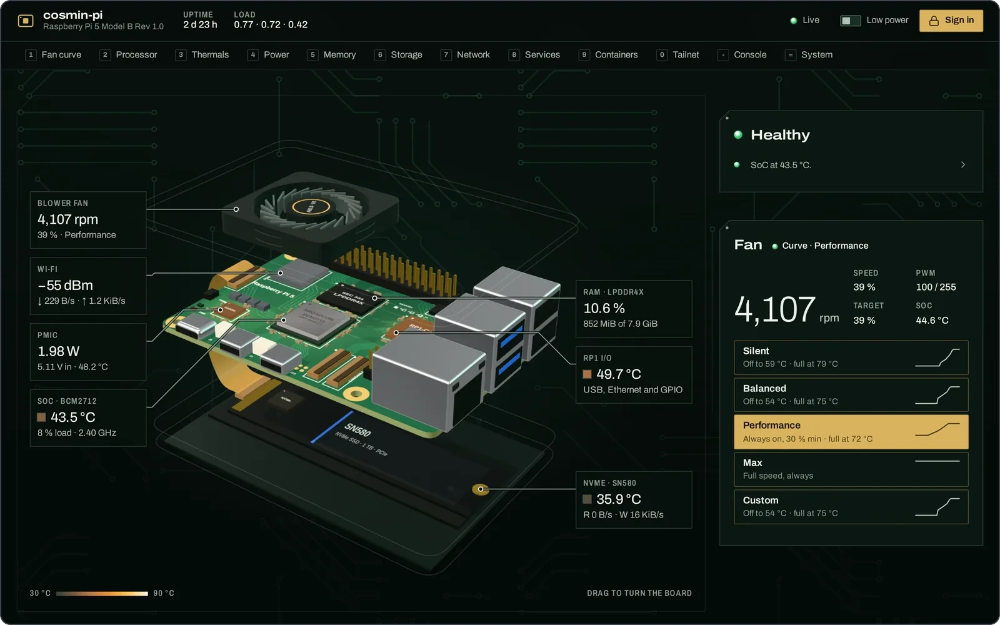
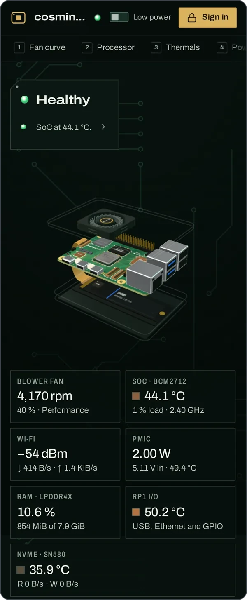
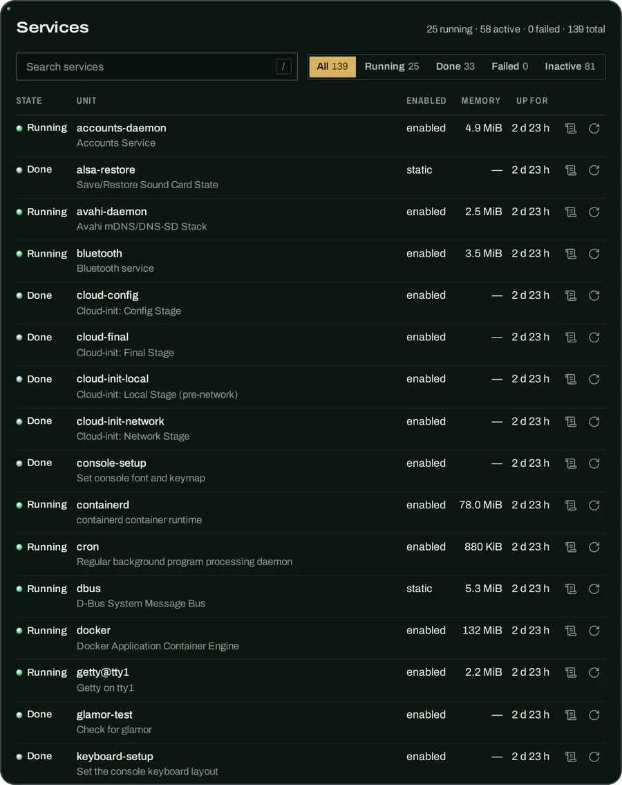
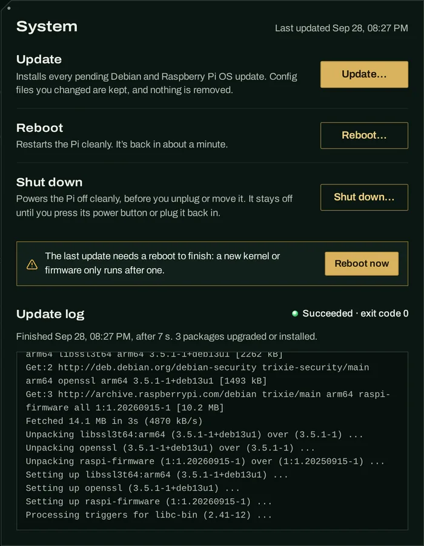
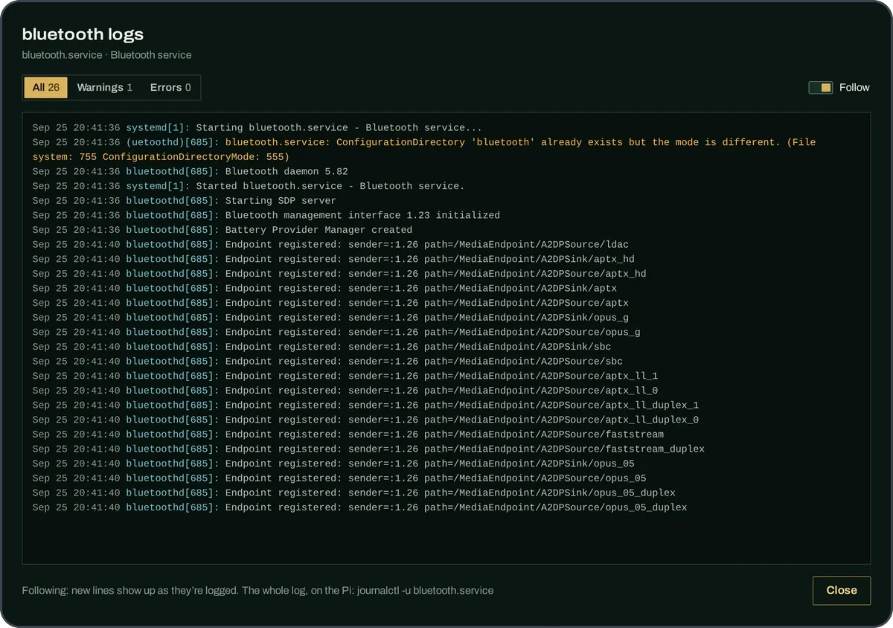
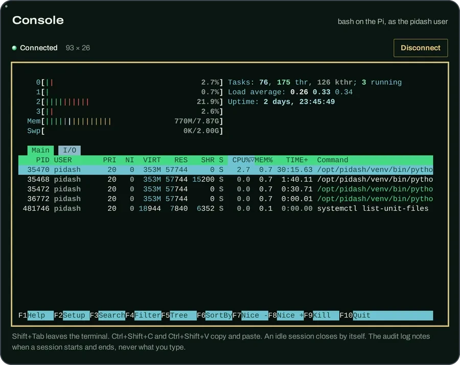
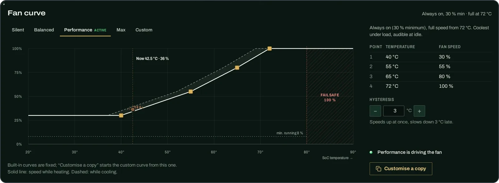
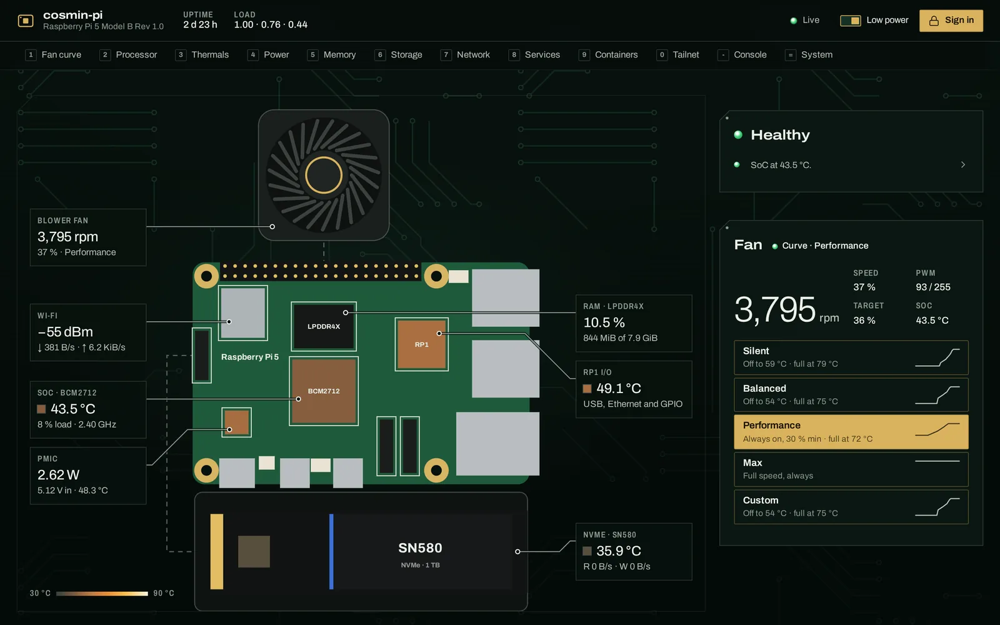

<div align="center">


# pidash

**Mission control for your Raspberry Pi 5.**

A live dashboard for temperatures, fan, power, services and containers, with one-click updates, reboots,
service restarts and a terminal. Open it from your phone or laptop, privately, over Tailscale.

[](#what-you-need)
[](backend/pyproject.toml)
[](LICENSE)

[Features](#features) · [Quick start](#quick-start) · [Configuration](#configuration) · [Security](#security) · [Troubleshooting](#troubleshooting)

</div>

<br>



<p align="center"><sub>Real data from a Pi 5. The 3D board turns when you drag it (<a href="docs/screenshots/tour.gif">see it move</a>).</sub></p>

## Features



- 🌡️ **Every sensor, live.** CPU per core, SoC, NVMe, RP1 and PMIC temperatures, power draw, throttling flags,
  memory, disks, Wi-Fi signal and the top processes, most of it every second. Every chart keeps the last 10
  minutes.
- 🧊 **A 3D Pi 5 on your screen.** An exploded board, fan and NVMe stack with the live readings pinned to each
  part. Prefer calm? The low-power switch gives you a flat 2D board instead.
- 🌀 **Fan profiles that apply instantly.** Silent, Balanced, Performance, Max, or drag your own curve. No
  `config.txt` edits and no reboot. It goes to full speed at 80 °C whatever you pick.
- 🧰 **Services at your fingertips.** Every systemd service with its state, memory and uptime. Search it, restart
  one from its row, or open its logs and watch new lines arrive.
- 🔄 **Update, reboot, shut down.** Install pending updates with a live log and progress bar. pidash tells you when
  a reboot is needed and reconnects on its own once the Pi is back.
- 💻 **A terminal in the browser.** A real shell on the Pi, with an Esc, Tab, Ctrl and arrow key row on phones.
- 🐳 **Containers and tailnet.** Docker containers with health, CPU and memory, and your Tailscale devices with
  how each one connects.
- ✅ **Health at a glance.** One line says "Healthy" or "1 problem, 2 to check" and links to what's wrong.
- 📱 **At home on your phone.** Add it to your home screen and it opens like an app. On a desktop, number keys
  jump between sections.
- 🔒 **Private by default.** Only devices in your tailnet can reach it. Every change needs your token and is logged.

<br clear="right">

### A closer look

<table>
  <tr>
    <td valign="top"><br><sub>Every service, with <b>logs</b> and <b>restart</b> on each row</sub></td>
    <td valign="top"><br><sub>Update, reboot or shut down. Each asks first. (Demo data)</sub></td>
  </tr>
</table>
<table>
  <tr>
    <td valign="top"><br><sub>Any service's logs, following new lines as they come</sub></td>
    <td valign="top"><br><sub>A real shell on the Pi, here running <code>htop</code></sub></td>
  </tr>
</table>
<table>
  <tr>
    <td valign="top"><br><sub>Pick a fan profile or draw your own curve. The dot shows where the fan is right now.</sub></td>
  </tr>
</table>
<table>
  <tr>
    <td valign="top"><br><sub>The low-power 2D view: the same live readings, easy on an old laptop's battery</sub></td>
  </tr>
</table>

<details>
<summary><b>Fan profiles and the safety net</b></summary>

<br>

pidash drives the fan on the Pi 5's FAN connector once a second, from the SoC temperature.

| Profile | Curve | Good for |
|---|---|---|
| **Silent** | Off up to 59 °C, 20 % at 60 °C, 100 % at 79 °C | Quiet rooms. The SoC runs warmer under load |
| **Balanced** (default) | Off up to 54 °C, 30 % at 55 °C, 100 % at 75 °C | Everyday use |
| **Performance** | 30 % from the start, 100 % at 72 °C | The coolest under load, audible at idle |
| **Max** | 100 % all the time | Stress tests |
| **Custom** | Your curve: 2–8 points between 20 and 80 °C | Anything else. It starts as a copy of Balanced |

- **Smooth, not twitchy.** Between points the speed follows a straight line. It speeds up at once but slows down
  only once the SoC is a few degrees cooler, so sensor jitter can't make it pulse.
- **Never stalls.** A running fan never drops below 8 %.
- **Fail-safe.** At 80 °C or above, or if the temperature can't be read, the fan runs at 100 % until the SoC is
  below 75 °C. No profile can change that. The kernel's 110 °C emergency trip is never touched.
- **Hands back cleanly.** When pidash stops, crashes or hangs (systemd notices a hang within 15 s), the fan goes
  to full speed and your `config.txt` fan settings take over again. Nothing is ever written to `config.txt`.

The hardware details are in [docs/PI_RECON.md](docs/PI_RECON.md).

</details>

## Quick start

### What you need

- A **Raspberry Pi 5** running **64-bit Raspberry Pi OS "trixie"** (Debian 13). That's what pidash is built and
  tested on. Fan control needs a fan on the Pi 5's FAN connector, such as the official Active Cooler or an Argon
  NEO 5 case (the one it was tested with).
- **Tailscale** on the Pi ([install](https://tailscale.com/kb/1031/install-linux)) and on each phone or computer
  you'll open it from ([download](https://tailscale.com/download)). It keeps the dashboard off your LAN and off
  the internet. No Tailscale? See [Without Tailscale](#without-tailscale).
- Internet access on the Pi while you install.

### Install

Run these on the Pi, over SSH or in its terminal:

1. **Get the tools and the code.**
   ```bash
   sudo apt update && sudo apt install -y --no-install-recommends git nodejs npm python3-venv
   git clone https://github.com/cosminfuica/raspberrypi-dashboard ~/pidash
   ```
2. **Build the web page.**
   ```bash
   cd ~/pidash/frontend && npm ci && npm run build
   ```
3. **Install it.**
   ```bash
   cd ~/pidash && sudo ./install.sh
   ```
   It ends by printing your **token**, the password for making changes. Save it in your password manager. To
   see it again later, run `sudo grep TOKEN /etc/pidash/pidash.env`.

That's it. Open **<http://raspberrypi:8787>** on any device in your tailnet. 🎉

- `raspberrypi` is the Pi's name in Tailscale. If yours is different, `tailscale status` lists it.
- **Use the name, not the `100.x.y.z` address.** Tailscale answers the bare address with `404 page not found`.
- Looking needs no sign-in. To change something, click **Sign in** and paste the token. The browser stays signed
  in for 7 days.
- On a phone, use the browser's **Add to Home screen** (on iPhone: Share → Add to Home Screen) to get an app icon.
- Press <kbd>1</kbd>–<kbd>0</kbd>, <kbd>-</kbd> and <kbd>=</kbd> to jump between sections, and <kbd>/</kbd> to
  search the services.

> [!TIP]
> **Curious first?** Try it on any computer with Node.js 20.19 or newer, with made-up data and no Pi needed:
> `git clone https://github.com/cosminfuica/raspberrypi-dashboard && cd raspberrypi-dashboard/frontend && npm ci && npm run dev`,
> then open <http://localhost:5173/?demo> and sign in with `demo`.

<details>
<summary><b>Build on another computer instead</b> (keeps Node.js off the Pi, and needed on Bookworm)</summary>

<br>

Raspberry Pi OS Bookworm's Node.js is too old for the build (it needs 20.19 or newer). Build on any computer
that has a newer one, then copy the result to the Pi.

On the Pi, get what the install needs:

```bash
sudo apt update && sudo apt install -y --no-install-recommends rsync python3-venv
```

On your computer:

```bash
git clone https://github.com/cosminfuica/raspberrypi-dashboard
cd raspberrypi-dashboard/frontend && npm ci && npm run build && cd ..
rsync -a --exclude node_modules --exclude .git --exclude .venv ./ pi@raspberrypi.local:pidash/
```

Use your Pi's user name and address in the last line. Then, on the Pi, run `cd ~/pidash && sudo ./install.sh`.
To update later, run `git pull` on your computer and these same steps again.

</details>

<details>
<summary><b>What <code>install.sh</code> sets up</b></summary>

<br>

| What | Where |
|---|---|
| A system user, `pidash`, that can't log in. It's in the `video` group (for `vcgencmd`), the `systemd-journal` group (to read service logs) and the `docker` group (for the Containers panel) | `/etc/passwd` |
| The backend in its own Python venv, and the built web page | `/opt/pidash` |
| Your settings and the token | `/etc/pidash/pidash.env` (root:pidash, 0640) |
| The saved fan profile and custom curve, and the audit log | `/var/lib/pidash/` |
| A udev rule that lets `pidash` set the fan speed and park the kernel's fan curve, and nothing else | `/etc/udev/rules.d/90-pidash-fan.rules` |
| A sudoers rule for the four root actions (see [Configuration](#configuration)) | `/etc/sudoers.d/pidash` |
| The system update unit (`apt-get update`, then `upgrade`) | `/etc/systemd/system/pidash-update.service` |
| A systemd service that starts at boot and restarts if it fails | `/etc/systemd/system/pidash.service` |
| `tailscale serve`, which shares port 8787 with your tailnet only | Tailscale's own config |

- Running it again is safe. It updates the app and keeps your settings, token and fan profile.
- Add `--no-docker` to keep `pidash` out of the `docker` group, which is root-equivalent. The Containers panel
  then says it can't read Docker, and nothing else changes.

</details>

### Without Tailscale

pidash listens on the Pi itself only (`127.0.0.1:8787`). Without Tailscale, reach it through an SSH tunnel from
your computer, with your Pi's user name:

```bash
ssh -L 8787:127.0.0.1:8787 pi@raspberrypi.local
```

Leave that running and open <http://localhost:8787>. If port 8787 is taken on your computer, use
`-L 18787:127.0.0.1:8787` and open <http://localhost:18787>. Installed Tailscale later? Once it's connected, run
`sudo ./install.sh` again and it shares the dashboard on your tailnet.

## Configuration

Settings live in `/etc/pidash/pidash.env`. Edit it with `sudo nano /etc/pidash/pidash.env`, then apply your
changes with `sudo systemctl restart pidash`.

| Setting | Default | What it does |
|---|---|---|
| `PIDASH_TOKEN` | random | The password for changes. Leave it empty for a look-only dashboard: nothing can be changed and the console is off |
| `PIDASH_CONSOLE` | `1` | `0` turns the web console off |
| `PIDASH_CONSOLE_IDLE_S` | `900` | A console session closes after this many seconds without typing. `0` means never |
| `PIDASH_FAN_CONTROL` | `1` | `0` leaves the fan alone: your `config.txt` fan settings stay in charge |
| `PIDASH_PORT` | `8787` | The port pidash listens on, on the Pi itself. Change it only if another program there uses 8787, then run `sudo ./install.sh` again so Tailscale follows it |
| `PIDASH_HOST` | `127.0.0.1` | Keep this. Tailscale shares it with your devices. Never use `0.0.0.0`: that would put it on your LAN |

> [!NOTE]
> Put each setting on its own line, with nothing after the value. systemd reads a trailing `# comment` as part of
> the value.

- **Your token.** Show it with `sudo grep TOKEN /etc/pidash/pidash.env`. To change it, set a new one and restart:
  every browser is then signed out. Or delete the file and run `sudo ./install.sh` again, which prints a fresh
  token and puts every setting back to its default.
- **Turning the console off.** Set `PIDASH_CONSOLE=0` and restart. The Console card then says it's off.
- **A different port in the address.** You open port 8787 because Tailscale shares pidash there. To open
  `http://raspberrypi:9000` instead, run on the Pi:
  ```bash
  sudo tailscale serve --http=8787 off
  sudo tailscale serve --bg --http=9000 http://127.0.0.1:8787
  ```
  Running `install.sh` shares port 8787 again, and `uninstall.sh` removes only that one: remove yours with
  `sudo tailscale serve --http=9000 off`.
- **HTTPS (optional).** Turn on "HTTPS Certificates" on the DNS page of the Tailscale admin console, then run
  `sudo tailscale serve --bg --https=443 http://127.0.0.1:8787` on the Pi. The dashboard is then also at
  `https://raspberrypi.<your-tailnet>.ts.net/`. Remove it with `sudo tailscale serve --https=443 off`.
- Every setting, and the whole API, is in [docs/API.md](docs/API.md#configuration).

### The sudoers rule, in plain words

pidash runs as its own user, `pidash`, which has no root rights. Four buttons need root: **Reboot**,
**Shut down**, **Update** and a service's **Restart**. So `install.sh` adds one small file,
`/etc/sudoers.d/pidash`, that lets `pidash` run exactly these commands as root, and nothing else:

```text
systemctl reboot
systemctl poweroff
systemctl start --no-block pidash-update.service    # the update: apt-get update, then upgrade
systemctl restart --no-block -- <one-unit>.service
```

- There's no shell, no other `systemctl` command, and no `apt-get` with anything from a web request.
- `install.sh` checks the file with `visudo` before installing it, because a broken sudoers file breaks `sudo`
  for everyone.
- To see what it allows, run `sudo -l -U pidash`.
- The file is in [deploy/pidash.sudoers](deploy/pidash.sudoers), with a comment on each line.

## Security

- **Private by default.** pidash listens on the Pi itself only (`127.0.0.1`). Tailscale then shares it with the
  devices in your tailnet, so it isn't on your home LAN and never on the internet. Tailscale encrypts the traffic
  (WireGuard), even though the address starts with `http://`.
- **Keep it that way.** Don't forward port 8787 on your router, and never run `tailscale funnel` for it: that
  publishes it to the whole internet. Tailscale already gives you private access from anywhere. If you use
  something else, put pidash behind a VPN, or a reverse proxy with TLS and its own login. Never expose the bare
  port.
- **What the token protects.** Changing the fan, reboot, shut down, system update, service restarts, service logs
  and the console. A browser swaps the token for a sign-in cookie that scripts on the page can't read and that
  other websites can't use, and every change must also carry a header that other sites can't add.
- **What anyone on your tailnet can see without it.** Every reading on the dashboard, including the processes'
  command lines. Sharing your tailnet with others? Limit who can reach the Pi with
  [Tailscale access controls](https://tailscale.com/kb/1018/acls).
- **The console is a shell for whoever has the token**, as the `pidash` user. Because `pidash` is in the `docker`
  group by default, that shell is as good as root. If you don't want that, set `PIDASH_CONSOLE=0` or install with
  `--no-docker`. Sessions close after 15 minutes without typing, and at most 3 run at once.
- **Least privilege.** The service runs as `pidash`, with `/usr` and `/etc` read-only and no access to `/home`.
  In `/sys` it can only set the fan speed and park the kernel's fan curve, and as root it can run only the four
  commands above.
- **An audit trail.** Every change, and each console session's start and end, is logged to
  `/var/lib/pidash/audit.log` and to the journal. What you type in the console is never logged.
- **Nothing is loaded from the internet.** Fonts, the 3D view and the terminal are all served by the Pi.

More detail: [docs/API.md → Security notes](docs/API.md#security-notes).

## Updating

**pidash itself.** Pull, build and install again. Your token, settings and fan profile are kept.

```bash
cd ~/pidash && git pull
cd frontend && npm ci && npm run build
cd ~/pidash && sudo ./install.sh
```

Built on another computer? Pull and build there, then copy it over and run `sudo ./install.sh` on the Pi again.

**Your Pi's software.** Use **Update** in the dashboard's System card. It installs every pending Raspberry Pi OS
update, keeps the config files you've changed, and never removes a package.

## Uninstalling

```bash
cd ~/pidash && sudo ./uninstall.sh
```

This stops pidash and hands the fan back to your `config.txt` settings. It then removes everything `install.sh`
added: the service, the Tailscale share on port 8787, the udev and sudoers rules, the update unit, `/opt/pidash`,
your settings and token, the saved fan profile, the audit log and the `pidash` user. It's safe to run twice.

It leaves Docker, Tailscale, `config.txt` and your `~/pidash` folder alone. To also remove the folder, and
Node.js if you installed it just for pidash:

```bash
rm -rf ~/pidash
sudo apt-get remove --autoremove nodejs npm
```

## Troubleshooting

| Symptom | Fix |
|---|---|
| `404 page not found` | You opened the `100.x` address. Use the name: `http://raspberrypi:8787` |
| The page doesn't load | Check `tailscale status` on both devices. On the Pi, check `systemctl status pidash` and `curl -s localhost:8787/api/info`. `tailscale serve status` should list `http://raspberrypi:8787` |
| "Offline · retry in …" | pidash is restarting or the Pi can't be reached. The page reconnects by itself. See `journalctl -u pidash -n 50` |
| "That token isn't right" | Copy it again with `sudo grep TOKEN /etc/pidash/pidash.env`. If you edited the file, restart pidash first |
| The fan card says **Kernel curve** | pidash isn't driving the fan. Check that `PIDASH_FAN_CONTROL` isn't `0`. `ls -l /sys/class/hwmon/hwmon*/pwm1` should show the group `pidash` with `rw`. If not, run `sudo ./install.sh` again |
| The fan runs at full speed after pidash stops | That's expected for a few seconds. The kernel slows it down as the SoC cools |
| Containers: "permission denied" | You installed with `--no-docker`, or installed Docker after pidash. Run `sudo ./install.sh` again |
| Power or Throttling shows "unavailable" | `vcgencmd` needs the `video` group. Run `sudo ./install.sh` again |
| Reboot, update or restart fails with `command_failed … sudo` | The sudoers rule is missing or out of date. Run `sudo ./install.sh` again, then check `sudo -l -U pidash` |
| A service's logs say "can't read the system journal" | `pidash` isn't in the `systemd-journal` group yet. Run `sudo ./install.sh` again |
| An update fails with `Could not get lock` | apt was busy, for example with automatic updates. Nothing changed: try again in a few minutes. The full log is in `/var/log/pidash-update.log` |
| `install.sh` fails while installing the Python packages | The Pi needs internet access to download them. Fix the connection and run it again |
| `npm run build` fails with a `styleText` error | Your Node.js is older than 20.19, as on Raspberry Pi OS Bookworm. [Build on another computer](#install) instead |

pidash's own log: `journalctl -u pidash -f`.

<details>
<summary><b>Does it work on other Pi models, or a different case?</b></summary>

<br>

pidash is built for the Pi 5, and other models aren't tested. On them, the readings only a Pi 5 has (fan control
through the FAN connector, PMIC power and the RP1 temperature) would show as unavailable. Any case works, but the
3D model always shows a Pi 5 in an Argon NEO 5 case with an NVMe drive.

</details>

<details>
<summary><b>Will it slow my Pi down?</b></summary>

<br>

Barely. On a Pi 5 it uses about 2 % of one CPU core and about 60 MB of memory. The 3D view runs in your
browser, not on the Pi.

</details>

<details>
<summary><b>Does it change my <code>config.txt</code>?</b></summary>

<br>

Never, and no change ever needs a reboot. While pidash runs, it drives the fan itself and parks the kernel's fan
settings. They take over again the moment pidash stops.

</details>

<details>
<summary><b>Why is there no Docker image?</b></summary>

<br>

Fan control needs the host: a udev rule on `/sys`, and systemd running `pidash --restore-fan` after every stop or
crash so the fan is never left unmanaged. A container would need privileged access to the host's `/sys` and would
lose that fail-safe. `install.sh` is the supported way.

</details>

## Contributing

Bug reports, ideas and pull requests are welcome: [open an issue](https://github.com/cosminfuica/raspberrypi-dashboard/issues).
You don't need a Pi to work on pidash. You need Python 3.11 or newer and Node.js 20.19 or newer. The console tests
also run `top`, from `procps`, which minimal containers lack.

```bash
# backend: a mock server with made-up data (sign in with "dev")
cd backend
python3 -m venv .venv && .venv/bin/pip install -e .
PIDASH_TOKEN=dev .venv/bin/pidash --mock                 # http://127.0.0.1:8787
.venv/bin/python -m unittest discover -s tests -t tests  # the backend tests

# frontend, in a second terminal
cd frontend
npm ci
npm run dev     # http://localhost:5173, forwards /api to the backend on :8787
npm test        # unit tests
npm run build   # writes frontend/dist, which the backend serves
```

`npm run dev` alone works too: open <http://localhost:5173/?demo> for data generated in the browser. The
browser checks in [frontend/scripts](frontend/scripts) cover the nav, sign-in and every action. Each file's
header says how to run it.

<details>
<summary><b>Where things are</b></summary>

<br>

| Path | What |
|---|---|
| `backend/` | The server, `pidash` (FastAPI): the REST API, the live WebSocket and the console. It also serves the built page |
| `frontend/` | The web page (Vite, three.js, xterm.js) |
| `install.sh`, `uninstall.sh` | Install, update and remove on the Pi |
| `deploy/` | The systemd units, the udev rule, the sudoers rule and the update script that `install.sh` installs |
| `docs/API.md` | The API: every endpoint, message and setting |
| `docs/PI_RECON.md` | The Pi's sensors and how the fan is controlled |
| `DESIGN.md` | The visual design: colors, type and components |

</details>

## License

[MIT](LICENSE). Made for a Pi 5 on a desk. If pidash makes yours feel like mission control,
[give it a ⭐ on GitHub](https://github.com/cosminfuica/raspberrypi-dashboard).
