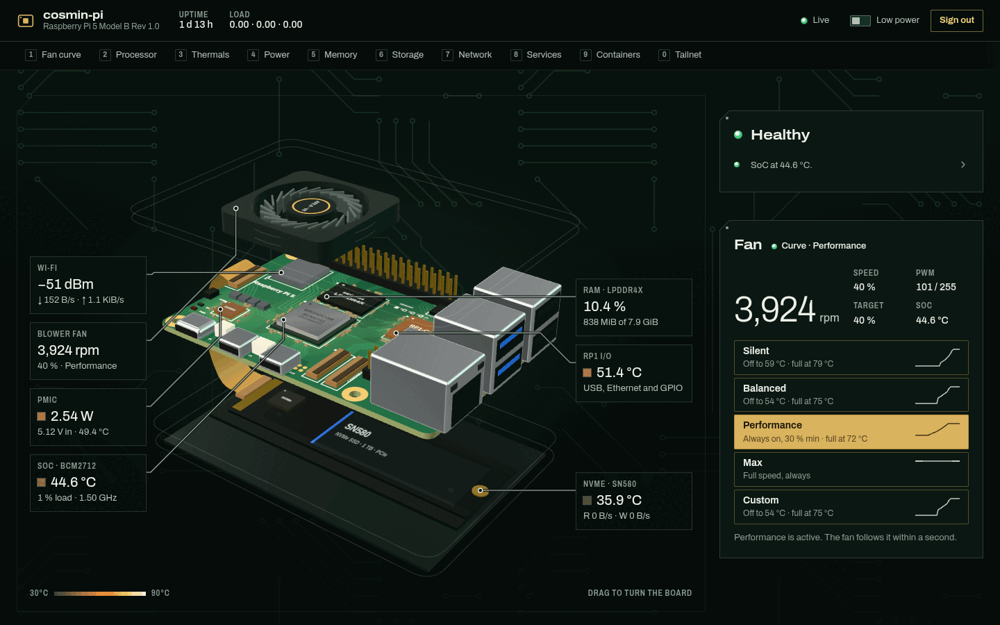

# raspberrypi-dashboard

A live dashboard for a Raspberry Pi 5 in an Argon NEO 5 NVMe case. It shows how the Pi is doing and lets
you change the fan curve from any device on your tailnet. One small Python process on the Pi streams the
metrics over a WebSocket and serves the web UI.



## Features

- **Live data, once a second:** CPU (per core, clock, load), SoC/NVMe/RP1/PMIC temperatures, firmware
  throttle flags, power from the PMIC rails, memory and swap, disks and filesystems, network per interface
  with Wi-Fi signal, and the top processes.
- **Services, containers and tailnet:** every systemd service with its state, memory and uptime
  (searchable); Docker containers with health, CPU and memory; Tailscale peers and how they connect.
- **10 minutes of history** in every chart, shown as soon as you open the page.
- **Fan profiles:** Silent, Balanced, Performance, Max, and a Custom curve you drag, type or edit with the
  keyboard. Switching takes effect within a second, with no reboot and no `config.txt` edit.
- **Fail-safe fan control:** full speed at 80 °C whatever the profile; if the dashboard stops, crashes or
  hangs, the kernel's own curve takes over again.
- **A 3D model of your board** (Pi 5, NEO 5 case, SN580 NVMe) with the live readings pinned to each part,
  plus a low-power 2D view.
- **Health at a glance:** one verdict ("Healthy", "1 problem, 2 to check") with links to what's wrong.
- **Works on a phone**, with the keyboard only, and with reduced motion.
- **Tailnet only.** It is never exposed to your LAN or the internet, and changes need a token.

More screenshots in [docs/screenshots/](docs/screenshots/). They show the built-in demo data:
a 10-second tour of the 3D board (`tour.gif`: the stack opening, then a drag to turn it), the whole page
(`desktop-full.webp`), the phone layout (`mobile.png`), the low-power 2D view (`low-power-2d.png`) and the
fan curve editor (`fan-curve.png`).

## Install on the Pi

Needs a Raspberry Pi 5 on Raspberry Pi OS / Debian 13 (Python 3.11+, `python3-venv`), and Tailscale for
remote access. Docker is optional. The Pi needs internet access during the install (pip downloads
FastAPI and uvicorn).

1. **On your desktop, build the UI.** The Pi has no Node.js, so the build happens here (Node ≥ 20.19):
   ```bash
   git clone https://github.com/cosminfuica/raspberrypi-dashboard
   cd raspberrypi-dashboard/frontend && npm ci && npm run build && cd ..
   ```
2. **Copy it to the Pi** over SSH (add `user@` if your Pi username differs from your desktop's):
   ```bash
   rsync -a --exclude node_modules --exclude .git --exclude .venv ./ raspberrypi:pidash/
   ```
3. **On the Pi, install:**
   ```bash
   cd ~/pidash && sudo ./install.sh
   ```
   It ends by printing the **auth token once**. Keep it: you need it to change the fan from the
   dashboard. You can show it again later with `sudo grep TOKEN /etc/pidash/pidash.env`.

`install.sh` sets up:

| What | Where |
|---|---|
| A system user `pidash` (no login), in the `video` group (for `vcgencmd`) and the `docker` group | `/etc/passwd` |
| The backend in a venv (psutil comes from apt), and the built UI | `/opt/pidash` |
| The config, with a random token | `/etc/pidash/pidash.env` (root:pidash 0640) |
| The saved fan profile and custom curve | `/var/lib/pidash/fan.json` |
| A udev rule that lets `pidash` write the fan speed and the four fan trip points, and nothing else | `/etc/udev/rules.d/90-pidash-fan.rules` |
| A sudoers drop-in that lets `pidash` reboot, start the system update and restart a service, and nothing else | `/etc/sudoers.d/pidash` |
| The system update unit (`apt-get update && apt-get -y upgrade`, started from the dashboard) | `/etc/systemd/system/pidash-update.service`, `/opt/pidash/pidash-update` |
| A systemd service: starts at boot, restarts on failure, re-applies the saved fan profile | `/etc/systemd/system/pidash.service` |
| `tailscale serve`, publishing the dashboard to your tailnet over plain HTTP | Tailscale's own config |

- **Updating:** `git pull`, then repeat steps 1–3. Running `install.sh` again keeps the config, the token
  and the saved fan profile.
- **`--no-docker`:** leaves `pidash` out of the `docker` group. That group is root-equivalent; without it the
  Containers panel says it can't read Docker, and nothing else changes. Re-run without the flag to add it back.

## Uninstall

```bash
cd ~/pidash && sudo ./uninstall.sh
```

This stops the service, and the fan goes back to the kernel's `config.txt` curve. It then removes
everything in the table above: the service, the `tailscale serve` handler on port 8787, the udev rule (and
the permissions it set), the sudoers drop-in and the update unit, `/opt/pidash`, the config and token, the
saved fan profile and audit log, and the `pidash` user. It leaves Docker, Tailscale, apt packages,
`config.txt` and your `~/pidash` copy alone. It is safe to run twice.

## Open it from your desktop

Open **`http://<pi-tailscale-name>:8787`** in a browser on any device on your tailnet, for example
**`http://raspberrypi:8787`**.
- `<pi-tailscale-name>` is the Pi's machine name in Tailscale (`tailscale status` lists it); MagicDNS
  resolves it.
- The full name also works: `http://raspberrypi.<your-tailnet>.ts.net:8787`.
- **Use a name, not the `100.x.y.z` address:** `tailscale serve` routes by host name and answers the bare
  IP with `404 page not found`.

Looking needs no login. The first time you change the fan, the dashboard asks for the token and remembers
it in that browser; "Sign out" forgets it.

How it's reachable:
- The service listens on `127.0.0.1:8787` only, so it is not on your home LAN.
- `tailscale serve` forwards port 8787 of the Pi's tailnet address to it. The traffic between your
  devices is encrypted by Tailscale (WireGuard), even though the page is plain `http://`.

**HTTPS (optional).** Turn on "HTTPS Certificates" on the DNS page of the Tailscale admin console, then
on the Pi run:
```bash
sudo tailscale serve --bg --https=443 http://127.0.0.1:8787
```
The dashboard is then also at `https://raspberrypi.<your-tailnet>.ts.net/`. `uninstall.sh` only removes the
port 8787 handler it added; remove this one with `sudo tailscale serve --https=443 off`.

> [!WARNING]
> **Never run `tailscale funnel` for this dashboard.** Funnel publishes a service to the **public
> internet**. Anyone could then read your Pi's metrics, including every process's command line, and try
> tokens against the fan controls. The installer only uses `tailscale serve`, which stays inside your
> tailnet. Funnel is off, and should stay off.

## Configuration

Settings live in `/etc/pidash/pidash.env`. Apply a change with `sudo systemctl restart pidash`.

| Variable | Installed value | Meaning |
|---|---|---|
| `PIDASH_TOKEN` | random | The token for changes. Anyone with it can change the fan curve, reboot, update the system, restart services and open the console |
| `PIDASH_HOST` | `127.0.0.1` | Keep it: `tailscale serve` publishes it. Never `0.0.0.0` (the Pi has no firewall) |
| `PIDASH_PORT` | `8787` | `tailscale serve` forwards the tailnet's port 8787 here |
| `PIDASH_FAN_CONTROL` | `1` | `0` = read-only: the kernel's `config.txt` curve keeps the fan. Profile choices are saved, not applied |
| `PIDASH_CONSOLE` | `1` | `0` turns the web console off. It is also off while no token is set |
| `PIDASH_CONSOLE_IDLE_S` | `900` | A console session closes after this many seconds without input; `0` = never |

- The service sets `PIDASH_STATE_DIR=/var/lib/pidash` and `PIDASH_STATIC_DIR=/opt/pidash/frontend/dist`.
- **New token:** edit `PIDASH_TOKEN` and restart. Or delete the file and run `sudo ./install.sh` again,
  which prints a fresh one.
- Every setting, and the API itself, is in [docs/API.md](docs/API.md).

## Fan profiles

The NEO 5's blower sits on the Pi 5's FAN header. While the dashboard runs, it drives the fan from the
active profile once a second, using the SoC temperature. The kernel's curve from `config.txt` is parked,
not deleted.

| Profile | Curve | Hysteresis | Good for |
|---|---|---|---|
| **Silent** | Off up to 59 °C, 20 % at 60 °C, 40 % at 68 °C, 70 % at 75 °C, 100 % at 79 °C | 4 °C | Quiet rooms; the SoC runs warmer under load |
| **Balanced** (default) | Off up to 54 °C, 30 % at 55 °C, 50 % at 63 °C, 70 % at 70 °C, 100 % at 75 °C | 5 °C | Your existing `config.txt` curve, smoothed. Installing changes nothing until you pick another |
| **Performance** | 30 % from the start, 55 % at 55 °C, 80 % at 65 °C, 100 % at 72 °C | 3 °C | Coolest under load; audible at idle |
| **Max** | 100 % all the time | 0 °C | Stress tests |
| **Custom** | Your curve: 2–8 points between 20 and 80 °C | 0–10 °C | Anything else. Starts as a copy of Balanced |

How a curve is applied:
- **Between points** the speed is interpolated linearly.
- **Hysteresis:** the fan speeds up at once but slows down only once the SoC is that many degrees cooler.
  So Balanced switches on above 54 °C and off again at 49 °C, and sensor jitter can't make it pulse.
- **Stall guard:** a running fan never goes below 8 % (about 670 rpm). It starts reliably from 4 %.
- For scale: 30 % ≈ 3,100 rpm, 50 % ≈ 5,100 rpm, 100 % ≈ 9,000 rpm.

The safety net, which no profile can change:
- **At 80 °C or above, the fan runs at 100 %** until the SoC is below 75 °C. That is also what happens if
  the temperature can't be read. The firmware starts throttling at 80 °C.
- **The kernel's 110 °C emergency trip is never touched.**
- **When the dashboard stops, crashes or hangs** (systemd's watchdog catches a hang within 15 s), the fan
  is set to full speed and the kernel's `config.txt` curve takes over again. The kernel then brings it back
  down, which takes about 10 s at idle.
- `config.txt` is never edited, and no change ever needs a reboot.

The details and the hardware measurements are in [docs/PI_RECON.md](docs/PI_RECON.md).

## Security

- **Tailnet only.** The service listens on `127.0.0.1`, and `tailscale serve` shares it with your tailnet
  only. It is not reachable from your home LAN, and never from the internet (see the Funnel warning above).
- **Reading needs no login.** Anyone on your tailnet can see the metrics, including process command lines.
  If you share your tailnet with others, limit access to the Pi with Tailscale ACLs.
- **Changes need the token.** Scripts send it as a `Bearer` header. A browser can instead trade it for an
  `HttpOnly`, `SameSite=Strict` session cookie, and every change made with the cookie must also carry a
  custom header, so other websites can't make changes through your browser. The WebSocket also refuses
  pages from other origins.
- **The worst a token holder can do** is reboot the Pi, install pending Debian updates, restart services, or
  make the fan loud. The 80 °C failsafe and the kernel's emergency trip still apply. Every change is logged
  to `/var/lib/pidash/audit.log`.
- **The web console turns the token into a shell login** as the `pidash` user, in the service's sandbox.
  With the `docker` group (the default) that shell is root-equivalent. Don't want that? Set
  `PIDASH_CONSOLE=0` in `/etc/pidash/pidash.env`, or install with `--no-docker`. Sessions close after 15
  minutes without input, at most 3 run at once, and each one's start and end are logged.
- **The `docker` group is root-equivalent.** Membership lets the service control the Docker daemon.
  Install with `--no-docker` if you'd rather not show containers.
- **Least privilege:** the service runs as the `pidash` user with no login shell. It has a read-only `/usr`
  and `/etc` (`ProtectSystem=full`) and no access to `/home`. The udev rule gives it the fan speed and the
  four fan trip points only; the emergency trip and the thermal zone's on/off switch stay root-only. As root
  it can run exactly three commands (`/etc/sudoers.d/pidash`): reboot, start the update unit, restart one
  service. See [docs/API.md → System actions](docs/API.md#system-actions).

## Troubleshooting

| Symptom | Fix |
|---|---|
| `404 page not found` | You opened the `100.x` address. Use `http://raspberrypi:8787` |
| The page doesn't load | Check `tailscale status` on both machines. On the Pi, check `systemctl status pidash`, `tailscale serve status` (it should list `http://raspberrypi:8787` → `http://127.0.0.1:8787`) and `curl -s localhost:8787/api/info` |
| "Offline · retry in …" | The service is restarting or the Pi is unreachable; the page reconnects by itself. See `journalctl -u pidash -n 50` |
| The fan card says **Kernel curve** | The dashboard isn't driving the fan. `ls -l /sys/class/hwmon/hwmon*/pwm1` should show group `pidash` with `rw`. If not, run `sudo udevadm trigger --action=change --settle /sys/class/hwmon/hwmon* /sys/class/thermal/thermal_zone*`, then `sudo systemctl restart pidash`. Also check that `PIDASH_FAN_CONTROL` isn't `0`, and see `journalctl -u pidash \| grep fan` |
| Containers: "permission denied: /var/run/docker.sock" | Installed with `--no-docker`, or Docker was installed after pidash. Run `sudo ./install.sh` again |
| `install.sh` fails while installing the Python packages | The Pi needs internet access (PyPI). Fix the connection and run it again. Until then the service stays stopped and the kernel's `config.txt` curve runs the fan |
| Power or Throttling unavailable | `vcgencmd` needs the `video` group. Run `sudo ./install.sh` again |
| "That token isn't right" | Copy it again from `sudo grep TOKEN /etc/pidash/pidash.env`. If you edited the file, restart the service first |
| The fan runs at full speed after a stop | Expected for a few seconds: the kernel steps it down as the SoC cools |
| Reboot, update or restart fails with `command_failed ... sudo` | The sudoers drop-in is missing or outdated: run `sudo ./install.sh` again, then check `sudo -l -U pidash` |
| An update fails with `Could not get lock` | apt was busy (e.g. `unattended-upgrades`). Nothing changed; try again in a few minutes. Full log: `/var/log/pidash-update.log` |
| Logs | `journalctl -u pidash -f` |

## Why there is no Docker image

Fan control needs the host: the udev rule on sysfs, and systemd running `pidash --restore-fan` after every
stop or crash so the fan is never left unmanaged. A container would need privileged access to the host's
`/sys` and would lose that fail-safe. `install.sh` is the supported way.

## Layout

| Path | What |
|---|---|
| `backend/` | FastAPI app (`pidash`): REST + WebSocket, and it serves `frontend/dist` |
| `frontend/` | Vite app: the dashboard UI |
| `install.sh`, `uninstall.sh` | Install on the Pi, update, remove |
| `deploy/` | The systemd unit and the udev rule that `install.sh` installs |
| `docs/API.md` | The API contract: endpoints, WebSocket messages, fan profiles, auth |
| `docs/PI_RECON.md` | What's on the Pi, which sensors exist, how the fan is controlled |
| `NOTES.md` | Things that need the owner's attention |

## Develop

Needs Python ≥ 3.11 and Node ≥ 20.19 (for Vite).

```bash
# backend
cd backend
uv venv .venv && uv pip install --python .venv/bin/python -e .   # or: python3 -m venv .venv && .venv/bin/pip install -e .
.venv/bin/pidash --port 8787                                      # http://127.0.0.1:8787
PIDASH_TOKEN=dev .venv/bin/pidash --mock                          # synthetic data, no Pi needed; log in with "dev"
.venv/bin/python -m unittest discover -s tests -t tests           # backend tests

# frontend (second terminal)
cd frontend
npm install
npm run dev     # http://localhost:5173, proxies /api to :8787
npm run build   # writes frontend/dist, which the backend serves at /
```

Try the UI with no backend at all: `npm run dev`, then open `http://localhost:5173/?demo`. The data is
generated in the browser.

## License

[MIT](LICENSE)
