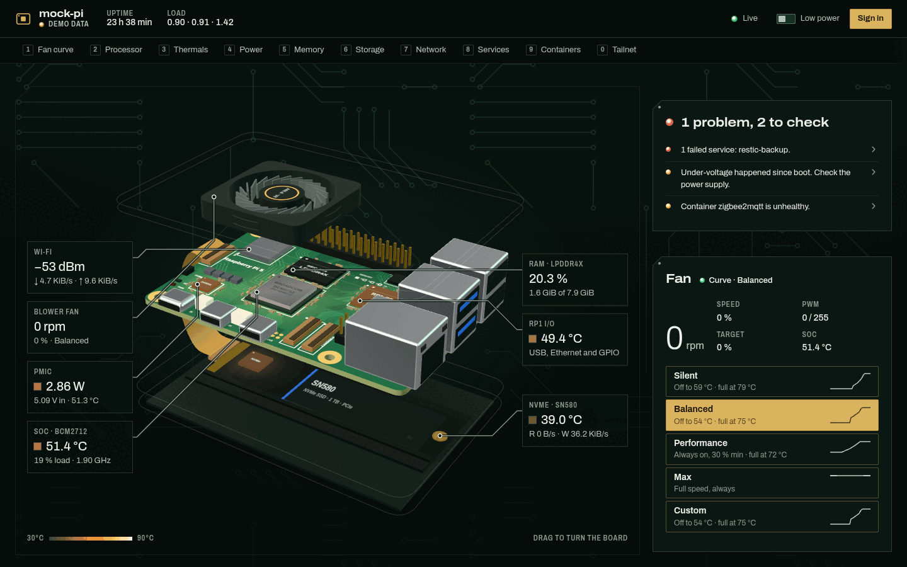

# raspberrypi-dashboard

A live dashboard for a Raspberry Pi 5 (in an Argon NEO 5 NVMe case). One small Python process
streams metrics over WebSocket, serves a 3D web UI, and lets you switch fan profiles from any
device on your tailnet.

**Status: work in progress.** The API contract, hardware recon, backend and dashboard UI are done. The
installer is being built.



More in [docs/screenshots/](docs/screenshots/): the whole page (`desktop-full.webp`), the phone layout
(`mobile.png`), the low-power 2D view (`low-power-2d.png`), and the fan curve editor (`fan-curve.png`).
Try the UI without a Pi or a backend: `cd frontend && npm install && npm run dev`, then open
`http://localhost:5173/?demo` (synthetic data generated in the browser).

## Layout

| Path | What |
|---|---|
| `backend/` | FastAPI app (`pidash`): REST + WebSocket, and it serves `frontend/dist` |
| `frontend/` | Vite app: the dashboard UI |
| `deploy/` | Reference systemd unit and the udev rule that lets the service drive the fan without root |
| `docs/API.md` | The API contract: endpoints, WebSocket messages, fan profiles, auth |
| `docs/PI_RECON.md` | What's on the Pi, which sensors exist, how the fan is controlled |
| `NOTES.md` | Things that need the owner's attention |

## Develop

Needs Python ≥ 3.11 and Node ≥ 20.19 (for Vite).

```bash
# backend
cd backend
uv venv .venv && uv pip install --python .venv/bin/python -e .   # or: python3 -m venv .venv && .venv/bin/pip install -e .
.venv/bin/pidash --port 8787                                      # http://127.0.0.1:8787
PIDASH_TOKEN=dev .venv/bin/pidash --mock                          # synthetic data, no Pi needed; log in with "dev"
.venv/bin/python -m unittest discover -s tests -t tests           # backend tests

# frontend (second terminal)
cd frontend
npm install
npm run dev     # http://localhost:5173, proxies /api to :8787
npm run build   # writes frontend/dist, which the backend serves at /
```

## License

[MIT](LICENSE)
