<div align="center">
  <picture>
    <source media="(prefers-color-scheme: dark)" srcset=".github/readme/banner-dark.svg">
    
  </picture>

  <p>A live dashboard for the Raspberry Pi 5, served by the Pi to any device on your tailnet. It reads the board's own sensors, pins every reading to its part on a 3D model, drives the fan from the curve you pick, and updates, reboots or restarts services without SSH.</p>

  <p>
    <a href="https://github.com/cosminfuica/raspberrypi-dashboard/stargazers"></a>
    &nbsp;
    <a href="https://github.com/cosminfuica/raspberrypi-dashboard/actions/workflows/ci.yml"></a>
    &nbsp;
    <a href="backend/pyproject.toml"></a>
    &nbsp;
    <a href="LICENSE"></a>
  </p>

  <p>
    <a href="#quick-start"><picture><source media="(prefers-color-scheme: dark)" srcset=".github/readme/cta-start-dark.svg"></picture></a>
    &nbsp;
    <a href=".github/readme/demo.mp4"><picture><source media="(prefers-color-scheme: dark)" srcset=".github/readme/cta-demo-dark.svg"></picture></a>
  </p>

  <p>
    <a href="#how-it-works"><b>How it works</b></a> &middot;
    <a href="#quick-start"><b>Quick start</b></a> &middot;
    <a href="#usage"><b>Usage</b></a> &middot;
    <a href="#configuration"><b>Configuration</b></a> &middot;
    <a href="#contributing"><b>Contributing</b></a>
  </p>

  <a href=".github/readme/demo.mp4">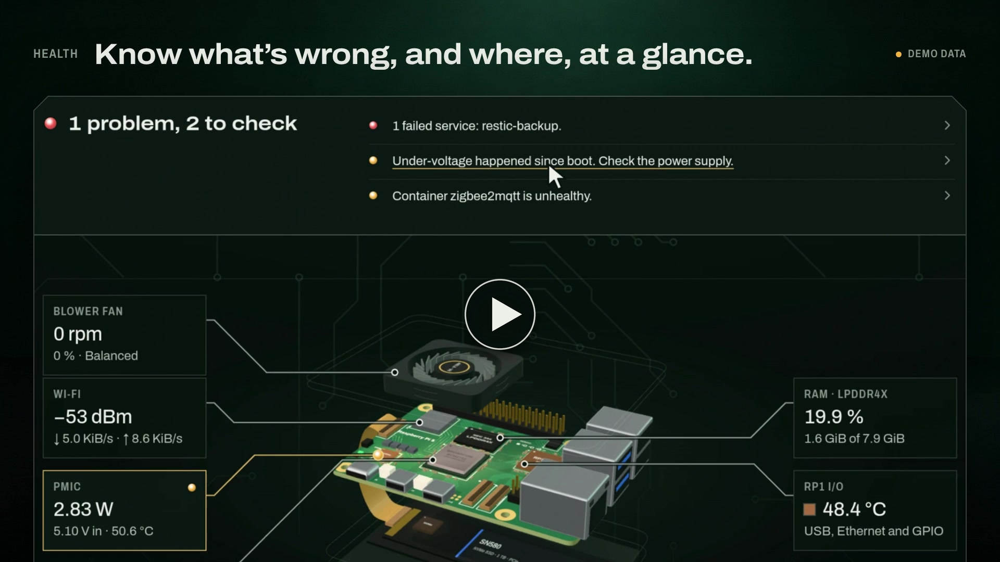</a>

  <p align="center">
    <picture><source media="(prefers-color-scheme: dark)" srcset=".github/readme/spec-1-dark.svg">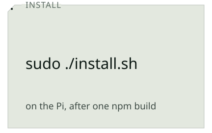</picture><picture><source media="(prefers-color-scheme: dark)" srcset=".github/readme/spec-2-dark.svg">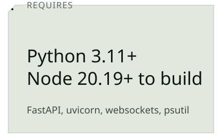</picture><picture><source media="(prefers-color-scheme: dark)" srcset=".github/readme/spec-3-dark.svg">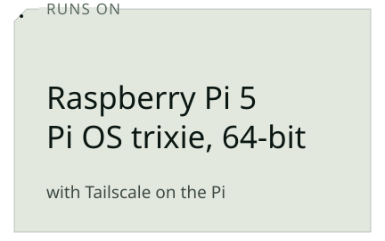</picture><picture><source media="(prefers-color-scheme: dark)" srcset=".github/readme/spec-4-dark.svg">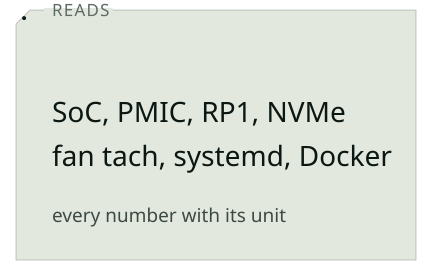</picture>
    <picture><source media="(prefers-color-scheme: dark)" srcset=".github/readme/spec-5-dark.svg">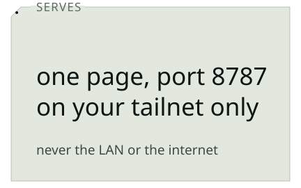</picture><picture><source media="(prefers-color-scheme: dark)" srcset=".github/readme/spec-6-dark.svg">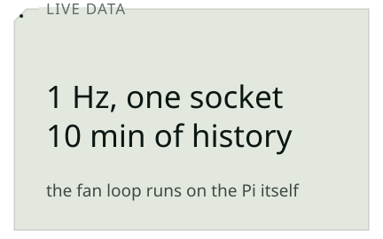</picture><picture><source media="(prefers-color-scheme: dark)" srcset=".github/readme/spec-7-dark.svg">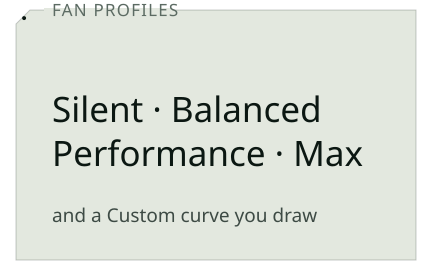</picture><picture><source media="(prefers-color-scheme: dark)" srcset=".github/readme/spec-8-dark.svg">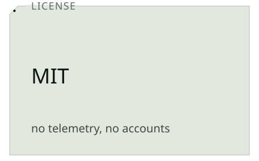</picture>
  </p>
</div>

<picture><source media="(prefers-color-scheme: dark)" srcset=".github/readme/rule-dark.svg"></picture>

<p align="center">
  <picture><source media="(prefers-color-scheme: dark)" srcset=".github/readme/tile-preview-dark.webp">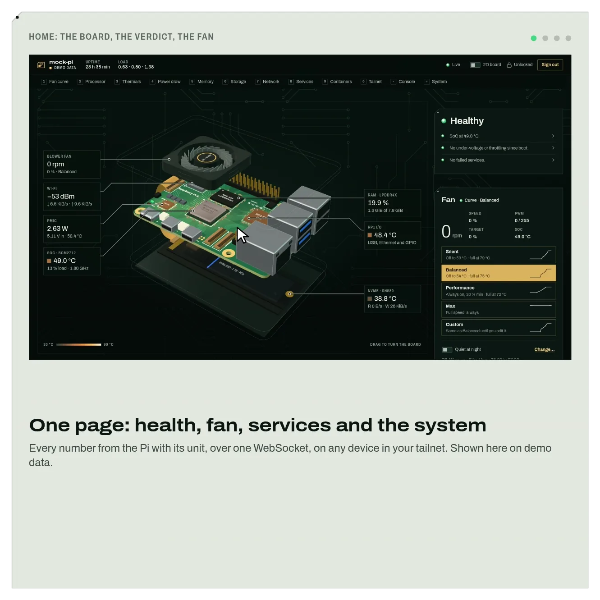</picture><picture><source media="(prefers-color-scheme: dark)" srcset=".github/readme/tile-stack-1-2-dark.webp">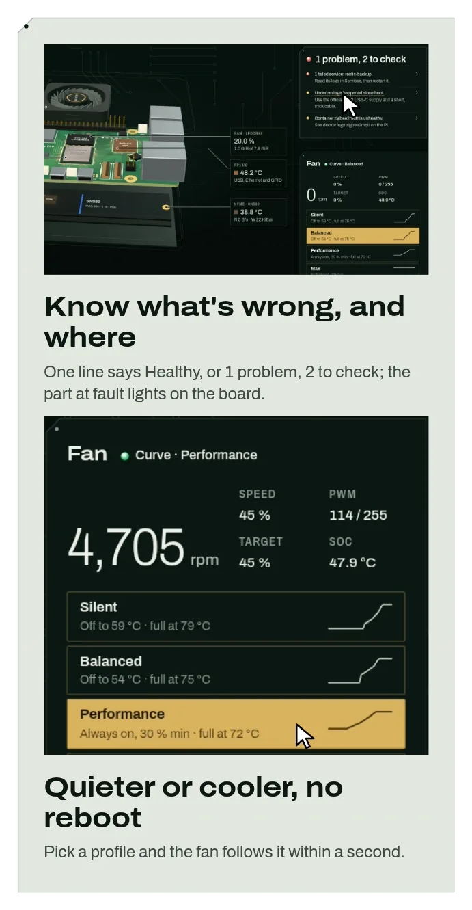</picture>
  <picture><source media="(prefers-color-scheme: dark)" srcset=".github/readme/tile-feature-3-dark.webp">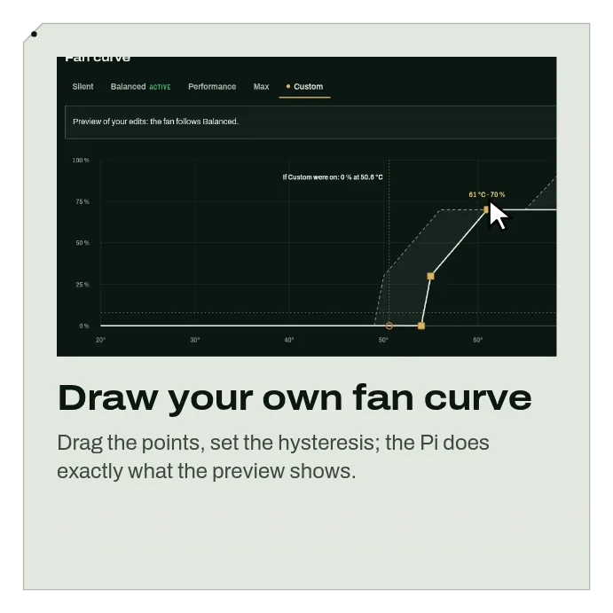</picture><picture><source media="(prefers-color-scheme: dark)" srcset=".github/readme/tile-feature-4-dark.webp">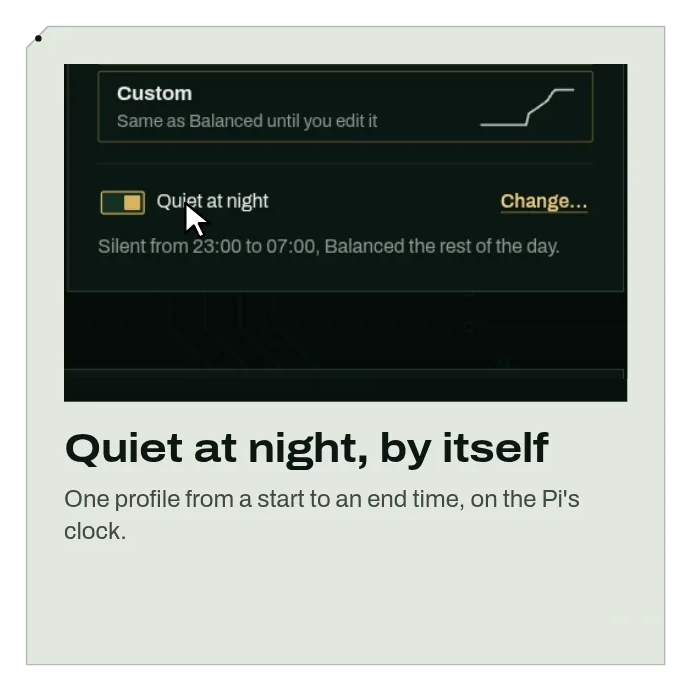</picture><picture><source media="(prefers-color-scheme: dark)" srcset=".github/readme/tile-feature-5-dark.webp">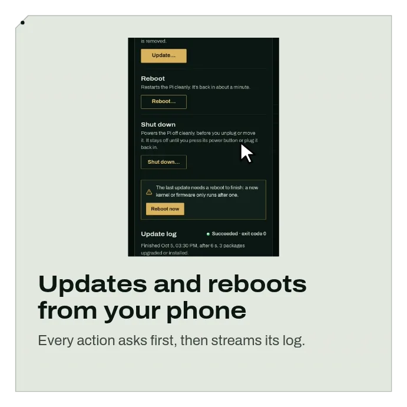</picture>
  <picture><source media="(prefers-color-scheme: dark)" srcset=".github/readme/tile-feature-6-dark.webp">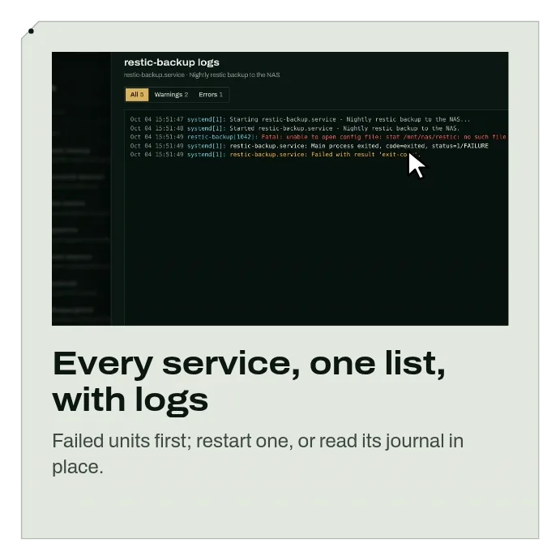</picture><picture><source media="(prefers-color-scheme: dark)" srcset=".github/readme/tile-feature-7-dark.webp">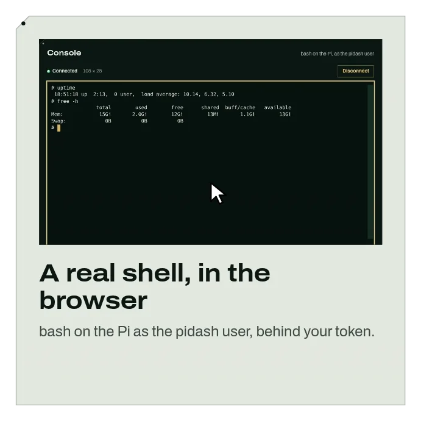</picture><picture><source media="(prefers-color-scheme: dark)" srcset=".github/readme/tile-feature-8-dark.webp">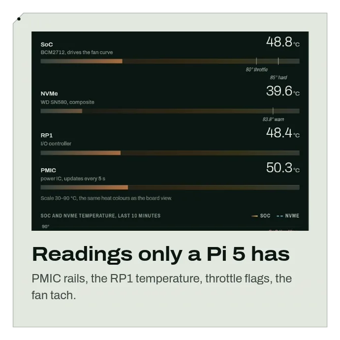</picture>
  <picture><source media="(prefers-color-scheme: dark)" srcset=".github/readme/tile-code-dark.webp">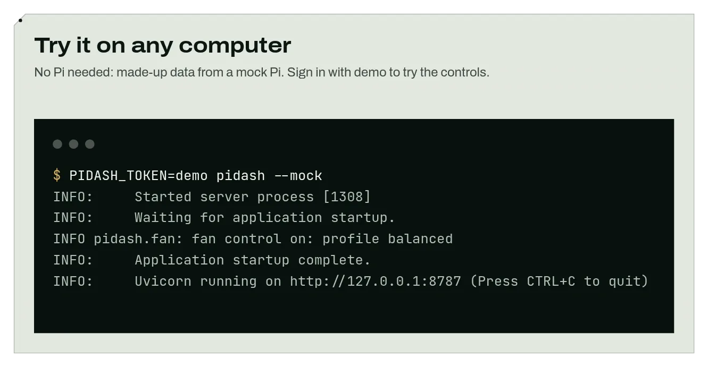</picture><picture><source media="(prefers-color-scheme: dark)" srcset=".github/readme/tile-list-dark.webp">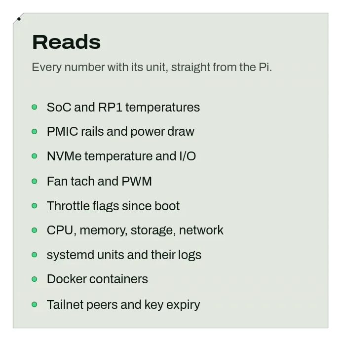</picture>
</p>

<picture><source media="(prefers-color-scheme: dark)" srcset=".github/readme/rule-dark.svg"></picture>

## How it works

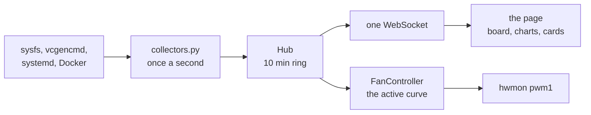

pidash runs on the Pi as one FastAPI process. The collectors read sysfs, `vcgencmd`, systemd and Docker once a second, the Hub keeps the last 10 minutes and fans each reading out over one WebSocket, and the fan loop drives the PWM from the active curve whether or not a browser is open.

## Quick start

```console
$ git clone https://github.com/cosminfuica/raspberrypi-dashboard && cd raspberrypi-dashboard
$ cd frontend && npm ci && npm run build && cd ..
$ python3 -m venv .venv && .venv/bin/pip install -e ./backend
$ PIDASH_TOKEN=demo .venv/bin/pidash --mock
INFO:     Started server process [1308]
INFO:     Waiting for application startup.
INFO pidash.fan: fan control on: profile balanced
INFO:     Application startup complete.
INFO:     Uvicorn running on http://127.0.0.1:8787 (Press CTRL+C to quit)
```

> [!TIP]
> That is the whole dashboard on made-up data from a mock Pi, at <http://127.0.0.1:8787>; sign in with `demo` to try the controls. It needs Python 3.11 and Node.js 20.19 or newer. On a Raspberry Pi 5, `sudo ./install.sh` sets it up for real: see [Usage](#usage).

## Usage

| Command or key | What it does |
|---|---|
| `sudo ./install.sh` | On the Pi: installs pidash as a service, shares it on your tailnet on port 8787 and prints your token once. Run it again to update: it keeps your settings, token and fan profile |
| `sudo grep TOKEN /etc/pidash/pidash.env` | Shows your token again |
| `sudo systemctl restart pidash` | Applies a change to `/etc/pidash/pidash.env` |
| `journalctl -u pidash -f` | Follows pidash's own log |
| `sudo ./install.sh --no-docker` | The same install, with the `pidash` user kept out of the root-equivalent `docker` group. The Containers panel then says it can't read Docker. Later updates keep this choice |
| `sudo ./install.sh --docker` | Puts the `pidash` user back in the `docker` group after a `--no-docker` install |
| `sudo ./uninstall.sh` | Removes everything `install.sh` added and hands the fan back to your `config.txt` settings |
| `pidash --mock` | Serves made-up data, on any computer |
| <kbd>1</kbd>-<kbd>0</kbd>, <kbd>-</kbd>, <kbd>=</kbd>, <kbd>/</kbd> | In the dashboard: the number row jumps between sections, <kbd>/</kbd> searches the services |

Installing on the Pi (64-bit Raspberry Pi OS "trixie", with Tailscale), over SSH or in its terminal:

```bash
sudo apt update && sudo apt install -y --no-install-recommends git nodejs npm python3-venv
git clone https://github.com/cosminfuica/raspberrypi-dashboard ~/pidash
cd ~/pidash/frontend && npm ci && npm run build
cd ~/pidash && sudo ./install.sh
```

Then open <http://raspberrypi:8787> on any device in your tailnet, with your Pi's name from `tailscale status`.

## Configuration

<details>
<summary><b>What do I need?</b></summary>

A Raspberry Pi 5 on 64-bit Raspberry Pi OS "trixie", with Tailscale on the Pi and on each device you'll open it from. Fan
control needs a fan on the Pi 5's FAN connector, such as the official Active Cooler or an Argon NEO 5 case. Other Pi
models aren't tested: on them, the readings only a Pi 5 has (fan control, PMIC power, the RP1 temperature) show as
unavailable. Building the page needs Node.js 20.19 or newer, which Bookworm lacks: build on another computer, copy the
folder to the Pi, and run `sudo ./install.sh` there.

</details>

<details>
<summary><b>Where do the settings live?</b></summary>

In `/etc/pidash/pidash.env`, one per line with nothing after the value: systemd would read a trailing comment as part
of it. The defaults:

```ini
PIDASH_TOKEN=<random, printed once by install.sh>
PIDASH_CONSOLE=1
PIDASH_CONSOLE_IDLE_S=900
PIDASH_FAN_CONTROL=1
PIDASH_PORT=8787
PIDASH_HOST=127.0.0.1
```

An empty token makes it look-only, `PIDASH_CONSOLE=0` turns the web console off, `PIDASH_FAN_CONTROL=0` leaves the fan
to your `config.txt`, and `PIDASH_HOST` stays as it is. Every setting is in [docs/API.md](docs/API.md#configuration).

</details>

<details>
<summary><b>How does it work?</b></summary>

pidash runs on the Pi as a small FastAPI service. It reads the sensors, systemd and Docker, keeps the last 10 minutes
of readings and drives the fan, with or without a browser open. Your browser gets the readings about once a second
over one WebSocket. Looking needs no sign-in. The fan, updates, reboot, shut down, service restarts and logs, and the
console need your token, which the browser trades for a sign-in cookie that lasts 7 days.

</details>

<details>
<summary><b>What happens to the fan if pidash stops or crashes?</b></summary>

Your `config.txt` fan settings take over again. pidash only parks the kernel's fan curve while it runs and never
writes `config.txt`, and systemd runs `pidash --restore-fan` after every stop or crash and notices a hang within 15&nbsp;s.
While pidash runs, the fan goes to 100&nbsp;% at 80&nbsp;&deg;C, or when the temperature can't be read, until the SoC is below
75&nbsp;&deg;C, whatever the profile.

</details>

<details>
<summary><b>Who can see it, and who can change things?</b></summary>

pidash listens on the Pi itself only (`127.0.0.1`), and `install.sh` shares it with your tailnet through `tailscale
serve`, so it's not on your LAN or the internet. Don't forward port 8787 or run `tailscale funnel` for it. Anyone on
your tailnet sees every reading; changes, service logs and the console need the token. The console is a shell as the
`pidash` user, which is in the `docker` group and so as good as root: set `PIDASH_CONSOLE=0` or install with
`--no-docker` if that's too much. Every change is logged to `/var/lib/pidash/audit.log` ([more](docs/API.md#security-notes)).

</details>

<details>
<summary><b>Can I use HTTPS, or skip Tailscale?</b></summary>

For HTTPS, turn on "HTTPS Certificates" on the DNS page of the Tailscale admin console, then run
`sudo tailscale serve --bg --https=443 http://127.0.0.1:8787` on the Pi: it's then also at
`https://raspberrypi.<your-tailnet>.ts.net/`. Without Tailscale, use an SSH tunnel from your computer, with your Pi's
user name and address, and open <http://localhost:8787> while it runs:

```bash
ssh -L 8787:127.0.0.1:8787 pi@raspberrypi.local
```

</details>

<details>
<summary><b>Something isn't working. Where do I look?</b></summary>

`404 page not found` means you opened the `100.x` address: use the Pi's name instead. Most permission problems (the fan
card says Kernel curve, Containers says permission denied, Power shows unavailable, a restart fails with a sudo error)
are fixed by running `sudo ./install.sh` again. Then check pidash's own log, and for a failed update,
`/var/log/pidash-update.log`.

</details>

## Contributing

```bash
git clone https://github.com/cosminfuica/raspberrypi-dashboard && cd raspberrypi-dashboard
cd backend && python3 -m venv .venv && .venv/bin/pip install -e .
.venv/bin/python -m unittest discover -s tests -t tests   # backend tests
cd ../frontend && npm ci && npm test                       # frontend tests
npm run dev                                                # the page at http://localhost:5173/?demo
```

Found a bug or want a feature? [Open an issue](https://github.com/cosminfuica/raspberrypi-dashboard/issues). You don't
need a Pi: the page's `?demo` mode (sign in with `demo`) and `pidash --mock` serve made-up data, and the browser checks
in [frontend/scripts](frontend/scripts) cover the nav, sign-in and every action.

<picture><source media="(prefers-color-scheme: dark)" srcset=".github/readme/contribute-dark.svg">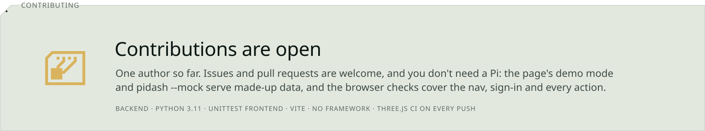</picture>

## License

MIT - see [LICENSE](LICENSE).

<div align="center">
  <picture>
    <source media="(prefers-color-scheme: dark)" srcset=".github/readme/outro-dark.svg">
    
  </picture>
  <p><a href="#readme">Back to top</a></p>
</div>
