# Design improvement plan: pidash web page and README

Review of 2026-09-29 · frontend at `cd0cee6` · kanban t_5d298674

This plan feeds five downstream tasks:

| Task | Role |
|---|---|
| t_c645c12e | code changes |
| t_355f1cb3 | generated assets |
| t_504745a8 | putting the assets into the page |
| t_00607910 | README |
| t_4ce6f0a7 | QA |

Items are numbered so each task can check them off: **H** = high, **M** = medium, **L** = low, **A** = asset, **R** = README. Every finding was either measured or read in the code. This review changed nothing in the app.

- **Screenshots:** `docs/design-review/2026-09-29/`
- **Scripts, Lighthouse reports and the mark draft:** `.impeccable/review/2026-09-29/`. See `scripts/README.txt` there for how to run each one.
- **Test setup:**
  - Data: the in-browser demo (`?demo`), the mock backend (`pidash --mock`) and the production build (`vite build`).
  - Browser: headless Chromium 1243 (Playwright 1.63).
  - Widths: 360, 375, 390, 768, 820, 1024, 1180, 1280, 1366, 1440, 1920 and 2560 px.

---

## 1. Current state

### 1.1 Summary

pidash already has a committed design of its own:

- The page is drawn in the Pi's own manufacturing language: solder mask, silkscreen, ENIG gold pads, a heat ramp and LED health colours.
- One variable typeface carries the whole hierarchy.
- The exploded 3D board with live callouts makes a memorable hero.
- Keyboard focus, reduced motion, low-power mode and text contrast are solid.

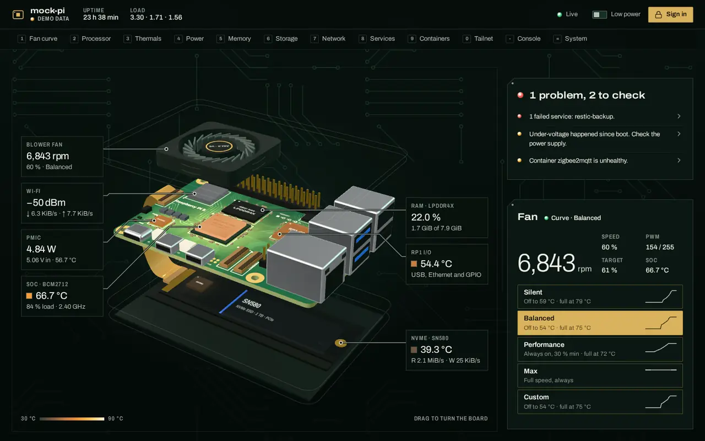

The next level is not a new look. It is making the current look hold up everywhere:

1. **The Health First Rule breaks at 1024×768.** On tablets the verdict sits at the bottom edge of the screen.
2. **The first second is unsteady.**
   - When the verdict list arrives it pushes the page down (CLS 0.102 on phones).
   - All seven callouts sit in one pile until the 3D view is ready.
3. **The board's brightest objects are the Ethernet and USB shells**, not the hot parts.
4. **Accessibility gaps:**
   - Three failing audits.
   - Input borders below 3:1 contrast.
   - Forced-colors mode loses every state that is shown only by colour.
5. **Slow delivery.**
   - The backend sends about 850 KB on first load, 762 KB of it uncompressed text, and nothing is cached long-term.
   - The 3D scene builds in a single long task.
6. **The healthy state says the least**, although it is the one the owner sees most. The browser tab title never shows health.
7. **README gaps:**
   - A generic mark.
   - A 3.1 MB GIF tour behind a link.
   - No social preview.

### 1.2 Measured baseline

| Check | 375×812 | 768×1024 | 1024×768 | 1440×900 | Script |
|---|---|---|---|---|---|
| Verdict and its reasons above the fold | yes | yes, with 36 px to spare | **no**: the last reason ends at 826 px | yes | `fold.mjs` |
| Layout shift (CLS), production build | **0.102** | 0.003 | 0.003 | 0.017 | `proto5.mjs` (base) |
| Hostname in the header | **cut off** (68 of 71 px for `mock-pi`) | full | full | full | `hostfit.mjs` |
| Width of each fan readout column | – | 56 px | 120 px | – | `cut2.mjs` |

Lighthouse 12 on the production build. These are lab runs with SwiftShader, which is software WebGL and inflates 3D costs, so only compare them with runs made the same way:

| | Perf | A11y | Best pr. | SEO | FCP | LCP | TBT | CLS |
|---|---|---|---|---|---|---|---|---|
| Desktop | 54 | 96 | 100 | 90 | 0.7 s | 2.2 s | 2,220 ms | 0.018 |
| Mobile | 29 | 92 | 100 | 90 | 3.9 s | 9.2 s | 6,640 ms | 0.102 |

Other measurements:

- **Text contrast:** every text element is at least 4.5:1. The faintest text token, silk-3 `#8a9a90`, is 6.2:1 on the mask. No target is under 24 px. (`probe.mjs`)
- **Focus:** the first 14 tab stops all show the 2 px `#f0cf7e` ring, offset 2 px. They are the skip link, Low power, Sign in and 11 nav keys. (`focus.mjs`)
- **axe-core 4:** one critical violation, `aria-valid-attr-value`. It ran on WCAG 2.2 A/AA plus best practice, at 375 and 1440 px, with motion on and with reduced motion. (`axe.mjs`)
- **Input borders:** 2.34:1 against the surface behind them. WCAG 1.4.11 needs 3:1. (`inputs.mjs`)
- **First load from a real Pi** (served by `pidash --mock`, checked with curl):
  - About 762 KB of uncompressed text (`index.html`, the index CSS and JS, and the 3D chunk) plus an 88 KB woff2 font (`archivo-latin-standard-normal`, 90,104 bytes).
  - At gzip level 6 the text would be about 205 KB.
  - `/assets/*` files have an ETag but no `Cache-Control`.
- **3D scene** (`scene-cost.mjs`):
  - `import()` takes 17 ms.
  - `createScene3D()` is one main-thread task of 668 ms at normal CPU speed, and 950 ms with the CPU throttled to a quarter.
- **`impeccable detect`:** no real findings. Its hits are heading sizes set in CSS, which it can't resolve, and the "—" placeholders shown for unknown values.

### 1.3 Audit health score

| # | Dimension | Score | Key finding |
|---|---|---|---|
| 1 | Accessibility | 3 | Keyboard, focus and text contrast are right. Gaps: one invalid ARIA reference, a label-in-name error on 5 radios, input borders at 2.34:1, and state lost in forced colors. |
| 2 | Performance | 2 | Assets are sent uncompressed and uncached. The 3D build is one task of 0.67–0.95 s. |
| 3 | Responsive | 3 | Phone and desktop layouts are right. 1024×768 breaks the Health First Rule, phone CLS is 0.102 and the hostname is cut off. |
| 4 | Theming | 3 | The token system is coherent. One token (input borders) is too faint, and there are no forced-colors rules. |
| 5 | Implementation integrity | 3 | Coherent and intentional. Small gaps: callouts show before they are placed, an entrance hook has no styles, and one status marker is gold. |
| | **Total** | **14/20** | **Good.** Address the weak dimensions. |

The implementation-integrity check passes. The page expresses one product-specific system: the named rules in DESIGN.md are all visible in the CSS, and the detector found nothing generic.

### 1.4 Keep: these decisions are settled

- **The PCB direction and the named rules in DESIGN.md.** They are:
  - One Meaning: the heat ramp means temperature, LEDs mean health, gold means controls.
  - Cool Field, Width Axis, Tabular, Health First, Flat Board, 45° and No Round Card.
- **One family, Archivo Variable.** Hierarchy comes from its width and weight axes.
- **The hero.**
  - The exploded 3D board, with callouts in fixed columns.
  - Leaders routed at 45° and 90°. They no longer cross (t_d949efc5).
  - The 2D drawing as the fallback for low power or no WebGL.
- **The fixed 30–90 °C heat scale.** A cool board reads as dim copper on purpose.
- **Dark only.** There is no light theme, and none is proposed.
- **Navigation.**
  - The keyed section strip (1–0, then - and =) with scroll spy.
  - The sticky stage on desktop.
- **Earlier QA work** from t_d949efc5 and t_8101fb1f:
  - 60 fps when idle.
  - DNP notes.
  - Stale data dims.
  - The page reloads itself after an install.
- **The README** rewritten in t_cc4ebf2e: its structure, the framed screenshots and the alt texts.

### 1.5 Where it falls short

**The Health First Rule, at 1024×768 and on tablets.** Below 1100 px the page is one column in nav order, so the stage comes first and the verdict after it.

- At 1024×768, the last reason ends 58 px below the fold.
- At 768×1024:
  - The verdict sits at the bottom edge, from 801 to 988 px.
  - The fan card starts below the fold.
  - The fan readout columns are only 56 px wide.

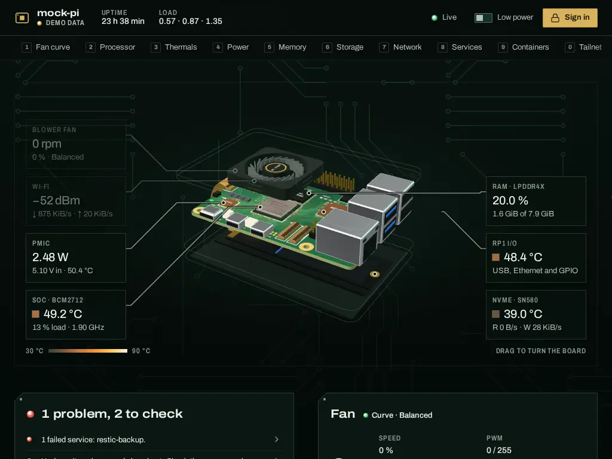
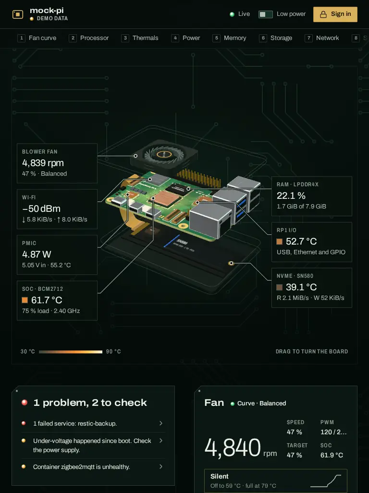

**The first second.**

- **The verdict list starts empty** (`index.html:94`). When data arrives it grows by three rows (125 px). That moves the stage on phones (CLS 0.102) and the fan card on desktop.
- **Callouts pile up before the 3D view exists.**
  - Callouts are absolutely positioned at 0,0, and `layout()` returns until an implementation exists.
  - So before the 3D chunk is ready, all seven callouts sit on one spot at the stage's top left.
  - On a 4 Mbit/150 ms link this lasted from 0.87 s to 2.78 s (`pile.mjs`). Only the top box shows, with "—" values.
- **A staggered entrance was planned but never styled.** `stage.js:177` sets `--i` on each callout, and `enter()` sets `data-enter` on the list (`:291`) for 2.6 s, but no CSS uses either.

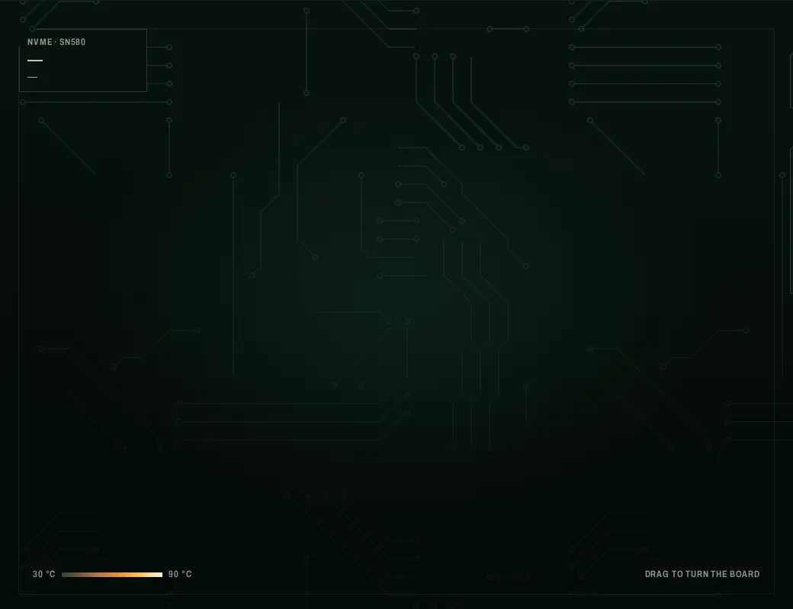

**The hero's focal point.**

- The brightest pixels on the board are the port shells: `M.silver` in `scene3d.js:301`, with metalness 1 and roughness 0.3.
- So the eye lands on the Ethernet jack before the SoC.
- Toning that one material down removes 37 % of the near-white pixels (M1).

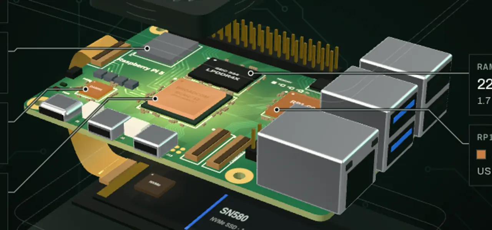

**The phone header.**

- At 360–375 px, the gold Sign in pad (92 px) and Low power (101 px) leave only 53–68 px for the hostname.
- So every name tested is cut off; `mock-pi` needs 71 px.
- Signed in it is worse: the padlock plus Sign out leave 57 px at 375.
- The gold pad is also the most saturated thing in the header. It outranks the red verdict LED below it.

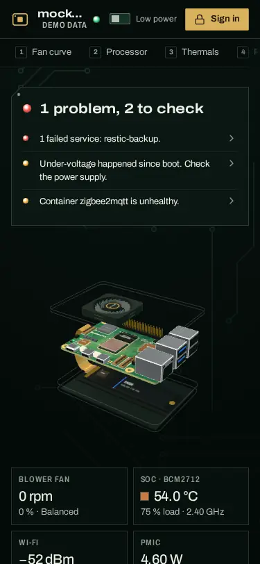

**Failing audits and non-text contrast.**

- `aria-valid-attr-value` (axe critical, and Lighthouse): the fan curve tabs point `aria-controls="fan-panel"` at an id that doesn't exist (`fan.js:205`).
- `label-content-name-mismatch` (Lighthouse): the five network interface radios have an `aria-label` that leaves out their visible text (`main.js:939`).
- `color-contrast` (Lighthouse mobile):
  - New rows in the top-processes table fade in from opacity 0 (`util.js:235`).
  - Lighthouse caught them mid-fade at 2.18:1 and 1.51:1.
  - silk-3 text needs at least 0.82 opacity to reach 4.5:1 (`fade.py`).
- Form-field borders (search, hysteresis, curve points and the sign-in token) use silkscreen at 0.30, which is 2.34:1.
- The page has no `meta description` (SEO 90).

**Forced colors (Windows High Contrast).** `style.css` has no `@media (forced-colors: active)` rules.

- Lost:
  - The verdict and check LEDs, the heat swatches and the scale bar.
  - Every meter fill: per-core bars, the CPU-time stack, and the memory and swap bars.
  - The legend swatches.
  - Every selection mark: the selected fan profile, the current nav tab, the current profile tab and the selected Services filter.
- Survives: text, outlines, the canvas charts (the memory area fill barely does) and the WebGL board.

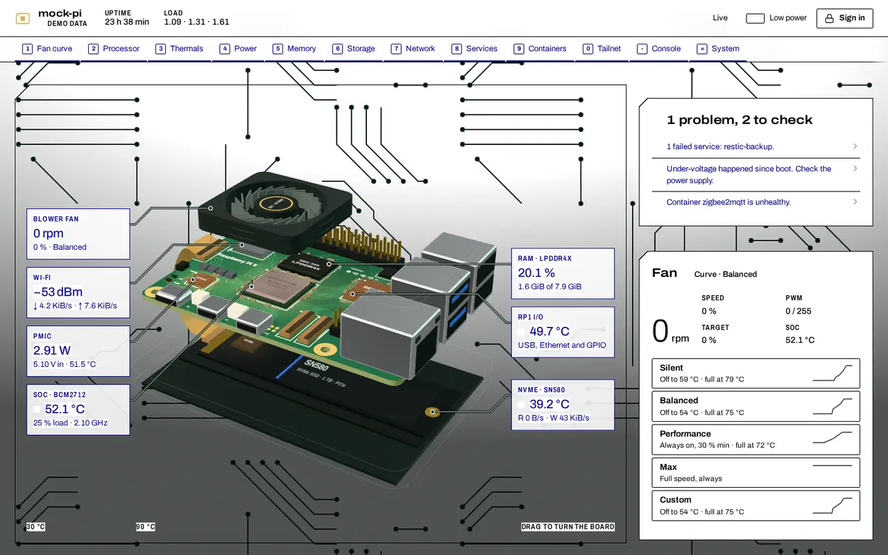
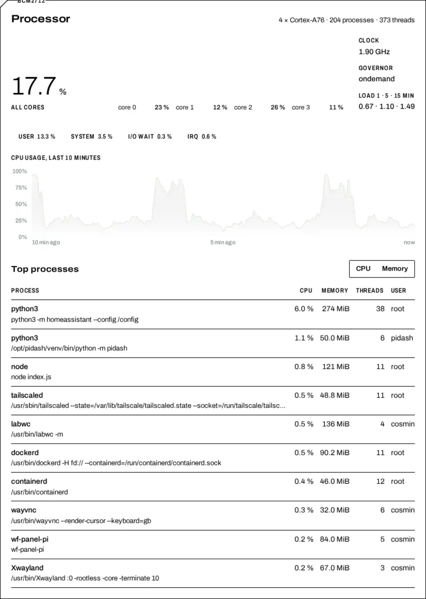

**The low-power drawing.**

- Everything is drawn with one hairline weight (0.22).
- Chips are bare rectangles and ports are flat grey blocks.
- The PCIe ribbon and the fan cable are dashed assembly lines, and the NVMe carrier is empty.
- It reads as a placeholder next to the 3D view. It is also what a phone in low-power mode shows all the time.

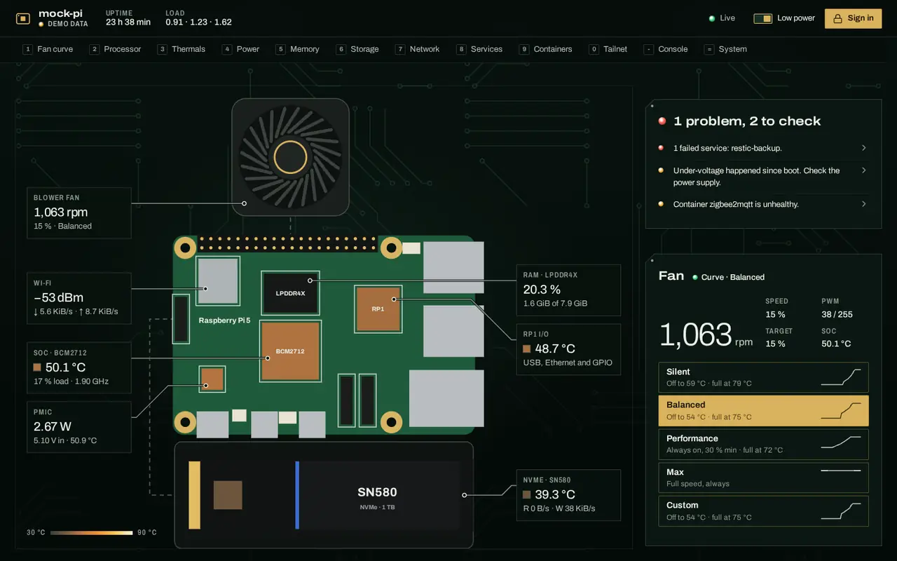

**Healthy says the least.**

- When nothing is wrong, the verdict shows "Healthy" and a single row, "SoC at 43.5 °C." Only the SoC check adds an ok row (`main.js:423–490`).
- So the state the owner sees most often is the least informative.
- The browser tab title never shows health either (`main.js:300`).

**Delivery.** See the bytes, cache and long-task figures in 1.2.

**Small truths.**

- **Two SoC readings.** The fan card's "SoC" is `control_temp_c`, the fan controller's own sample (`fan.py:345,402`). The callouts and Thermals use `temps.soc_c`. So the README hero shows 44.6 °C next to 43.5 °C.
- **Custom looks like Balanced.** Custom starts as a copy of Balanced (`fan.py:130`), so two pads show the same hint and curve.
- **Gold used for status.** Services marks a changed row in gold (`style.css:1743`). That draws a status in the control colour, which breaks the One Meaning Rule.
- **Stale DESIGN.md.** It still says callouts have a 6 px backdrop blur (line 244). t_d949efc5 removed it.

**The end of the page.**

- At 1440 px the footer markings wrap "Rev 1.0" and "(aarch64)", and the column gaps are uneven.
- The signed-out update log and the demo console are large empty areas. Both are honest states (see L4).

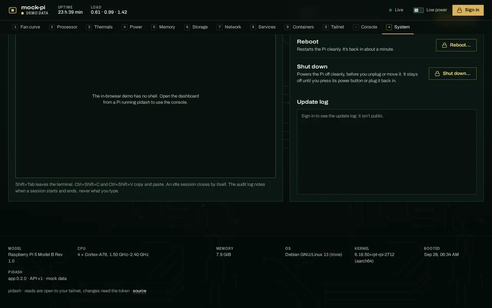

**Ultra-wide is fine.** At 2560×1440 the main column stops at 1640 px and the stage at 760 px tall, and type stays at instrument size. No change is proposed.

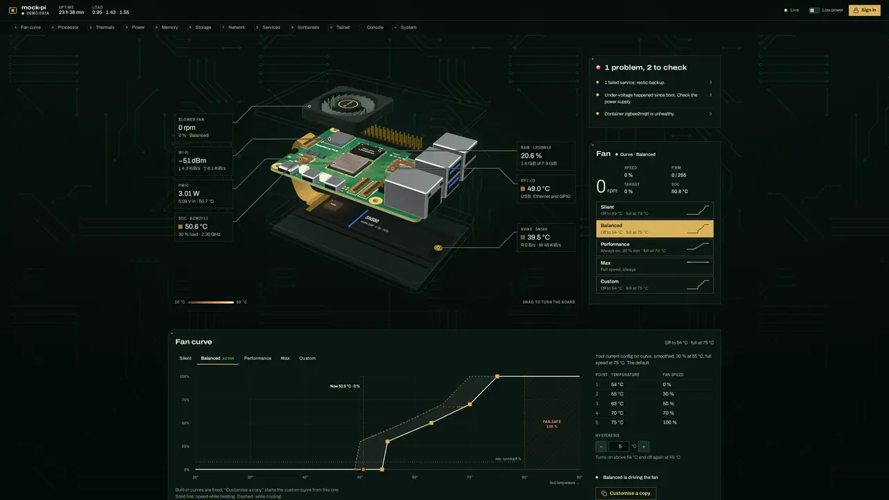

**The README.**

- **Generic mark.** It opens with the favicon at 96 px, a rounded rectangle with a square and a dot. It could belong to any app.
- **Busy hero screenshot.** The hero is a real 1600×1000 capture, but at README width:
  - The grey sublines are borderline to read.
  - The gold Sign in pad pulls the eye.
  - The two SoC values disagree.
- **Heavy tour.** The tour is a 3.1 MB GIF behind a link.
- **Missing pieces:** no social preview image, no "how it works" picture and no closing section.
- **Orphaned screenshots.** Five files in `docs/screenshots/` (652 KB) are not referenced anywhere.

---

## 2. Improvements

Each item gives the reason (with evidence), the exact change, the affected files, the expected effect and the check. Every script named here is in `.impeccable/review/2026-09-29/scripts/`.

### High

#### H1. Put the verdict first below 1101 px

> [x] **Done** (t_c645c12e, branch `wt/t_c645c12e`). As specified: the phone hero rules moved into the 1100 px block with `align-items: stretch`, plus the 701–1100 px band, the shorter stage and the two-column fan card. DESIGN.md › Responsive rewritten. Check: health above the fold at 10/10 viewports, no fan reading truncated, stage 331–751 at 1024×768.

**Why.**

- The Health First Rule (DESIGN.md:201) fails at 1024×768.
- On tablets:
  - The verdict barely makes the fold.
  - The fan card starts below the fold.
  - Its four readings get 56 px columns.

Phones already put the verdict first (`style.css:2830–2844`). The same idea should cover everything below 1101 px.

**Change**, in `frontend/src/style.css`:

1. **Move the phone rules into the 1100 px block.** Take the four hero rules out of the 700 px block (`.hero`, `.hero-side`, `.verdict`, `.fanctl` at 2830–2844) and put them in the `@media (max-width: 1100px)` block (2737–2766). There they replace the `.hero-side` two-column grid (2746–2751).
2. **Add `align-items: stretch`.** Without it, the stage collapses to its content width in a flex column.
3. **Delete the leftover rule.** `.hero-side { grid-template-columns: 1fr }` (2827–2829) no longer does anything.
4. **Add a new block for 701–1100 px.** It holds the verdict band, the shorter stage and the two-column fan card.

```css
@media (max-width: 1100px) {
  .hero { display: flex; flex-direction: column; align-items: stretch; }
  .hero-side { display: contents; }
  .verdict { order: -1; margin-bottom: 24px; }
  .fanctl { margin-top: 32px; }
}
@media (min-width: 701px) and (max-width: 1100px) {
  /* the verdict band and the stage share one viewport; 356px = header + strip + band + gaps, re-derive with proto4.mjs if any of them change */
  .stage { height: clamp(420px, calc(100svh - 356px), 620px); }
  .verdict { display: grid; grid-template-columns: minmax(200px, 1fr) minmax(0, 2fr); column-gap: 32px; align-items: start; }
  .verdict .fp-head { margin: 0; }
  .verdict .checks { grid-column: 2; grid-row: 1 / span 2; }
  /* fan card: readout and notices on the left, the profiles on the right */
  .fanctl { display: grid; grid-template-columns: minmax(0, 2fr) minmax(0, 3fr); column-gap: 32px; align-items: start; }
  .fanctl > * { grid-column: 1; }
  .fanctl > .pads, .fanctl > [data-bind='pads-note'] { grid-column: 2; }
  .fanctl > .pads { grid-row: 1 / span 5; margin-top: 0; }
  .fan-live { grid-template-columns: minmax(0, 1fr); }
  .fan-live .kv { grid-template-columns: repeat(2, minmax(0, 1fr)); }
}
```

**Files:** `frontend/src/style.css`, and DESIGN.md "Layout › Responsive" (lines 192–198). The DESIGN.md text becomes:

> Under 1100 px: one column; the verdict comes first (701–1100 px: a band with its reasons beside the headline), then the stage (short enough to end at the fold with the band), then the fan card (701–1100 px: readout | profiles). The stage stops being sticky.

The phone bullet keeps only the callout grid, the 16 px padding and the sideways-scrolling strip.

**Effect.** Measured with `proto4.mjs` on the production build, with H2's row reservation applied:

| Viewport | Verdict and reasons above the fold | Stage (top–bottom) | CLS |
|---|---|---|---|
| 768×1024 | yes (was at the edge) | 331–951 | 0.001 |
| 820×1180 | yes | 331–951 | 0.001 |
| 1024×768 | **yes (was no)** | 331–751 | 0.002 |

- Fan readout columns grow from 56 to 122 px at 768, from 69 to 133 at 820, and from 120 to 173 at 1024 (`cut2.mjs`). Nothing is truncated.
- The screenshot below is the prototype.

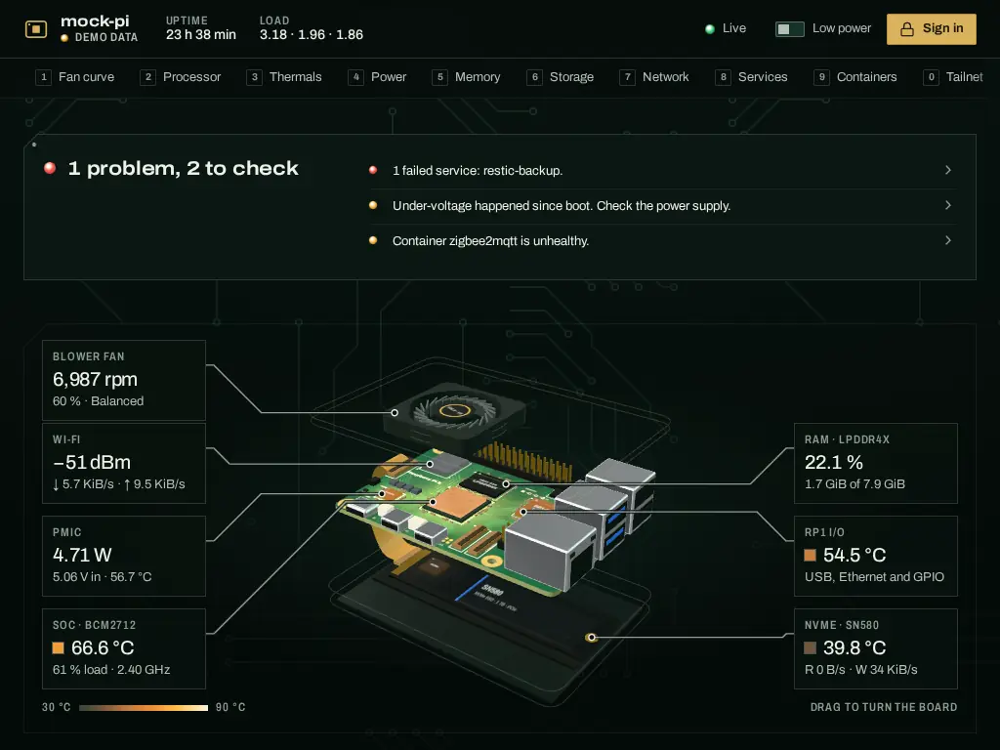

**Check.** `fold.mjs` reports `healthAboveFold` true at all 10 viewports. `proto4.mjs` confirms the stage bounds.

#### H2. Keep the first paint still

> [x] **Done.** (a) placeholder row in `index.html`, (b) `.checks { min-height: 108px }`, (c) `data-placed` in `setMode()` with the "Loading the board…" hint (also the hint's initial text in `index.html`), (d) the clip-path entrance. Check (production build, demo): CLS 0.013 at 375×812 (was 0.102), 0.001 at 768, 0.002 at 1024×768, 0.007 at 1180, 0.005 at 1440; callouts stay hidden until placed (`pile`), and every box is unclipped after the entrance.

**Why.**

- Phone CLS is 0.102, over the 0.1 "good" limit, and tablets would reach 0.05 once H1 lands.
- The callouts pile up for up to about 2 s before the 3D view is placed.
- The entrance stagger was built but has no styles.

**Change.**

(a) **Placeholder row.** Ship one row in `index.html:94`. `renderVerdict` replaces it on the first data, because `list._html` starts out unset:

```html
<ul class="checks" data-bind="checks"><li><span class="check" data-tone="off"><span class="badge" data-tone="off"><i aria-hidden="true"></i><span></span></span><span class="check-text">Reading the Pi’s sensors…</span></span></li></ul>
```

(b) **Reserve three rows at every width.** Add `.checks { min-height: 108px; }` to `style.css` next to `.checks li` (line 1066).

- 108 px is three single-line rows (3 × 34.8 px, measured) plus two 1 px rules.
- This also keeps the fan pads still when one or two reasons come and go live. Today every change of 35 px moves the pads under the pointer.

(c) **Hide callouts until they are placed.** In `stage.js` `setMode()` (299–332):

- Just after `impl?.dispose()`, `delete root.dataset.placed` and set `hint.textContent = 'Loading the board…'`.
- After `layout(true)`, set `root.dataset.placed = ''`.
- Move the existing `hint.textContent = 'Drag to turn the board'` (`stage.js:309`) to just after `layout(true)`, inside `if (want === '3d')`. The hint is `aria-hidden` and already hidden in 2D mode, so nothing else changes.

In `style.css`:

```css
@media (min-width: 701px) {
  .stage:not([data-placed]) :is(.callouts, .leaders) { visibility: hidden; }
}
```

Phones are left out on purpose: their callouts are a static grid and are never stacked.

(d) **Give the existing entrance hook its styles.** The CSS below goes with the `.callouts` rules (`style.css:943`):

```css
.callouts[data-enter] .callout { animation: callout-in 0.4s var(--ease) both; animation-delay: calc(0.3s + var(--i) * 0.08s); }
@keyframes callout-in { from { clip-path: inset(0 0 100% 0); } to { clip-path: inset(0); } }
```

- Each box is revealed top-down just before its leader starts drawing (0.5 s + i × 0.08 s).
- **Use `clip-path`, not opacity or `transform`.** A clipped box never shows text at reduced contrast, so contrast audits can't catch it mid-fade. `layout()` owns the inline `transform`.
- `enter()` already skips this under reduced motion.

**Files:** `frontend/index.html`, `frontend/src/stage.js`, `frontend/src/style.css`.

**Effect.** Measured with `proto5.mjs` and `proto6.mjs` on the production build with demo data, including H1:

| Viewport | Today | With H1 + H2 |
|---|---|---|
| 375×812 | 0.102 | 0.054 |
| 768×1024 | 0.003 | 0.001 |
| 1024×768 | 0.003, verdict below the fold | 0.002 |
| 1180×820 | – | 0.011 |
| 1440×900 | 0.017 | 0.005 |

- The placeholder alone, without the reservation, made tablets worse (0.047–0.050). The two go together.
- The 0.054 left on phones is one reason wrapping to two lines, which makes three rows 125 px against the 108 reserved.
- The callouts no longer stack before the view is ready.

**Check.**

- `proto6.mjs` reproduces the CLS table.
- `pile.mjs` shows no visible callouts until `data-placed` is set.

#### H3. Clear every failing audit

> [x] **Done.** (a) `fan-panel` tabpanel, `fan-tab-*` ids and `aria-labelledby`; (b) the network radios lost their `aria-label`, and the arrows come from CSS with "down"/"up" as alt text; (c) new process rows flash their background; (d) `--silk-line-3` (0.40) on every form field and the console well; (e) meta description. Check: axe 0 violations at 375/1440, motion on and reduced; field borders 3.47:1; Lighthouse accessibility 100 and SEO 100 on desktop and mobile (the only audit left under 1 is `valid-source-maps`, a best-practices diagnostic).

**Why.** The QA gate (t_4ce6f0a7) asks for Lighthouse accessibility of at least 95 and no critical issues. Today mobile is at 92 with one critical axe violation, and form fields fail WCAG 1.4.11.

**Change.**

(a) **Fan tabs** (`aria-valid-attr-value`):

- `index.html:133` becomes `<div class="curve-wrap" data-ref="wrap" id="fan-panel" role="tabpanel">`.
- In `fan.js:205` each tab gets `id="fan-tab-${p.id}"`.
- `renderTabs()` sets `R.wrap.setAttribute('aria-labelledby', \`fan-tab-${tab}\`)`.

(b) **Network radios** (`label-content-name-mismatch`):

- Delete the `aria-label` in `main.js:939`, so each button's name is its visible text: name, state badge, address and rates.
- Print the arrows from CSS with alternative text, and set only the rate in `main.js:937–938`:

```css
.iface-rates .rx::before { content: '↓\00a0' / 'down '; }
.iface-rates .tx::before { content: '↑\00a0' / 'up '; }
```

(c) **New process rows** (`color-contrast` mid-fade):

- In `util.js:235`, replace the opacity fade with a background flash:
  `c.animate([{ backgroundColor: 'rgb(237 240 232 / 0.06)' }, { backgroundColor: 'rgb(237 240 232 / 0)' }], { duration: 900, easing: 'ease-out' })`.
- During the flash, silk-3 text stays at 5.4:1 or better.
- `flip()` is only used by the process table (`main.js:654`).

(d) **Form-field borders** (WCAG 1.4.11):

- Add a token next to `--silk-line-2` (`style.css:22`):
  `--silk-line-3: rgb(237 240 232 / 0.4); /* form-field boundaries: ≥ 3:1 on field, mask and raised mask */`.
- Use it for the borders of `.cell-in input, .hyst input` (1427), `.search input` (2090) and `.field input` (2661).
- At 0.40, contrast is 3.46:1 against the field, 3.31:1 against the mask and 3.05:1 against the raised mask (`inputborder.py`).
- Decorative outlines keep 0.30.

(e) **SEO.** Add to the `<head>` of `index.html`:
`<meta name="description" content="Live health, fan control and system actions for your Raspberry Pi 5." />`. This is the same sentence as the manifest.

**Files:** `frontend/index.html`, `frontend/src/fan.js`, `frontend/src/main.js`, `frontend/src/util.js`, `frontend/src/style.css`, and DESIGN.md:

- Line 159: add "0.40 for form-field boundaries".
- Line 250: say the field outline is 0.40.

**Effect.**

- Lighthouse accessibility is expected to reach 100 on desktop (from 96) and on mobile (from 92). These three are the only failing audits.
- SEO goes from 90 to 100.
- axe reports 0 violations.
- Field borders are at least 3.05:1.

**Check.** Run `axe.mjs`, `inputs.mjs` and Lighthouse, as described in `scripts/README.txt`.

#### H4. Send compressed, cached files

> [x] **Done.** `GZipMiddleware(minimum_size=1024, compresslevel=6)` and the immutable `Cache-Control` on `/assets/`; the old test now asserts the header, and a new one asserts gzip for `Accept-Encoding: gzip` and plain bytes without it. Check (curl, `pidash --mock`): the 3D chunk drops from 597 KB to 152 KB gzipped; the index JS is 42 KB, the CSS 12 KB and `index.html` 6 KB. First load is about 302 KB with the 90 KB woff2 (was about 850 KB), and `/` keeps `no-cache`. Backend: 87 tests pass.

**Why.**

- A real Pi sends about 850 KB on first load: 762 KB of uncompressed text plus the 88 KB font.
- The 3D chunk alone is 583 KB, and it would be 148 KB gzipped.
- The hashed `/assets/*` files have no `Cache-Control`, so every visit revalidates them.
- Lighthouse flags "text compression, est. 573 KiB" and "cache, 855 KiB".
- Over Tailscale to a phone, this is the single largest cost of the showpiece.

**Change**, in `backend/pidash/app.py`:

- In `create_app()`, add `from starlette.middleware.gzip import GZipMiddleware` and `app.add_middleware(GZipMiddleware, minimum_size=1024)`. It covers HTTP only; the WebSockets `/api/ws` and `/api/console/ws` are untouched.
- In `Frontend.file_response` (387–395), set `Cache-Control: public, max-age=31536000, immutable` when the path starts with `/assets/`. Vite names those files by content hash. Everything else keeps `no-cache`, which is still needed so pages reload after an install.

Add a test in `backend/tests/test_api.py`:

1. Call `serve(PIDASH_STATIC_DIR=<tmp dir>)`, where the dir holds `index.html` and an `assets/x-hash.js` over 1 KB.
2. Assert `content-encoding: gzip` for `Accept-Encoding: gzip`.
3. Assert the immutable header on `/assets/`, and `no-cache` on `/`.

**Files:** `backend/pidash/app.py`, `backend/tests/test_api.py`.

**Effect.**

- First load from a real Pi drops from about 850 KB to about 293 KB: text gzipped at level 6 (205 KB), plus the 88 KB woff2, which is already compressed.
- The console's xterm chunk drops from 323 KB to 80 KB the first time the console opens.
- Repeat visits don't re-request any hashed asset.

**Check.** Run `curl -sI -H 'Accept-Encoding: gzip' http://127.0.0.1:<port>/assets/<scene3d chunk>.js` against `pidash --mock`, then run the backend tests.

### Medium

#### M1. Let heat, not chrome, lead the board

> [x] **Done.** `M.silver` is `#a3a9ab`, metalness 1, roughness 0.5; DESIGN.md › Signature says so. Check: near-white pixels in the 1440 stage (demo, reduced motion) 2,184 → 889 (−59 %).

**Why.** The brightest things on the stage are the metal port shells. The hot SoC, RP1 and PMIC reach mid-value orange at most. PRODUCT.md says "the worst state on the board is the loudest thing on the screen".

**Change.**

- In `scene3d.js:301`, change `M.silver` to `std({ color: '#a3a9ab', metalness: 1, roughness: 0.5 })`.
- That one material is used by the Wi-Fi can (408), the USB and Ethernet shells (463, 469), the micro-HDMI ports (477) and USB-C (480).
- In DESIGN.md "Signature" (270–274), add: "Port shells and cans are brushed steel (roughness 0.5), dimmer than the SoC lid, so heat and the SoC lead the eye."

**Effect** (prototyped with `last.mjs`, same pose):

- Near-white pixels in the 1440 stage fall from 4,630 to 2,905 (−37 %).
- The ports still read as metal.
- The Ethernet jack still stands out by its size, which is true of the real board.

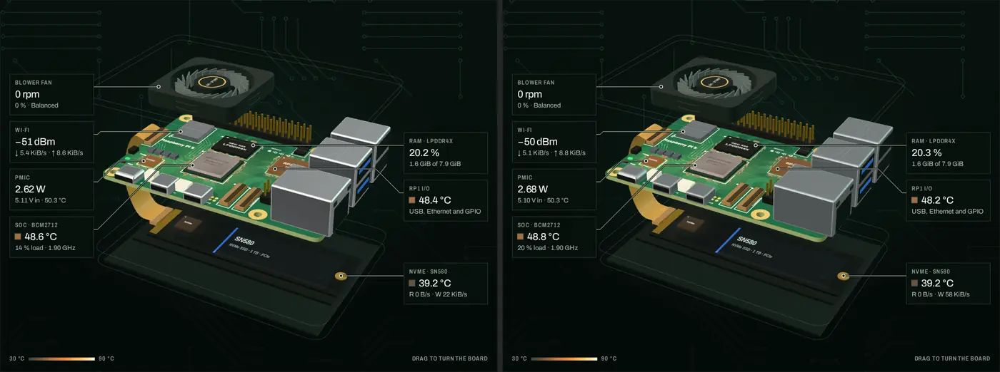

#### M2. Keep state visible in forced colors

> [x] **Done**, with three additions found in testing: the thermal strips, rails and Low power knob keep their colours; the selected profile, segment and latched console key get a Highlight *fill* (an outline would look like the focus ring); and the unselected nav keys and curve tabs get a Canvas underline, because forced colors paints their transparent ones too. `charts.js` draws every line in CanvasText without fills, dashes the second series (and its key), and redraws on the media query's `change`. DESIGN.md › Forced colors added. Check: forced-colors screenshots; LEDs, swatches, scale bar, selections and meters are visible.

**Why.** Windows High Contrast removes every state that is drawn only in colour (see 1.5).

**Change.** Add one block to `style.css`, after the reduced-motion block (2984):

```css
@media (forced-colors: active) {
  /* health and heat keep their own colours: they carry meaning the text doesn't repeat */
  .led, .badge > i, .verdict-word::before, .demo-tag::before, .callout .chip, .scale-bar, .legend i { forced-color-adjust: none; }
  /* meters: an outlined track. Plain fills turn Highlight; the segmented stacks keep their inline colours
     (inline styles win over this sheet), which still match their legend swatches */
  .core-bar, .meter, .stack { border: 1px solid CanvasText; }
  .core-bar i, .meter i, .stack i { forced-color-adjust: none; }
  .core-bar i, .meter i { background: Highlight; }
  .stack i + i { border-left: 1px solid Canvas; }
  /* selections drawn with fills or gold underlines */
  .fingers a[aria-current='true'], .tabs button[aria-selected='true'] { border-bottom-color: Highlight; }
  .pads button[aria-pressed='true'], .seg button[aria-checked='true'], .iface[aria-checked='true'] { outline: 2px solid Highlight; outline-offset: -2px; }
}
```

In `charts.js`:

- When `matchMedia('(forced-colors: active)').matches`, stroke every series in the chart canvas's computed `color`, which is CanvasText in this mode, and skip the fills.
- Redraw on that media query's `change` event.
- Today the near-white series vanish on light high-contrast themes.

**Files:** `frontend/src/style.css`, `frontend/src/charts.js`, and a new "Forced colors" paragraph in DESIGN.md "Elevation & Depth" or "Components".

**Check.** `forced.mjs` and `last.mjs` take `forcedColors: 'active'` screenshots.

- Pass when the selected profile, the current tab, the verdict LED, the core bars and the stack are all visible.

#### M3. Phone header: the padlock is the control

> [x] **Done.** At 420 px and under, the pad is its padlock alone (36 px: closed and gold, or open and ghost); the words stay for assistive tech, and a transparent `::before` makes it a 44 px touch target. Check: `raspberrypi`, `cosmin-pi` and `homelab-pi5` fit at 360, 375 and 390 px, signed in and out; the accessible name stays "Sign in"/"Sign out"; the focus ring shows; the hit area is 44×44 and doesn't take the Low power switch's taps.

**Why.** On phones the hostname is cut off in both signed-out and signed-in states (see 1.5), and the gold Sign in pad outranks the verdict.

**Change.**

At 420 px and below (`style.css:2954` block):

- `[data-bind='signin'] > span` and `[data-bind='lock-state'] > span` are visually hidden. Copy the declarations of the existing live-text rule at 2956–2962, so assistive technology still hears "Sign in" or "Sign out", and the status "Unlocked".
- `[data-bind='lock-state'] .ico { display: none; }`. The pad's own padlock shows the state instead.
- `[data-bind='signin'] { width: 36px; padding: 0; }`.
- `.only-xs { display: inline-block; }`, with `.only-xs { display: none; }` at all widths.

In `main.js:243`:

- The signed-in markup becomes `` `${ico(LockOpen, 'only-xs')}<span>Sign out</span>` ``. `LockOpen` is already imported.
- The ghost style stays, so on a small phone the pad shows a closed padlock in gold (Sign in) or an open padlock in the ghost style (Sign out).

On coarse pointers:

- Extend the hit area to 44 px with a transparent pseudo-element on the pad, leaving the layout unchanged. The pad is `position: relative`.
- Don't use `::after`, which is taken by the busy sheen (`style.css:475`).

**Effect.**

- The control shrinks from 92 px (signed out) or 93 px (signed in: padlock + Sign out) to 36 px.
- Measured with a 42 px pad (`hostfit.mjs`), 11-character names fit at 375 px. That includes `raspberrypi`, the default hostname.
- At 360 px, all but the widest tested name fit; `homelab-pi5` was 6 px short. The 36 px pad gains those 6 px.

**Check.**

- `header.mjs`: `host` shows visible equal to full width at 360, 375 and 390 px, signed in and signed out.
- `focus.mjs`: the pad still shows the focus ring.

#### M4. When healthy, show what was checked

> [x] **Done**, plus `?demo&healthy` in `mock.js`. Check: healthy demo shows "SoC at 52.7 °C.", "No under-voltage or throttling since boot.", "No failed services."

**Why.**

- Healthy is the most common state, yet it shows one row.
- Three rows prove more, and they fill H2's reserved space exactly.
- The data is already in `renderVerdict`.

**Change**, in `main.js` `renderVerdict()` (423–490):

- **Power and throttling:** when `th?.available` and none of the `now` or `since_boot` flags is set, add `add('ok', 'No under-voltage or throttling since boot.', '#thermals')`.
- **Services:** when `m.services?.available && !m.services.summary.failed`, add `add('ok', 'No failed services.', '#services')`.
- **The SoC row stays first.** `Array.prototype.sort` is stable, so the rows appear in insertion order among equals.

Both new rows fit on one line at 360 px (`fit.mjs`).

For demo QA, add `healthy: q.has('healthy')` to `opt` in `mock.js:10`, and skip the three built-in faults when it is set:

- the failed `restic-backup`,
- since-boot under-voltage,
- the unhealthy `zigbee2mqtt`.

The demo is never healthy today.

**Files:** `frontend/src/main.js`, `frontend/src/mock.js`.

#### M5. Make the verdict the page's headline (at 1101 px and wider)

> [x] **Done.** As specified; DESIGN.md has the Verdict role (typography front matter and Hierarchy), and Headline covers section headings only.

**Why.**

- The verdict uses the same Headline role as every section heading (DESIGN.md:176): 1.25rem.
- Right under it, the fan's 3rem rpm is the loudest text in the column.
- That inverts PRODUCT.md principle 2.

**Change.** In `style.css`, after `.verdict-word` (1041–1055):

```css
@media (min-width: 1101px) {
  .verdict-word { font-size: 1.75rem !important; font-stretch: 100% !important; line-height: 1.1; text-wrap: balance; }
  .verdict-word::before { width: 14px; height: 14px; }
}
```

In DESIGN.md "Hierarchy", add a role: "**Verdict** (700, 1.75rem, width 100 %, desktop): the health verdict; the page's headline." The Headline role then covers section headings only.

**Effect** (`fit.mjs`/`fit2.mjs`):

- At 1.75rem, every realistic headline stays on one line in the 360 px column (at 1180) and the 380 px column (at 1440).
- The one exception is "12 problems, 3 to check" at 1180, which balances onto two lines.
- 2rem wrapped even "1 problem, 2 to check" at 1180, so it was rejected.

#### M6. Build the 3D scene without blocking the page

> [x] **Done.** `yieldToPage()` between the five build phases, `compileAsync` before the first frame, and the canvas goes into the page only when the scene is ready. Check (`scene-cost.mjs`, SwiftShader): at normal CPU the build was one 647 ms task and is now 101 + 70 + 183 ms. At 4× throttling one 555 ms task remains, probably the first render's shader compile under SwiftShader; it wasn't split further. The < 200 ms goal holds at normal CPU speed only.

**Why.**

- `createScene3D()` is a single main-thread task of 668 ms at normal CPU speed and 950 ms with the CPU throttled to a quarter (`scene-cost.mjs`).
- Lighthouse TBT is 2,220 ms on desktop.
- A tap on Sign in or a nav key during the build waits for it to finish.

**Change**, in `scene3d.js` `createScene3D()` (262 onward), which is already `async`:

1. Add a helper:
   `const yieldToPage = () => globalThis.scheduler?.yield?.() ?? new Promise((r) => setTimeout(r, 0))`.
   It works in background tabs too.
2. Call `await yieldToPage()` between the build phases:
   - renderer and PMREM environment (263–280),
   - materials and the 2048 px PCB texture (300–372),
   - the board layer,
   - the fan layer,
   - the M.2 base.
3. Call `await renderer.compileAsync(scene, camera)` before the first frame. three 0.186 has it.

`stage.js` already disposes a scene that finishes after a mode switch, so no change is needed there.

**Effect:** no single task over 200 ms at normal CPU speed on this desktop. Check with `scene-cost.mjs` and Lighthouse TBT, comparing like with like.

#### M7. Make the low-power view an assembly drawing, not blocks

> [x] **Done.** Three line weights, port lips, USB tongues, pin-1 dots, the ribbon and the fan cable at 45°/90°, the M.2 key and screw, and the port names. Two changes to the spec: the stacked USB/ETH names are printed on the shells (the right-hand leaders jog beside them), and the drawing now sits between the callout columns, like the 3D view, so no box covers a part. The names hide below 4.5 px per mm (under 7 px text). Check: `c645-drawing.mjs` finds no name, ribbon, callout or leader collisions at 1920, 1440, 1280, 1024, 768 and 375 px; `navcheck.mjs` passes.

**Why.** The fallback is what low-power phones always show, and it reads as a placeholder (see 1.5).

**Change**, in `stage.js` `createDrawing()` (its SVG template, 21–86). Keep the part colours, heat fills and lit boxes, and add:

- **Three line weights** in viewBox units: board edge 0.5 (new outline), courtyards 0.22 (the existing `.silk`), detail 0.12 (pins and port lips).
- **Port shells:** each port rect gets an inner lip inset by 0.8, with stroke `#7d8386` at 0.12. The two USB 3 ports get their blue tongue, as in the 3D view.
- **Pin-1 dots**: radius 0.5, in silkscreen, at the top-left of the SoC, RAM, RP1 and PMIC.
- **Port names.** Take them from the part keys in `board.js` (`usb3`, `usb2`, `eth`, `hdmi0`, `hdmi1`, `usbc`, `pcie`, `cam0`, `cam1`, `fanHdr`, `uart`, `bat`). Label them USB 3, USB 2, ETH, HDMI 0, HDMI 1, PWR, PCIe, CAM/DISP 0, CAM/DISP 1, FAN, UART, BAT.
  - Draw them as small drawing annotations just outside the board edge, in `.lbl` at 1.2 px and 60 % opacity.
  - They are not silkscreen on the part, so they don't claim to be the board's own markings.
- **The PCIe FFC**: a filled ribbon, 6 wide in the copper-orange of the 3D ribbon, routed at 45° and 90° from `P.pcie` to the SSD connector. It replaces the dashed line at 46.
- **The fan cable:** two 0.2 lines from the fan housing to `P.fanHdr`, at 45° and 90°.
- **The NVMe carrier:** the M.2 key notch, a screw at the far end and the controller already drawn.

**Effect.** The fallback reads as a real assembly drawing, close to the 3D view in richness. Check it in low power at 375 and 1440 px, and with `navcheck.mjs` for the hover and click links.

#### M8. Show the verdict in the browser tab

> [x] **Done.** Title and favicon are set in `renderVerdict`, written only on a change, and also rendered straight from `onMetrics` while the tab is hidden (a background tab gets no animation frames). The interim `favicon-warn.svg` and `favicon-bad.svg` are today's mark plus the LED lens; A1's set replaces them (t_504745a8). Check: "1 problem, 2 to check · mock-pi" with `/favicon-bad.svg`, also in a tab with no frames; healthy shows "mock-pi · pidash" with `/favicon.svg`.

**Why.**

- The owner keeps pidash open in a tab.
- Today a problem is invisible until you switch to that tab.
- The tab strip is the real "glance" surface.

**Change.**

**(a) Title.** In `main.js`, keep the hostname from `renderHeader` (line 300). `renderVerdict` then sets:

- `document.title = worst === 'ok' ? \`${host} · pidash\` : \`${headline} · ${host}\``, for example "1 problem, 2 to check · cosmin-pi".
- Write it only when it changes.

**(b) Favicon.**

- Give the `<link rel="icon">` in `index.html:9` a `data-bind="favicon"`.
- `renderVerdict` swaps its `href` between `/favicon.svg`, `/favicon-warn.svg` and `/favicon-bad.svg`.
- The two variants are part of A1: the mark with an LED lens at the lower right, radius 4.5 in `#ffb93e` or `#ff5f55`, on a radius-6 mask ring.
- Until A1 lands, derive them from today's `favicon.svg` by appending the two circles. At 16 px the LED is clearly visible (tested).

**Files:** `frontend/src/main.js`, `frontend/index.html`, `frontend/public/favicon-warn.svg`, `frontend/public/favicon-bad.svg`.

### Low

**L1. One SoC number, and an honest Custom pad.**

> [x] **Done.** The card's SoC cell shows `temps.soc_c` (the callout's number); the curve marker keeps `control_temp_c`. Custom reads "Same as Balanced until you edit it" while it equals Balanced.

- **SoC number:**
  - `main.js:1360` passes `data.temps?.soc_c` along with `data.fan`.
  - `fan.js:101` prints it in the card's "SoC" cell, so the same quantity shows one number everywhere.
  - The curve's live marker (`fan.js:303–305`) keeps `control_temp_c`, which is what the controller actually used.
- **Custom pad:** when the custom curve equals Balanced (same points and hysteresis), its hint (`fan.js:142`) reads "Same as Balanced until you edit it".

**L2. Changed-row marker in silkscreen.** In `style.css:1743–1750`, change `tr[data-changed] .nm::before` from `var(--gold)` to `var(--silk)`. It is a status, not a control, so gold breaks the One Meaning Rule.

> [x] **L2 done.** The marker is `var(--silk)`.

**L3. 44 px touch target for Low power.**

- The switch is 101×25 on phones.
- In `@media (pointer: coarse)`, give `.dip` `padding-block: 14px; margin-block: -10px`. The hit area grows to 45 px tall, and the layout box stays 25 px, so nothing moves.

> [x] **L3 done.** As specified. Check: taps 22 px above and below the switch's centre still land on it.

**L4. Footer markings.** `style.css:2577–2603`, `main.js:318`.

- Goal at 1101 px and wider: no value wraps ("Rev 1.0" and "(aarch64)" do today), column gaps are equal, and the `pidash` app line lines up with the grid.
- Leave the signed-out update log and the demo console alone. Their empty areas are honest states, and `.duo` stretches the pair to end together on purpose.

> [x] **L4 done**, in CSS only. At 1101 px and wider the markings are one wrapping flex row with a 40 px gap and `nowrap` values, so nothing wraps inside a value and every gap is the same. The narrower grid is unchanged. `main.js` is untouched.

**L5. Bring DESIGN.md up to date.**

- Remove the callout backdrop blur (line 244).
- Add the input border alpha (H3), the responsive text (H1), the Verdict role (M5), forced colors (M2), port-shell materials (M1) and the tab verdict (M8).
- Note that the 44 px touch rule covers the phone Sign in pad (M3).

> [x] **L5 done.** The blur line is replaced (callouts are 0.88 opaque); the rest are added. New sections: Health verdict (M4, H2, M8) and Forced colors (M2). The 44 px rule now names the Sign in pad and the Low power switch.

**L6. Considered and not recommended.**

- **A light theme.** Rejected: it breaks the Cool Field Rule.
- **Bigger type at 2560 px.** Rejected: it breaks instrument density, and the column already caps at 1640 px.
- **Drawing the 2D view first and swapping in the 3D view later.** Rejected: every callout would jump at the swap.
- **Open Graph tags on the app.** Rejected: see "Not needed" in section 3.
- **Generated imagery inside the app.** Rejected by Product principle 3: the hardware is the hero.
- **A second typeface.** Rejected by the Width Axis Rule.
- **Rescaling the heat ramp so a cool board looks warmer.** Rejected: it breaks the fixed 30–90 °C scale.

### Work order and owners

| Task | Items | Notes |
|---|---|---|
| t_c645c12e (code, no imagery) | H1–H4, M1–M8, L1–L5 | **Hot spots:**<br>- The hero part of `style.css` (H1, H2, M5) and `renderVerdict` in `main.js` (M4, M8, L1) are touched by several items. Do each group in one pass.<br>- M8 ships interim LED favicons; A1 replaces them.<br>- No new image slots are needed in the app. |
| t_355f1cb3 (assets) | A1, A2 | Capture A2's board cut-out after M1 lands, or with M1's one-line change applied in a scratch build. |
| t_504745a8 (assets in the page) | A1 into the header mark (`index.html:21–25`), `favicon.svg`, `favicon-warn.svg`, `favicon-bad.svg`, `icon.svg`, `icon-192.png`, `icon-512.png` and `apple-touch-icon.png` | No OG or Twitter tags (see section 3). |
| t_00607910 (README) | R1–R8, A3, A4 | Captures come after the code items, so the screenshots show the improved page. |
| t_4ce6f0a7 (QA) | Section 5 | Baselines and scripts. |

---

## 3. Asset requests

### Shared direction for every asset

- **Palette:**
  - Solder mask `#0b1712` and field `#07110d`.
  - Copper `#c17a42`, the ramp's copper stop.
  - ENIG gold `#d9b35d` and `#f0cf7e`.
  - Silkscreen `#edf0e8`, `#b3bfb6` and `#8a9a90`.
  - The LED colours `#45d983`, `#ffb93e` and `#ff5f55` are for health only, never decoration.
- **Geometry:** lines at 0°, 45° and 90° only. The pin-1 chamfer is the only cut. No rounded cards, glow, neon, gradients on gold, people or generic "tech" imagery.
- **Type:** Archivo Variable only. Set all text in the composition, never inside an image model.
- **Truth:**
  - The Raspberry Pi board is always the real render, captured from the app with `board-capture.mjs`. Never let an image model draw the Pi, because it invents ports and chip markings.
  - No Raspberry Pi logo (a trademark).
- **One style phrase for every prompt:** "matte green-black solder mask, faint copper traces at 0, 45 and 90 degrees, flat ENIG gold pads, low-angle soft light, calm, precise, technical".
- **Generation:**
  - Use `python3 $HF gen <endpoint> '<json>' --out <dir>` from the higgsfield-api skill.
  - Run `estimate` first for Flare, which is priced per token.
  - Recraft is $0.21 per image (estimated today).
  - Make drafts on `z-image/turbo`.

### A1. Brand mark (High)

- **Purpose:** one mark for the header (`index.html:21–25`), the favicon, the PWA icons, the README logo, the social preview, and M8's tab-health variants. Today's mark (a rounded rectangle, a square and a dot) is generic.
- **Deliverables:**

  | File | What it is |
  |---|---|
  | `frontend/public/favicon.svg` | The mark on a 32×32 grid |
  | `frontend/public/favicon-warn.svg`, `favicon-bad.svg` | M8's variants: LED lens at radius 4.5 inside a radius-6 mask ring, at cx 25, cy 25 |
  | `frontend/public/icon.svg` | Full bleed. Keep all content inside the central 80 % circle; today's icons do (0 px outside) |
  | `icon-192.png`, `icon-512.png` | Maskable, same rule |
  | `apple-touch-icon.png` | 180×180, opaque |
  | `docs/images/mark.svg` | README copy |
  | Inline header SVG | 24×24 viewBox, `currentColor` |

- **Format:** hand-built, pixel-snapped SVG. Render the PNGs with `rsvg-convert`, which is installed.
- **Style:**
  - A solder-mask tile with a pin-1 chamfer at the top left, 4 px at 16 px.
  - Inside it, a board outline drawn in gold with its own chamfer and a 2-unit stroke.
  - Four GPIO pads along the top, and the SoC as a solid square left of centre, as on a Pi 5.
  - Two 45° traces from the SoC toward the pads. Without them the draft reads like an SD or SIM card.
- **Starting point:** `.impeccable/review/2026-09-29/mark-proposal.svg`. At 16 px only 8 of 256 pixels are anti-aliased. Hand-pixel the chamfer at 16 px, because it leaves grey smudges today.
- **Acceptance:**
  - No more than 10 anti-aliased pixels at 16 px.
  - Recognisable on dark and light tab strips. Check with `mark.py` and `mark2.py`.
  - Clearly different from today's mark.
- **Generation:** Recraft returns raster only, so use it to explore ideas; the deliverable is the hand-built SVG. Make 4 variants, about $0.84.

  ```bash
  python3 $HF gen recraft/v4.1/utility/pro/text-to-image '{"prompt":"<below>","aspect_ratio":"1:1","resolution":"2k","output_format":"png","colors":[{"rgb":[217,179,93]},{"rgb":[240,207,126]}],"background_color":{"rgb":[11,23,18]}}' --out /tmp/pidash-mark
  ```

  > Minimal flat app icon. A single square tile of matte green-black solder mask with its top-left corner cut at 45 degrees. Inside it, a simplified single-board computer drawn in flat ENIG gold lines: a board outline with one chamfered corner, a row of four small square header pads along the top edge, one solid square chip left of centre, two short traces leaving the chip at 45 degrees toward the pads. Pixel-grid geometry, uniform 2-pixel strokes, no gradients, no shading, no text, no fruit, no logos, no rounded corners, readable at 16 pixels.

### A2. Social preview poster (High)

- **Purpose:** GitHub's repo social preview. Today it is the default card with the repo name and avatar. The same image is also the picture in the README footer (R5).
- **Deliverables:**
  - `docs/images/social-preview.png`: 1280×640 (2:1), under 1 MB. GitHub's upload accepts PNG, JPG or GIF only.
  - `docs/images/poster.webp`: the same image at quality 80, under 150 KB, for the README.
  - Masters in `docs/images/src/`: `plate.png`, `board.png` and `social.html`.
- **Composition:**
  - Build it as a small HTML page (`docs/images/src/social.html`) and render it with Playwright at 1280×640. This gives exact Archivo from `frontend/node_modules/@fontsource-variable/archivo`, exact colours, and one command to rebuild it.
  - **Left 55 %:** the board cut-out.
    - Capture it with `board-capture.mjs` using `?demo` and reduced motion, for a fixed pose.
    - Crop to the alpha bounding box plus 40 px, since the outlines nearly touch the edges today.
    - Check the alpha on a light background.
  - **Right side:**
    - The A1 mark at 64 px.
    - "pidash" in Archivo 700 at 118 % width, about 112 px, in silkscreen `#edf0e8`.
    - The tagline "Mission control for your Raspberry Pi 5." in Archivo 500, about 36 px, in `#b3bfb6`.
    - A label row "LIVE HEALTH · FAN CURVES · UPDATES · CONSOLE" in Archivo 600 at 78 % width, uppercase, tracked 0.07em, about 18 px, in `#8a9a90`.
  - Keep all text inside the central 1200×560, because link cards crop the edges.
- **Plate:**
  - **Primary:** photographic. Generate at 16:9 and centre-crop to 2:1:

    ```bash
    python3 $HF estimate marketing-studio/image/flare '{"prompt":"<below>","aspect_ratio":"16:9","resolution":"2k","quality":"high"}'
    python3 $HF gen marketing-studio/image/flare '{"prompt":"<below>","aspect_ratio":"16:9","resolution":"2k","quality":"high"}' --out docs/images/src
    ```

    > Macro product photograph of a bare circuit board surface: matte green-black solder mask (#0b1712), faint copper traces visible under the mask routed only horizontally, vertically and at 45 degrees, a few small vias and flat ENIG gold pads clustered near the right and bottom edges. No components, no chips, no connectors, no text, no logos, no markings. Soft low-angle light from the upper left grazing the mask texture, shallow depth of field, the left two thirds dark and even with generous empty space for a product cut-out, calm, precise, premium.

  - **Flat alternative** (Recraft, $0.21):
    `recraft/v4.1/pro/text-to-image` with `{"aspect_ratio":"2:1","resolution":"2k","output_format":"png","colors":[{"rgb":[11,23,18]},{"rgb":[7,17,13]},{"rgb":[193,122,66]},{"rgb":[217,179,93]}],"background_color":{"rgb":[7,17,13]}}`:

    > Flat vector background of a printed circuit board: deep green-black solder mask, thin copper traces routed at 0, 45 and 90 degrees only, small round vias, a few flat gold pads, sparse and calm, detail only near the right and bottom edges, a large empty dark area on the left and in the centre. No components, no text, no logos, no gradients, no glow.

  - **Fallback with no generation:** the app's own trace field, `frontend/src/traces.svg`, tiled on `#07110d`.
  - **Pick the plate where:**
    - the board and the wordmark are clearly the brightest things,
    - the wordmark keeps at least 7:1 contrast against the plate behind it,
    - nothing reads as a component.
- **Alt text** (README): "pidash: an exploded 3D model of a Raspberry Pi 5 in an Argon NEO 5 case, beside the pidash wordmark and the tagline Mission control for your Raspberry Pi 5."
- **Upload:** the owner uploads it by hand in Settings › General › Social preview. There is no API for this.

### A3. README screenshots, refreshed after the code items (Medium; captured, not generated)

| File | Spec |
|---|---|
| `docs/images/hero.webp` | 1600×1000. Capture the real Pi at 1440×900 viewport with `deviceScaleFactor: 2`, then Lanczos down to 1600×1000 for crisper text at README width. Take it signed in, so the header shows the ghost Sign out instead of the gold Sign in, and healthy, with M4's three rows. Use the same frame as today: a 2 px `#3f444e` border and rounded alpha corners. Quality 82, under 150 KB. |
| `docs/images/phone.webp` | 600×1455, the same as today. Capture after M3 so the hostname shows in full. |
| `docs/images/low-power.webp` | 1600×1000, after M7. |
| `services`, `system`, `fan-curve`, `console`, `service-logs` | Same sizes as today. Recapture only if the implemented items visibly changed them; H3 changes field borders. |

- Keep the capture script and the frame script next to the masters in `docs/images/src/`, so the next refresh is one command.
- Never re-frame a file that is already framed (readme-design skill).

### A4. Tour animation (Medium; captured)

- **File:** `docs/images/tour.webp`. It replaces the 3.1 MB `docs/screenshots/tour.gif`.
- **Format:** animated WebP, 800×500, 12 fps, an 8–10 s loop, under 1.5 MB.
- **Storyboard:**
  - 0–2 s: the board sways.
  - 2–4 s: a drag turns it.
  - 4–6 s: hover the SoC callout; its part and the Processor section light.
  - 6–8 s: click a fan profile; the pads and the curve update.
  - Then the loop starts again.
- **How:** record with Playwright `recordVideo` at 1280×800, then convert with `ffmpeg` (libwebp, `-loop 0 -q:v 70`) or ImageMagick.
- **Interim, if the re-record waits:**
  `magick docs/screenshots/tour.gif -coalesce -quality 70 -define webp:method=6 docs/images/tour.webp`
  measured 1,288 KB (−59 %).

### Not needed

- **A hero image for the web page.** The live 3D board is the hero, and a picture would compete with it (Product principle 3).
- **Background textures.** The trace field (`frontend/src/traces.svg`, 3.6 KB) already covers this.
- **Illustrations.** None. The low-power drawing (M7) and the empty states stay code-drawn.
- **Icons.** Lucide, already installed, covers the UI. Only the mark is new.
- **Open Graph or Twitter images and meta tags on the app.**
  - pidash is served only on the tailnet, so no link-preview crawler can fetch it.
  - The shareable image is A2, on the GitHub repo. t_504745a8 should not add OG tags.
- **A README banner at the top.** See R8.

---

## 4. README improvements

> [x] **Done** in t_00607910: R1–R5 and R7, with A3 and A4 (`docs/assets-manifest.md`). R6 is left to the owner, and R8 holds (no banner). Check: GitHub's API render at 1280 px, light and dark: 16 heading ids and 0 broken anchors, 18 local refs and 0 missing, 14 images decode, the Mermaid chart renders, and each gallery row spans x 193–990.

- **R1. The new mark at the top.** In `README.md:3`, change `frontend/public/favicon.svg` to `docs/images/mark.svg` (A1) at `width="88"`. Keep `alt=""`: the H1 follows.
- **R2. A refreshed hero.** Replace `docs/images/hero.webp` with A3. Keep its alt text, and update it to mention the healthy state with its three reasons.
- **R3. Show the tour inline.**
  - Put `docs/images/tour.webp` (A4) as the first row of "A closer look" (`README.md:51`). GitHub renders animated WebP in ``.
  - Point the caption link in line 24 at it.
  - Update the tour reference in `NOTES.md:51`, then delete `docs/screenshots/tour.gif`.
- **R4. "How it works"** is a new short section before Configuration: a `flowchart TD` with node labels of at most 3 words per line, followed by the existing prose.
  - Verify it in GitHub's dark and light themes with the readme-design skill's `render_readme_preview.py`, at 1280 px.
  - Every node traces to PRODUCT.md "Operating Context":

  ```mermaid
  flowchart TD
    pi["Sensors,<br/>systemd, Docker"] --> app["pidash<br/>on the Pi"]
    app -->|"live, 1 Hz"| web["Your browser<br/>on the tailnet"]
    web -->|"with the token"| act["Fan, updates,<br/>reboot, console"]
    act --> app
  ```

- **R5. Footer.**
  - Before `## License`, add `docs/images/poster.webp` (A2) at `width="640"`, centred.
  - Add one line with a single link: "If pidash runs your Pi, give it a ⭐ on GitHub."
  - Keep the license line.
- **R6. Owner steps, manual.**
  - Upload `docs/images/social-preview.png` (A2) as the social preview.
  - Add repo topics such as `raspberry-pi`, `raspberry-pi-5`, `dashboard`, `tailscale`, `fan-control`, `self-hosted`. Use `gh repo edit --add-topic` only with the owner's OK. NOTES.md already lists both as optional.
- **R7. Remove orphaned screenshots.** These are referenced by nothing: `docs/screenshots/desktop-full.webp`, `desktop.png`, `fan-curve.png`, `low-power-2d.png` and `mobile.png` (652 KB). `live-pi.png` stays, because NOTES.md links it.
- **R8. No banner at the top.** This is a decision, for three reasons:
  - The README already opens with the real product, a real-Pi screenshot (truth first). A poster above it would push the real UI below the first screen.
  - Text in a banner would repeat the H1, and couldn't be selected or translated.
  - The product has one dark theme, so light and dark `<picture>` variants would misrepresent it.

  The poster composition lives in the social preview and the footer (A2, R5). t_00607910 should skip the "banner at the top" step.
- **Keep:**
  - The three badges; their white-text contrast is 5.8, 4.84 and 5.13:1.
  - The anchor nav and the framed screenshots.
  - The 3-step Quick start, the `<details>` blocks, and every technical fact.
- **Out of scope, for the owner to decide:** a hosted demo on GitHub Pages. The in-browser `?demo` mode already runs without a backend. It needs a Pages workflow and `base` set in Vite.

---

## 5. Verification and baselines (for QA, t_4ce6f0a7)

| Metric | Today | Target | How |
|---|---|---|---|
| Verdict and reasons above the fold (10 viewports) | 9/10 (fails at 1024×768) | 10/10 | `fold.mjs` |
| CLS at 375×812 | 0.102 | ≤ 0.06 | `proto6.mjs`, or `cls2.mjs` after the build |
| CLS at 768×1024 and 1024×768 | 0.003 and 0.003 | ≤ 0.005 with H1 | same |
| CLS at 1440×900 | 0.017 | ≤ 0.01 | same |
| Lighthouse accessibility, desktop and mobile | 96 and 92 | 100 (gate ≥ 95) | Lighthouse, see `scripts/README.txt` |
| Lighthouse SEO | 90 | 100 | same |
| axe violations (WCAG 2.2 AA + best practice) | 1 critical | 0 | `axe.mjs` |
| Field border contrast | 2.34:1 | ≥ 3.05:1 | `inputs.mjs` |
| First-load bytes from a real Pi | ~850 KB | ~293 KB | curl with `Accept-Encoding: gzip` |
| `/assets/*` cache header | none | `public, max-age=31536000, immutable` | curl |
| Longest main-thread task during the 3D build (normal CPU) | 668 ms | < 200 ms | `scene-cost.mjs` |
| Near-white pixels in the 1440 stage | 4,630 | ~2,900 | `last.mjs` |
| Callouts before the view is placed | 7 stacked, visible for ~1.9 s | hidden until placed | `pile.mjs` |
| Selections, LEDs and meters in forced colors | lost | visible | `forced.mjs`, `last.mjs` |
| Hostname at 360 and 375 px | cut off | full for up to 11 characters | `header.mjs`, `hostfit.mjs` |

Also run the project's existing checks:

- `cd frontend && npm test`, which runs the curve and apt tests.
- `node scripts/navcheck.mjs` and `node scripts/actionscheck.mjs`. See the top of each script for the server it needs.
- `cd backend && .venv/bin/python -m pytest`.

Demo switches for testing states, from `mock.js:10–16`:

| Switch | Effect |
|---|---|
| `?demo&hot` | hot SoC |
| `?demo&flaky` | unstable data |
| `?demo&docker=off` | no Docker |
| `?demo&fan=kernel` | the kernel drives the fan |
| `?demo&auth=off` | no sign-in |
| `?demo&healthy` | added by M4 |

**Results after t_c645c12e:** see `design-review/2026-09-29/c645/README.md`. The check scripts are `.impeccable/review/2026-09-29/scripts/c645-*.mjs`. It has before/after screenshots at 375, 768, 1024 and 1440 px, plus low power and forced colors, and the measured table.

**Lighthouse caveat.** In the lab, the 3D chunk runs on SwiftShader, so performance scores are much lower than on a real GPU. Use them only to compare before and after with the same flags. The full reports from today are `.impeccable/review/2026-09-29/lh-desktop.json.gz` and `lh-mobile.json.gz`.
