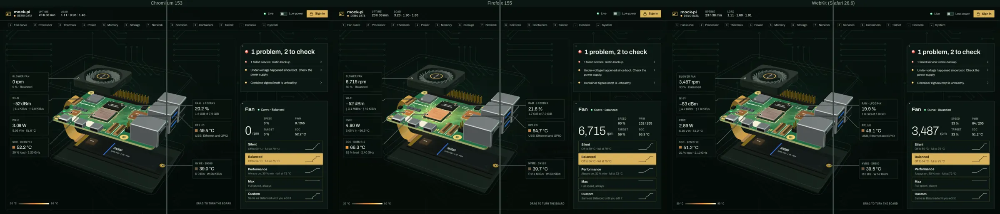
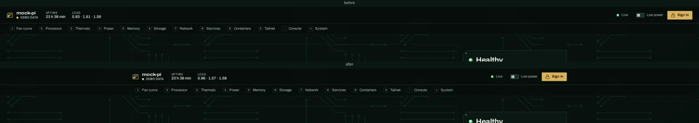
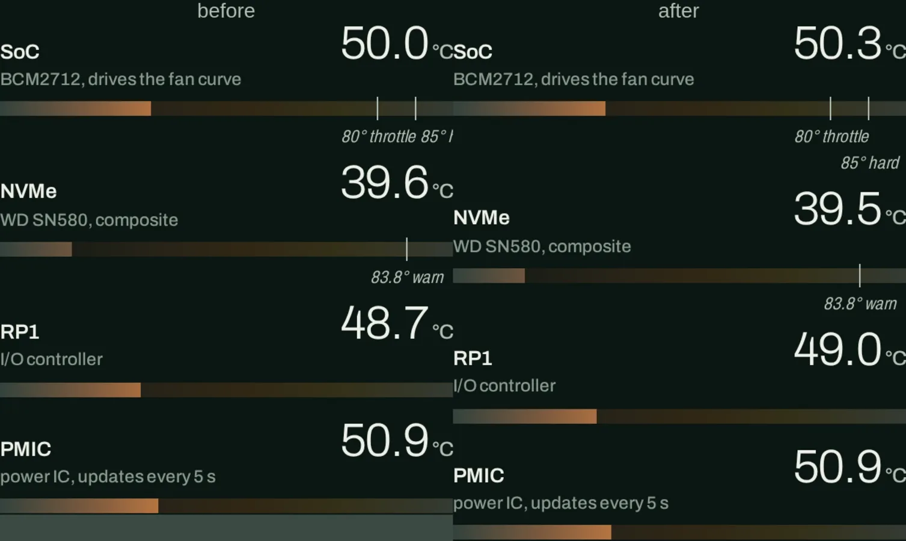
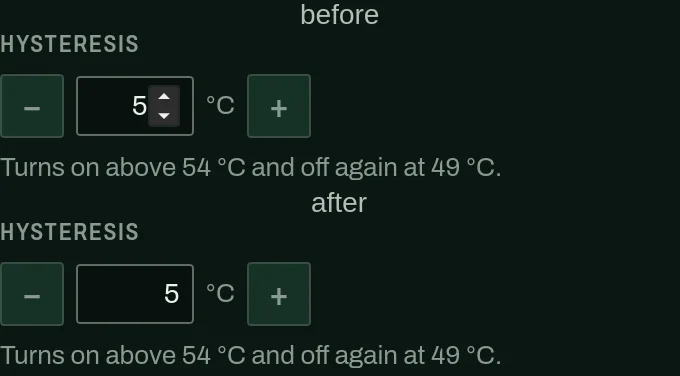
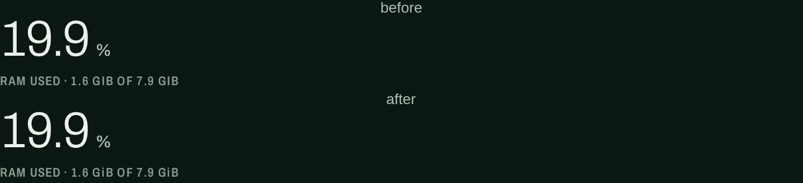
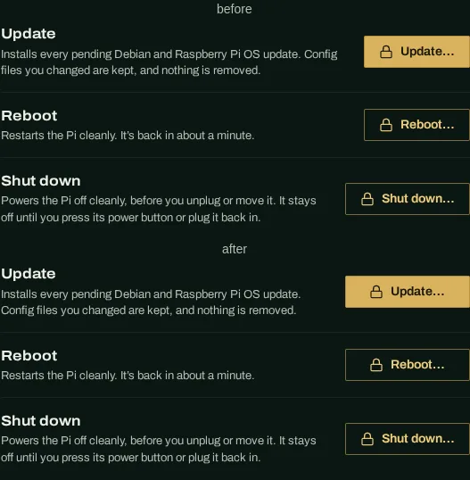
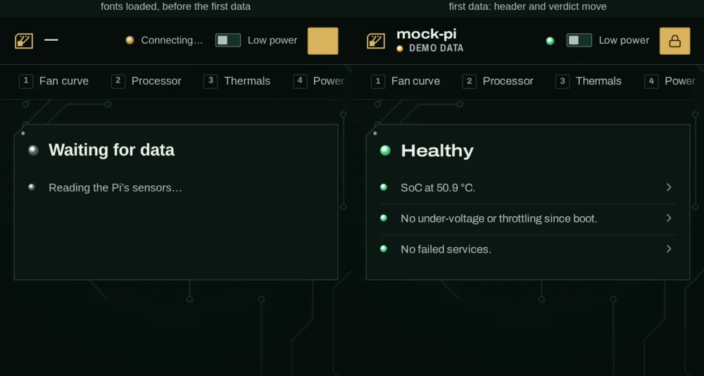
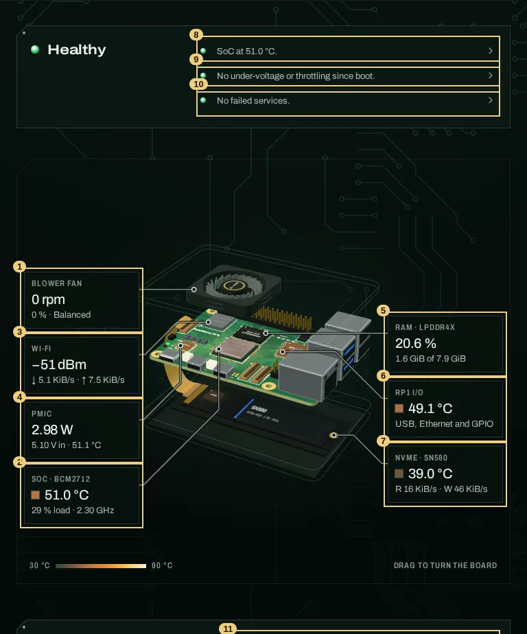

# Design QA report: the redesigned page

QA of 2026-09-30 · frontend at `30cf4e8` plus this task's fixes · kanban t_4ce6f0a7

This pass checks the combined work of t_c645c12e (code items H1–H4, M1–M8, L1–L5), t_504745a8 (the A1 mark in the page) and t_00607910 (README). The baselines come from `design-improvement-plan.md` §5.

**Result:**

- No critical or high accessibility issues remain.
- Lighthouse accessibility is **100** on desktop and mobile, in all three runs, before and after this task's fixes.
- axe finds **0 violations** in 9 UI states × 3 engines.
- Six small issues were fixed directly (§3). One medium issue (focus order in the hero below 1101 px) and four low ones are left open with a suggested fix (§4).

## 1. How it was tested

- **Build:** the production build (`vite build`) served statically, with in-browser demo data (`?demo`, `?demo&healthy`, `?demo&hot`). Delivery headers were checked against `pidash --mock` serving the same build.
- **Engines** (Playwright 1.63, headless):

  | Engine | Version | Notes |
  |---|---|---|
  | Chromium | 153 | WebGL on SwiftShader |
  | Firefox | 155 | WebGL on llvmpipe |
  | WebKit (WPE) | Safari 26.6 | Playwright's MiniBrowser. The host is Arch-based, so Ubuntu 24.04's ICU 74, libxml2 and flite were unpacked beside it; no system change. |

  Firefox headless has no WebGL here by default. That first run exercised the 2D fallback, which laid out correctly. The runs reported below force WebGL on so all three engines render the 3D view.
- **Viewports:** 375×812, 768×1024, 1024×768, 1440×900, 2560×1440 and 3440×1440 in every engine. Extra widths for single checks: 320, 360, 390, 412, 700/701, 1100/1101, 1180, 1280 and 1920.
- **Scripts:** `.impeccable/review/2026-09-30-qa/` (see its `README.txt`). Re-run unchanged:
  - the earlier `c645-check.mjs`
  - the project's `navcheck.mjs` and `actionscheck.mjs`, against `pidash --mock` serving the fixed build with the console on
  - `npm test` and the 87 backend tests

  All pass.
- **Screenshots:** `docs/design-review/2026-09-30-qa/`.

## 2. Results against the baselines

| Check | Plan baseline (t_5d298674) | After t_c645c12e | Now (HEAD + fixes) | Target |
|---|---|---|---|---|
| Lighthouse a11y, desktop / mobile | 96 / 92 | 100 / 100 | **100 / 100** (3 of 3 runs each) | ≥ 95 |
| Lighthouse perf, desktop / mobile (median of 3) | 54 / 29 | 56 / 32 | 57 / 33 | lab only, see note |
| Lighthouse best practices / SEO | 100 / 90 | 100 / 100 | 100 / 100 | 100 |
| axe (WCAG 2.2 A/AA + best practice) | 1 critical | 0 | **0** in 9 states × 3 engines | 0 |
| Verdict and reasons above the fold | 9/10 viewports | 10/10 | 10/10 in Chromium; 6/6 sweep viewports in Firefox and WebKit | 10/10 |
| CLS 375 / 768 / 1024×768 / 1440 (unthrottled) | 0.102 / 0.003 / 0.003 / 0.017 | 0.013 / 0.001 / 0.002 / 0.005 | 0.013 / 0.001 / 0.002 / 0.004 | ≤ 0.06 / 0.005 / 0.005 / 0.01 |
| CLS, Lighthouse mobile (throttled) | 0.102 | not reported | **0.053**, in 3 of 3 runs | see §4.1 |
| Form-field border contrast | 2.34:1 | 3.47:1 | 3.47:1 | ≥ 3:1 |
| Lowest text contrast (1,316 text nodes, 1440) | 6.2:1 (silk-3) | – | 4.79:1, the − and + glyphs of the hysteresis stepper (silk-3 on the pad); every node ≥ 4.5:1 | ≥ 4.5:1 |
| `/assets/*` gzip + `immutable` cache | none | yes | yes (152 KB gzipped 3D chunk) | yes |
| Callouts before the view is placed | 7 stacked | hidden | hidden until placed (all engines: 7 distinct positions once placed) | hidden |
| Hostname at 360/375/390, signed in and out | cut off | fits 11 chars | fits 11 chars | fits |

Lighthouse performance runs on SwiftShader (software WebGL), so compare those numbers only with each other. The runs before and after this task's fixes match: desktop 57/57/57 and 57/57/57, mobile 32/34/32 and 34/33/33.

### 2.1 Cross-engine

All 18 engine × viewport runs:

- No horizontal page scroll, and no element outside the page.
- No callout overlaps another or leaves the stage, and nothing overlaps in the header.
- No console errors or failed requests.
- Archivo loaded, and the verdict is above the fold.

Headings, labels, big readings and footprint padding compute to the same values in all three engines:

- 13 section headings: 20 px, 650 weight, 116 % width.
- 44–48 labels: 12 px, 600 weight, 78 % width, 0.07em tracking, uppercase.
- Padding: 20 px on desktop, 16 px on a phone.

`corner-shape: bevel` (the pin-1 chamfer) renders in Chromium and WebKit. Firefox doesn't support it and falls back to the square corner, as DESIGN.md › Shapes intends.

### 2.2 Keyboard, focus and motion

- **Tab order:** every tab stop to the end of the page, at 1440 and 768: 321 stops in Chromium, 316 in WebKit (Option-Tab, like Safari) and 317 in Firefox. Headless Firefox then stays on the last link instead of wrapping to the top.
  - Every stop has a visible focus indicator.
  - After the browser scrolls to it, no stop is under the sticky header or the section strip (WCAG 2.4.11).
- **Skip link** is the first stop and moves focus to `main`.
- **Section keys** (1–0, then - and =):
  - `3` focuses the Thermals heading, below the strip (top 137, strip bottom 101), and lights its key.
  - `/` focuses the service search.
- **Dialogs** (all three engines):
  - Sign in opens with focus on the token field. Focus stays inside the modal, and Escape closes it and returns focus to Sign in.
  - The confirm dialog focuses Cancel.
  - The logs dialog focuses the log. Escape returns focus to the row's logs button.
- **Reduced motion:**
  - No CSS animation is left running.
  - rAF drops to about 3 per second (the data ticks). With motion it is 20–94.
  - The entrance is skipped, and section jumps are instant.
  - This holds in all three engines.
- **Forced colors** (Chromium): the selected profile, segment and core meter fills are Highlight, and the LEDs keep their colours.

## 3. Fixed in this task

Each fix was checked in all three engines with `fixcheck.mjs` (all passed). After the fixes, the full `c645-check.mjs` suite still passes, and axe reports 0 violations in 9 states × 3 engines. The cross-engine sweep is clean (§2.1), and Lighthouse is unchanged (§2).

| # | Severity | Issue | Fix |
|---|---|---|---|
| F1 | Medium | **Ultra-wide:** the header and section strip sat at the viewport edges (brand at x 24, Sign in at 2536 of 2560) while the 1640 px column was centred (484–2076), so the brand and controls sat about 460 px outside it. | The bars' padding follows the column: `max(24px, (100% - 1640px) / 2 + 24px)`. Brand and first key now start at 484 and the controls end at 2076 (924/2516 at 3440). Measured at 1600, 1640, 1641, 1680 and 1920: brand, strip and controls sit exactly on the column's content edges, and at 1640 and narrower nothing moves. `style.css` `.top`, `.fingers`; DESIGN.md › Layout. |
| F2 | Medium | **Thermals, phone and laptop:** the SoC strip's two marks are 5 °C apart. "80° throttle" and "85° hard" ran together, and "85° hard" printed past the footprint outline: 6–11 px past it at 320–375 px, and within 4–16 px of it at 1101–1440. | The second label drops a line and is centred on its tick. The gauge keeps the same clearance below it. At 320 px every label now ends at least 14 px inside the outline. `style.css` `.strip .mark ~ .mark::after`. |
| F3 | Low | **Firefox and WebKit:** the hysteresis and curve-point fields showed native spin buttons (Chromium shows them on hover) crowding the value, next to the page's own − and + pads. | `appearance: textfield`, and the WebKit inner spin button is hidden. Arrow Up and Down still step the hysteresis and every curve-point field in all three engines. `style.css` `.cell-in input`, `.hyst input`. |
| F4 | Low | **Memory caption:** "RAM used · 1.7 GiB of 7.9 GiB" printed as "1.7 GIB OF 7.9 GIB". The caption is uppercase silkscreen, and DESIGN.md says units keep their case. | The figures go in `<b>`, which the existing `:is(.big-cap, …) b` rule keeps in case, at the caption's weight. `main.js` `renderMemory`; `style.css` `.big-cap b`. |
| F5 | Low | **System:** "Shut down…" is wider than "Update…" and "Reboot…". The pads were right-aligned per row, so their left edges stepped: 1276, 1276, 1255. | `.acts` is one grid and each row a subgrid, so the three pads share one column as wide as the widest (140 px, left edge 1255). On a phone they still stack under their text at their own widths. |
| F6 | Low | **Tabular Rule:** percent ticks read "0%" and "100%" (CPU and RAM charts, fan curve axis, failsafe "100 %" with a plain space), while every other reading uses a no-break space. | The ticks use `\u00a0%`. `main.js` (two `tickFmt`), `fan.js`. |

## 4. Open issues

### 4.1 Phone CLS is 0.053 under Lighthouse's load (Low)

**What.** Lighthouse mobile measures CLS 0.053 in 3 of 3 runs, the same before and after this task. That meets the plan's ≤ 0.06 target and Google's < 0.1 "good" line, but it is 4× the 0.013 that `c645-check.mjs` reports unthrottled.

**Why.** It is one shift, when the first data renders at about 2.2 s. Under Lighthouse's load (4× CPU, 1.6 Mbit, 412×823), the shift entry names three sources in the same frame (`cls-src.mjs`, 5 of 5 runs):

- The stage moves down 17 px.
- The header brand block grows from one line to two (24 to 32 px).
- The link state shrinks: "Connecting…" becomes the bare LED.

CSS probes (`cls-probe.mjs`, 3 runs each) show that **the stage is the whole score**:

| Probe | CLS |
|---|---|
| as is | 0.0546 (one run 0.0661) |
| link state at a fixed width | 0.0546 |
| brand block two lines from the start | 0.0540 |
| both header probes | 0.0540 |
| `.checks { min-height: 126px }` on a phone | **0.0022** |

The stage moves because the verdict's reasons need more room than the list reserves. H2 reserves 108 px, three one-line reasons. On a phone, "Under-voltage happened since boot. Check the power supply." wraps to two lines, so three reasons take 125 px.

The value depends on data and timing. Unthrottled, the header often updates before the first measured frame:

| Demo | 375×812 unthrottled, 3 loads | Why |
|---|---|---|
| `?demo&healthy` | 0.000, 0.002, 0.002 | three one-line reasons fit the reservation |
| `?demo` | 0.013, 0.013, 0.054 | one two-line reason (+17 px) |
| `?demo&hot` | 0.059, 0.060, 0.059 | five reasons: +70 to +108 px |

**Why it wasn't fixed here.** The fix is one line, but it trades against H2's choice, and the current value meets the target. With 126 px (`fold126.mjs`, 5 phone viewports × 3 demo states):

- The Health First Rule still holds everywhere.
- In the healthy state (three one-line reasons) the stage starts 18 px lower, under an 18 px empty band below the last reason. Healthy is the state the owner sees most.
- With one two-line reason nothing moves, and with five reasons nothing changes.

That is the owner's call.

**Suggested fix.** Add `@media (max-width: 700px) { .checks { min-height: 126px } }`, which is room for three reasons with one of them on two lines. That covers the common failing states. Five reasons (`?demo&hot`) still grow the list; a real overheat is the state where the verdict should take the room. Leave the header as it is: it costs 0.0006.

Check with `cls-probe.mjs`, `fold126.mjs` and `c645-check.mjs` ONLY=cls,fold.

### 4.2 Focus order in the hero below 1101 px (Medium)

**What.** Below 1101 px the verdict is shown first (H1: `.hero-side { display: contents }` and `.verdict { order: -1 }`), but it comes after the stage in the DOM. So Tab goes through the seven callouts first (lower down), then back up to the three verdict reasons, then down to the fan pads.

Inside the stage, the callouts follow `board.js` CALLOUTS order (fan, SoC, Wi-Fi, PMIC), while they are drawn in the parts' on-screen order (fan, Wi-Fi, PMIC, SoC). So focus drops to the SoC box and climbs back.

At 1101 px and wider the verdict sits to the right of the stage, so stage-then-verdict is a sensible reading order there.

axe and Lighthouse don't catch this; `logical-tab-order` is one of Lighthouse's manual checks. WCAG 2.4.3 (Focus Order, A) asks that the order preserve meaning and operability. Every control is still reachable and works, so this is a Medium usability issue, not a blocker.

**Why it wasn't fixed here.** `reading-flow: flex-visual` on `.hero` fixes the page-level order, which was verified in Chromium 153: verdict, then fan, then stage. But only Chromium supports it; Firefox and WebKit ignore it. Moving the verdict before the stage in the DOM changes the desktop grid and `social.mjs`. Both are layout changes for the code owner.

> **Fixed** in t_bc550f99, as suggested: the verdict is first in the DOM and grid areas place it at 1101 px and wider; the callouts are re-ordered to their drawn order (left column top to bottom, then right) once the view has placed them, and not while one has focus. Check: `frontend/scripts/herocheck.mjs` (Tab order header, nav, verdict, callouts, fan at 1440/1024/768/375).

**Suggested fix:**

1. **Page level:** move `.verdict` out of `.hero-side` to before `.stage` in `index.html`, and place it with grid areas at 1101 px and wider: `grid-template-areas: "stage verdict" "stage fan"`. Then DOM order equals visual order at every width, and `order: -1` goes away.
2. **Inside the stage:** list CALLOUTS in their drawn order (fan, Wi-Fi, PMIC, SoC on the left), or set `reading-flow` on `.callouts` once Firefox and WebKit ship it. The stack is re-sorted per frame as the board sways (`stage.js:267`), so a fixed DOM order can still differ briefly while a part moves. Ordering by the rest pose is enough.

### 4.3 Low

| # | Issue | Suggested fix |
|---|---|---|
| L1 | **Fixed** (t_bc550f99): the update log's empty message is centred, as the console's is. **The two empty wells differ.** Signed out, the update log is a 249 px well with its message at the top left. In the demo, the console is a 460 px box with its message centred. The two sections end together by design (DESIGN.md › Layout), so the wells take the slack, but their messages sit in different places. | Put both messages in the same place (top-left, like the log), or show the log's sign-in message with a Sign in link as the console shows Connect. |
| L2 | **Cut commands and descriptions are only in `title`.** At 375 px, top-process commands are cut at about 180 px and service descriptions at about 80 px. The full text is only in a `title` tooltip, which touch and keyboard users can't open. It is the same in all three engines. | Acceptable for a glanceable table. If wanted, give the process row an expandable `
` for the full command, or let the command wrap to two lines on a phone. Revisited in 0.4.0 after the persona review: the Low power switch and the service icons no longer rely on `title` on touch. |
| L3 | **"All 12 rails" is the only gold text link inside a footprint.** Gold means "you can press this" (One Meaning Rule), so it is correct, but it sits alone at the bottom of Power, with no equivalent on Memory or Storage. | Leave as is (it is the only section with more detail to disclose), or draw it as a ghost pad for consistency with the other in-card controls. |

## 5. Checked and fine

- **Image alt text:**
  - The page has no ``: the header mark is an inline SVG with `aria-hidden="true"` next to the hostname text.
  - Canvas charts have `role="img"` and an `aria-label`.
  - The 3D view is `aria-hidden`, and its readings are the callout list (`aria-label="Live readings by part"`).
  - README: all 14 images have alt text. The 88 px mark has `alt=""` beside the "pidash" heading, which is correct for a decorative logo next to the name.
- **Asset style coherence:** the header mark is 24×24 in ENIG gold `rgb(217 179 93)` in all three engines. The favicon swaps to the warn/bad LED variant with the verdict (checked with `?demo` and `?demo&healthy`: title "1 problem, 2 to check · mock-pi" with `/favicon-bad.svg`; healthy, "mock-pi · pidash" with `/favicon.svg`).
- **Spacing:** masonry gaps are 52–55 px between footprints and 20 px between the columns (DESIGN.md: 52 px between footprints, 20 px gaps). On a phone they are 52 px everywhere.
- **Charts:** every canvas chart draws at 1440 and 375 in all three engines (non-transparent pixels in each).
- **Low power, healthy, signed in with the custom curve editor, and each dialog:** axe finds nothing, and they lay out without overlap.
- **Contrast:** axe leaves 676 contrast checks "incomplete" because text sits over the trace field (a `background-image`) or over the canvas. The computed check here blends every text node against the surface under it and finds the lowest ratio is 4.79:1. The trace lines are 0.07 alpha and don't change that.
