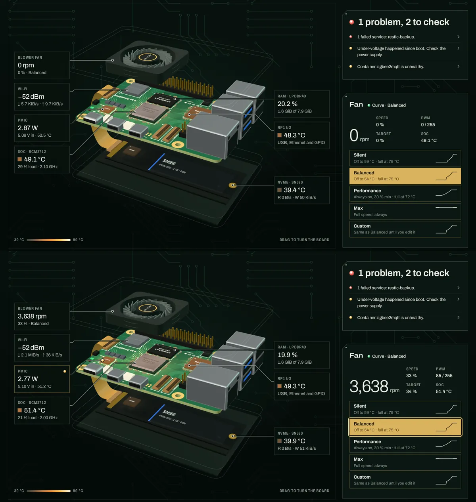
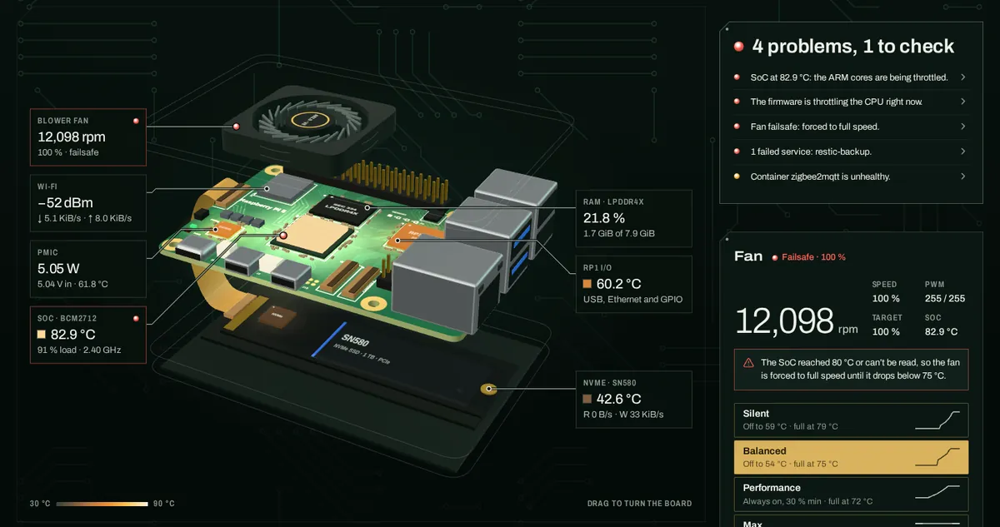
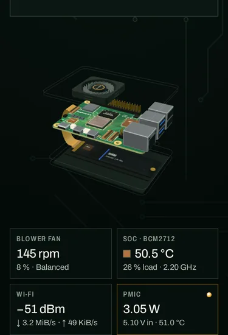

# The board carries the verdict (t_bc550f99)

A design pass on 2026-09-30, after the QA of t_4ce6f0a7. Version 0.3.0.

## What changed

**The 3D board now shows the verdict.** Before, the page's two strongest elements didn't talk to each other: the verdict said "Under-voltage happened since boot" while the board, the page's hero, showed a calm PMIC. Now a reason about a part turns that part into a notice on the board:

- its callout takes the notice outline (amber 0.45 or red 0.50, the same as `.notice-warn` / `.notice-bad`);
- an LED sits at the end of the callout's name line;
- the leader's pad on the part becomes an LED lens (r 5, bright core, the page's LED gradient in SVG);
- the reason's sentence is in the callout for screen readers.

Parts with nothing wrong stay plain silkscreen, so healthy shows no LEDs on the board.

| Reason | Part |
|---|---|
| SoC temperature (close to throttle, throttled, unreadable), firmware throttling now or since boot | SoC |
| Under-voltage now or since boot | PMIC |
| NVMe above its warning limit; an NVMe filesystem 90 % full | NVMe |
| Fan failsafe, fan powered but not spinning, fan unreadable | Blower fan |
| Memory 80 % / 90 % used | RAM |
| Failed services, containers, Tailscale | none (software, no part) |

**Reason ↔ part, both ways.** Hovering or focusing a reason lights its part, its callout and its section (the existing lit state). Lighting a part, from the board, a callout or a section, underlines its reasons.

**Focus order follows the page (QA report 4.2, Medium).** The verdict is now first in the DOM. At 1101 px and wider, grid areas place it beside the stage, and the pixel layout is unchanged at every width. The seven callouts are re-ordered to their drawn order, left column top to bottom then right, once the view has placed them, and never while one has focus. Tab now goes header, nav, verdict, callouts, fan at 1440, 1024, 768 and 375 px (it was nav, callouts, verdict, fan below 1101 px).

**Smaller:**

- The verdict's outline lights (0.30) when it has something to say.
- The update log's empty message is centred, like the console's (QA report L1).

## Checked

- `frontend/scripts/herocheck.mjs` (new; serves a production build, ?demo): 51/51 in Chromium, and 49/49 in Firefox (the same checks without the phone-emulation and forced-colors cases, which Firefox doesn't take). It checks:
  - the PMIC LED, pad lens and callout text at 1440, 1024, 768 and 375 px;
  - Health First;
  - layout order and Tab order;
  - hover both ways;
  - healthy shows no LEDs, and hot flags the SoC and the fan;
  - forced colors keep the LEDs;
  - axe finds 0 violations at 1440 and 375;
  - no page errors, no overflow.
- Pixel geometry of the verdict, stage, fan card and curve editor: identical to 0.2.0 at 1440, 1180, 1024, 768 and 375.
- Earlier suites, re-run on the new build:
  - `c645-check.mjs`: fold 10/10, CLS 0.000–0.006, callouts hidden until placed, axe 0, header fit, forced colors, title.
  - `navcheck.mjs` and `actionscheck.mjs` (pidash --mock, console on): pass.
  - `npm test`: pass. Backend: 87 OK.
- Low power (2D drawing): the pad lens and callout LED work the same.
