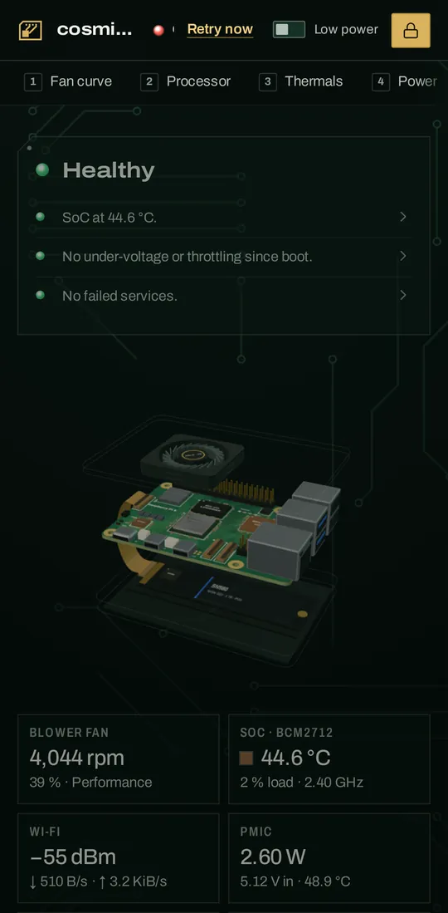
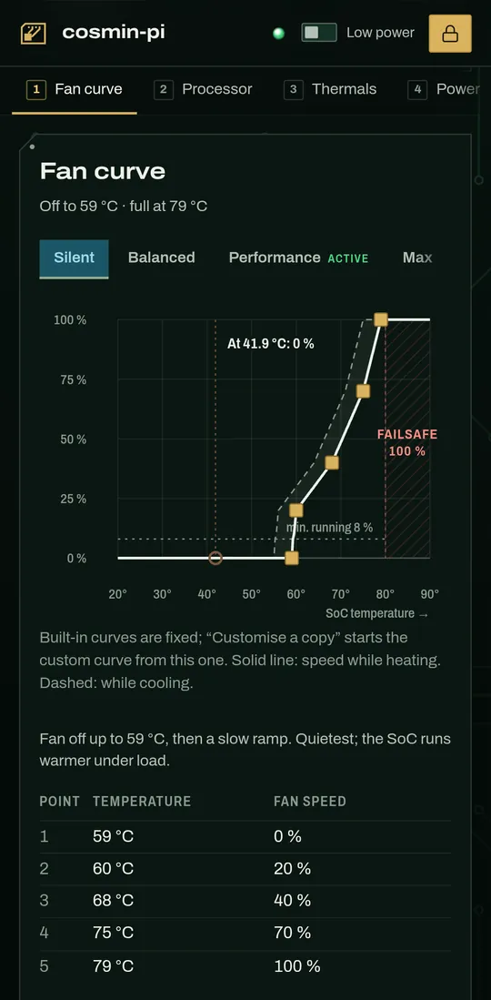
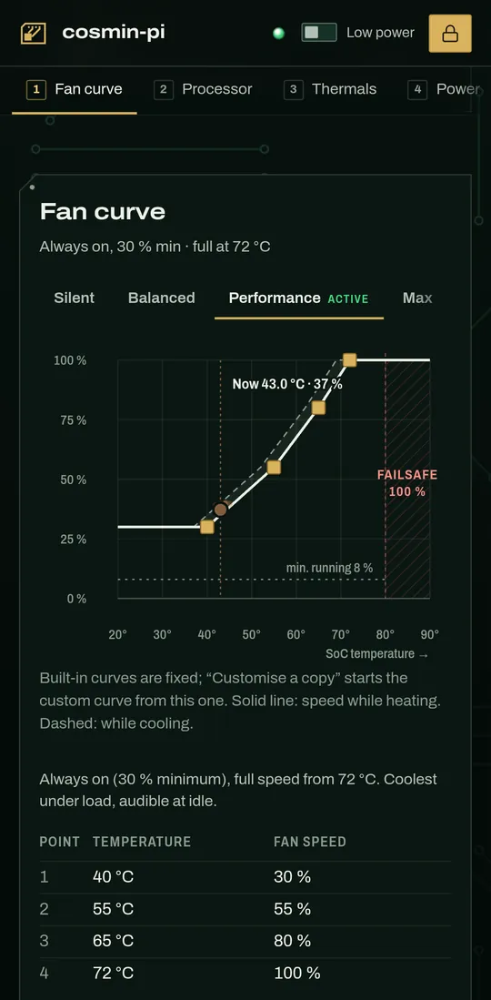
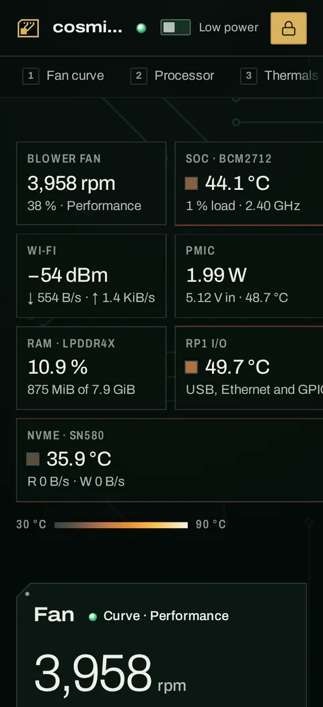
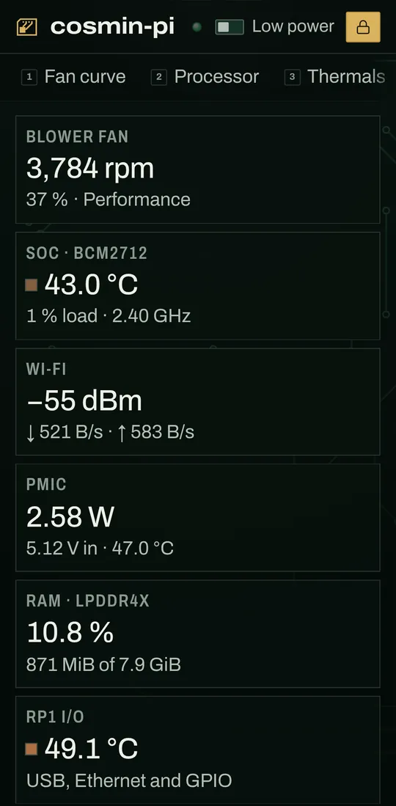

# The angry user test (2026-10-02)

This is an adversarial persona review of the live dashboard at `http://raspberrypi:8787/` (v0.3.0, the frontend build
`index-DbwcOq_G.js`, mock off). One hostile user ran the real page on a phone and on a laptop. His complaints were
then filtered for what is a real UX problem and what is just "I hate computers". Only the real problems became tickets.

## The persona

**"Nea Mitică" Dumitrescu, 67, retired TV and radio repairman.** He spent forty years with a soldering iron and a
multimeter. He trusts screwdrivers and hates apps. He uses an Android phone with the font turned up, WhatsApp and YouTube,
and his reading glasses are never on him. Cosmin is away for two weeks. The Pi sits in the hallway cupboard next to the
bedroom, and Cosmin pinned `http://raspberrypi:8787` to the phone's home screen, set up Tailscale, and sent the token on
WhatsApp.

- **His jobs:** (1) is the box all right, or is it about to burn; (2) it whines at night, so make it quieter (the live Pi
  runs **Performance**, which its own description calls "audible at idle": about 4,000 rpm at 43 °C); (3) if everything
  hangs, restart it and know when it is back.
- **He gives up when:** there are more than three taps, English jargon, text he can't read without glasses, a password
  he can't type, or anything that might break the son-in-law's computer.

## 1. The rant

> **Nea Mitică's review of pidash**
>
> **Overall: Maybe.** "I keep it on the phone to see if the box is alive. Only if it stops lying to me."

**The good (grudging admission)**

- "I open it and it says **Healthy**. One word, green, big, first thing, in one second. Fine." ([01](01-phone-first-screen.webp))
- "The fan buttons have real words: Silent, Balanced, Performance, Max. When it finally let me press Silent, the fan
  stopped and it said 'Silent is active'. One press." ([03](03-phone-fan-card.webp), [18](18-demo-silent-applied.webp))
- "Before it restarts the box, it asks in human words, and Cancel is already chosen. Somebody here was raised right."
  ([21](21-demo-reboot-confirm.webp), [36](36-demo-update-confirm.webp))
- "When something is broken it goes red and puts the broken thing first. Even in a list of a hundred and forty, the
  broken one is on top." ([23](23-demo-hot-verdict.webp), [28](28-demo-tap-failed-service-reason.webp))

**The bad (legitimate UX issues)**

- "'Low power' is for the picture, not for the box. The fan didn't even notice." ([08](08-phone-low-power-on.webp))
- "A password box full of dots, and an error that sends me to a box with no screen." ([10](10-phone-wrong-token.webp))
- "'Power' in the menu is watts. The restart button is twelve buttons away, off the edge." ([32](32-phone-power-tab-is-watts.webp))
- "With my big letters, the boxes fall off the side of the screen." ([35](35-phone-font150-callouts.webp))
- "Red alarms, and not one word about what to do." ([24](24-demo-hot-tap-reason.webp))

**The ugly (showstoppers)**

- "It said HEALTHY about a dead box." ([16](16-phone-pi-hung-30s.webp))
- "I pressed Silent and went to bed. Nothing had happened." ([40](40-phone-fan-curve-silent-tab.webp))
- "The screen froze under my thumb." ([07b](07b-phone-curve-chart-swipe-trap.webp))

**Specific complaints**

1. **Home screen:** "Healthy, good. Then 'SoC at 44.6 °C'. A sock? Under it, a cartoon of the board turning round like
   a kebab. Very nice. What do I do with it?" Expected words a person uses; got part names (SoC, PMIC, RP1, NVMe) and a
   3D model. ([01](01-phone-first-screen.webp))
2. **Low power switch:** "Finally, LOW POWER. I flip it. The kebab becomes a drawing. The fan: 4,041 before, 4,042
   after. Low power for the picture, not for the box!" Expected a quieter Pi; got the page's 3D view switched off. The
   explanation is a hover tooltip, which a phone never shows. ([08](08-phone-low-power-on.webp))
3. **Fan card:** "Silent, Balanced, Performance, Max. These I understand. Performance is the yellow one, so that's the
   noise." (Praise, for once.) ([03](03-phone-fan-card.webp))
4. **Sign-in:** "It wants a TOKEN, 'from the Pi's pidash config'. Cosmin sent me forty-three letters on WhatsApp. First I
   tried the password I know. It says 'Check PIDASH_TOKEN on the Pi'. ON the Pi? The Pi is a box in the cupboard. It has
   no screen! And the box shows only dots, so I can't see what I pasted." ([09](09-phone-signin-wall.webp),
   [10](10-phone-wrong-token.webp))
5. **Fan curve tab:** "So I try the big tab at the top, 'Fan curve'. There are tabs: Silent, Balanced… I press Silent. It
   lights up, the drawing changes, it says 'At 41.9 °C: 0 %'. ZERO! Done! I go to bed. At midnight it is still
   screaming. The button that really does it, 'Use Silent', is a whole screen lower, under a table."
   ([40](40-phone-fan-curve-silent-tab.webp), [41](41-phone-fan-curve-use-silent-button.webp))
6. **Fan curve chart:** "And on that drawing the screen freezes. I push up with my thumb: nothing. Again: nothing. I
   thought the phone was dead." ([07b](07b-phone-curve-chart-swipe-trap.webp))
7. **The box goes dead:** "Tuesday the internet went. The page still said HEALTHY, in green, with numbers from half a
   minute ago. The fan was '4,044 rpm' on a dead box! There was only a little red dot and 'Retry now', and the name was
   cut to 'cosmi…'. The patient is dead and the monitor says healthy." ([15](15-phone-pi-hung-first-signal.webp),
   [16](16-phone-pi-hung-30s.webp))
8. **Too hot (Cosmin's demo):** "'4 problems, 1 to check', in red. At least it shouts. 'The ARM cores are being
   throttled.' So what? Do I call the firemen? Unplug it? I press the arrow and get '0xf000e' and a table of Yes and No.
   That is not advice, that is a hex dump." ([23](23-demo-hot-verdict.webp), [24](24-demo-hot-tap-reason.webp))
9. **Restart:** "To restart it I press 'Power' in the menu. It's watts: '2.58 W SoC power (PMIC rails, excludes USB and
   NVMe)'. I wanted the power BUTTON. Restart lives under 'System', the twelfth button, hiding off the right edge, at
   the bottom of a page thirteen screens long." ([32](32-phone-power-tab-is-watts.webp),
   [11](11-phone-nav-strip-end.webp), [04](04-phone-system-card.webp))
10. **The reboot question:** "When I found it, it asked properly: 'It restarts now… the page reconnects by itself.'
    Cancel was already chosen. Fine." ([21](21-demo-reboot-confirm.webp))
11. **Update button:** "There's a big gold 'Update…'. I thought it would update the numbers. It asked me about 'apt-get'
    and 'don't unplug the Pi'. I pressed Cancel with my heart in my throat." ([04](04-phone-system-card.webp),
    [36](36-demo-update-confirm.webp))
12. **Services:** "One hundred and forty-two lines. A phone book. Every line has two little pictures glued together, a
    scroll and a round arrow. Which one restarts? Nobody says. The name only comes up for a mouse."
    ([12](12-phone-services-rows.webp))
13. **Big letters:** "My phone has the big letters, I am not a pilot. With big letters the boxes under the board run off
    the right side: 'USB, Ethernet and G'. G what? And the page wobbles left and right."
    ([35](35-phone-font150-callouts.webp), [31](31-desktop-320css-callouts-overflow.webp))
14. **Small letters:** "Everything else is small grey writing on black. The menu has little numbers, 1, 2, 3, smaller
    than ants. Keyboard numbers, on a phone! What keyboard? I have a thumb." ([01](01-phone-first-screen.webp),
    [11](11-phone-nav-strip-end.webp))
15. **Night:** "In the day it can howl, I don't care. At night it's next to the bedroom. Why must I do this every evening
    and every morning? My old fridge knew day from night." ([18](18-demo-silent-applied.webp))
16. **Colours:** "And why is everything black, like a funeral?" ([26](26-desktop-first-screen.webp))

> **Verdict:** "Beautiful, like a new television. But it told me a dead box was healthy, and it froze under my thumb. I
> keep it on the phone; the screwdriver stays in the drawer."

## 2. The pragmatism filter

Out of character, each complaint was tested against one question: would a competent, busy 35-year-old have it too?
Accessibility counts as RED. "Make it work like paper" counts as WHITE. A good idea hidden inside a complaint counts as
GREEN.

| # | Complaint | Class | Why |
|---|---|---|---|
| 7 | "Healthy" about a dead box | **RED** | Anyone is misled. Offline for 31 s, the verdict still reads Healthy (only dimmed to 0.6), the title and favicon stay healthy, and on a phone the offline text is squeezed to a 1 px box. This breaks Product Principle 1, Truth first. |
| 5 | Tapping the Silent tab looks like switching | **RED** | The tab lights up, the section's status line and the marker ("At 41.9 °C: 0 %") change, but the fan stays on Performance. A small ACTIVE tag stays on the Performance tab, and "Use Silent" sits 1.13 screens below. The hero pads with the same names switch on one tap. |
| 6 | The chart freezes the swipe | **RED** | Any touch user hits this: `.curve { touch-action: none }` is set even on the four built-in curves, which can't be edited. The chart covers a third of a phone screen. |
| 13 | Big letters push boxes off the side | **RED** | Accessibility: WCAG 1.4.10 Reflow fails at 320 CSS px (14–26 px of sideways scroll), and the page breaks with a larger default font. axe can't see it, and phone emulation hides it. |
| 8 | Red alarm, no advice | **GREEN** | The product promises "what is wrong". A one-line "what to do" per reason is a cheap step further. |
| 15 | It should be quiet at night by itself | **GREEN** | The real need behind "make it quieter" is time of day. A night profile on a schedule would solve it once. |
| 2 | "Low power" did nothing to the fan | YELLOW | The same word means two things: the header switch is about the page, while the "Power" section is the Pi's watts. The explanation is only in `title`, which touch never shows. Harmless, but misleading. |
| 4 | Token copy, no reveal | YELLOW | The error says "Check PIDASH_TOKEN on the Pi" without saying how. The real owner hits this after the 7-day session ends. |
| 9 | "Power" is watts; Reboot is far away | YELLOW | Competent users find System, but on a phone it is the 12th tab, off screen, 11.5 screens down. That is 4 actions signed in, about 7 signed out. |
| 12 | Icon-only service actions | YELLOW | 36×36 px with no gap and no label on touch. It passes WCAG 2.5.8 (24 px) but misses DESIGN.md's own 44 px touch rule, and a confirm dialog limits the harm. At 44 px with an 8 px gap the table still fits a 412 px phone ([39](39-fix-probe-services-44px.webp)). |
| 14 | Small text, keycaps on touch | YELLOW | On a phone, 98 % of the text is under 16 px. That is a density choice. The 10 px keycaps are dead weight on touch, and the console already hides `.kbd-only` there. |
| 4 | Needing a token at all | WHITE | Security: changes need the shared secret, and a 7-day session keeps it to one paste a week. |
| 12 | 142 services, "a phone book" | WHITE | The failed rows sort first, and the verdict's reason links straight to them (s5). |
| 1 | Jargon (SoC, PMIC, RP1) | WHITE | The owner is the user and knows the vocabulary (PRODUCT.md › Users). Translating it would cost everyone else. |
| 1 | The 3D board is a toy | WHITE | The showpiece is a brand commitment (PRODUCT.md), and swiping over it scrolls fine (345 px). |
| 11 | "Update" is scary | WHITE | It is the standard word, and the confirm explains it and has Cancel focused. |
| 16 | Black like a funeral | WHITE | Taste: the dark board look is the design system. |
| 3, 10 | Fan pads, reboot confirm | Praise | No action. |

The filter keeps four RED and two GREEN items as tickets, folds the five YELLOW notes into one, and drops six WHITE
items as persona noise. Two features got praise.

## 3. Tickets

All seven carry the `ux-review` label.

| Issue | Class | Title |
|---|---|---|
| [#6](https://github.com/cosminfuica/raspberrypi-dashboard/issues/6) | RED | Verdict keeps saying "Healthy" while the Pi is offline |
| [#7](https://github.com/cosminfuica/raspberrypi-dashboard/issues/7) | RED | Fan curve tabs look like a switch: tapping Silent changes the readout, not the fan |
| [#8](https://github.com/cosminfuica/raspberrypi-dashboard/issues/8) | RED | Phone: a swipe that starts on the fan-curve chart doesn't scroll the page |
| [#9](https://github.com/cosminfuica/raspberrypi-dashboard/issues/9) | RED | Phone callouts overflow at 320 CSS px and with a larger browser font (WCAG 1.4.10 Reflow) |
| [#10](https://github.com/cosminfuica/raspberrypi-dashboard/issues/10) | GREEN | Verdict reasons say what is wrong but never what to do next |
| [#11](https://github.com/cosminfuica/raspberrypi-dashboard/issues/11) | GREEN | Quiet at night by itself: a scheduled night fan profile |
| [#12](https://github.com/cosminfuica/raspberrypi-dashboard/issues/12) | YELLOW | ux-review: low-priority notes from the angry-user test (all five YELLOW items) |

## 4. Known issues the persona walked into

- **"Stale data dims"** is listed under "Keep: these decisions are settled" in
  [design-improvement-plan.md](../../design-improvement-plan.md) (§1.4).
  The hung-Pi run shows that dimming isn't read as stale: the headline still says Healthy.
- **QA report L2** ([design-qa-report.md](../../design-qa-report.md) §4.3) accepted that text kept only in `title`
  can't be read on touch. The same pattern hides what Low power does and which service icon restarts.
- **DESIGN.md › Buttons** asks for 44 px icon pads on touch. The Services row icons are 36 px.

## 5. What was run

Playwright (`playwright-core` 1.63.0, Chromium 1243, a new throwaway profile per run) drove the live page from this
desktop over Tailscale. It ran as a Pixel 7 (412×839, touch) and a 1440×900 laptop, plus `?demo` on the same deployed
build for every change. Scripts are in `.impeccable/review/2026-10-02-persona/scripts/` (git-ignored), and measurements
are next to them as JSON. To run one again: `npm i --no-save playwright-core@1.63.0 axe-core` in a scratch directory,
copy the scripts there, then `node s1-phone-live.mjs`.

| Run | What it checks | Result |
|---|---|---|
| s1 | Cold start, phone, live | Verdict "Healthy" 0.9 s after navigation. The page is 13 screens long; the fan pads sit at 1.5 screens and Reboot at 11.8. Text: 98 % < 16 px, 73 % < 14 px. axe 4.13 (WCAG 2.2 AA tags): 0 violations |
| s2 | Phone, live: Low power, sign-in wall, one wrong token, nav, Services, a hung Pi (WebSocket cut inside the browser) | Fan 4,041 → 4,042 rpm with Low power on. Wrong token → "Check PIDASH_TOKEN on the Pi". Offline after 5.2 s, still "Healthy" at 31 s |
| s2b, s10, s11 | Touch swipes from the CDP touch events, with a control area first | Board 345 px, 2D board 360 px, curve chart **0 px**. With `.curve:not([data-editable]){touch-action:pan-y}`: 345 px, and a Custom handle drag still moves its point (0 px page scroll) |
| s3, s5, s9 | Demo: Silent, Reboot, Update, hot, failed service | Silent: 1 tap signed in. Reboot: 4 actions. Both confirms default to Cancel. 0 non-GET `/api` requests left the browser |
| s4 | Laptop 1440×900, live | Verdict and fan pads in the first screen, every nav tab visible. axe: 0 violations |
| s6, s9, s12 | Reflow at 320/280 CSS px (no phone emulation), and a 412 px phone with a 21/24/32 px browser font | 14–26 / 58–64 px of sideways scroll; 6–26 / 49–65 / 176–192 px. With `minmax(min(100%, 10rem), 1fr)`: 0 px in all 8 cases of s12, with two columns kept at 360–412 px (11rem was also 0 px at 280 px and with a 32 px font, s10) |
| s11 | Phone, live: nav "Fan curve" → Silent tab (a view change, nothing sent) | The section summary and marker show Silent while the fan stays on Performance; "Use Silent" is 1.13 screens below |

- **Console:** 21 views were logged. None had a page error. The one console error on each live load is the
  signed-out `GET /api/auth` → 401, which the contract documents, plus the expected 401 of the one wrong-token
  sign-in. The WebGL warning comes from the lab's software
  renderer.
- **Safety:** the fan, reboot, update and restart flows ran only in `?demo`. On the real Pi there was exactly one
  deliberate wrong-token sign-in, at about 21:10 UTC on 2026-10-02 (00:10 on 3 October at +03:00). It is in the Pi's audit log
  as a refused `POST /api/auth/login`. Nothing on the Pi was changed.
- **Dropped:** a "Tailscale off" run, because the headless browser's error page renders blank, and the PWA
  installability check, which was inconclusive over plain http.

## Key screenshots

