# The persona-review fixes (2026-10-04)

The fixes for the seven tickets from [the angry user test](../2026-10-02-persona/README.md) (issues #6-#12). Version
0.4.0, not deployed yet.

Every "after" shot is from a production build of 0.4.0 on `?demo` (demo data in the browser), on the persona's phone: a
412 px touch screen, unless the caption says otherwise. The "before" shots are from the review, on 0.3.0. Each fix has a
check that fails if it comes back, in `frontend/scripts/herocheck.mjs` or `frontend/scripts/phonecheck.mjs`.

## #6: "Healthy" about a dead box

Before: [16, still "Healthy" 30 s after the Pi stopped answering](../2026-10-02-persona/16-phone-pi-hung-30s.webp).

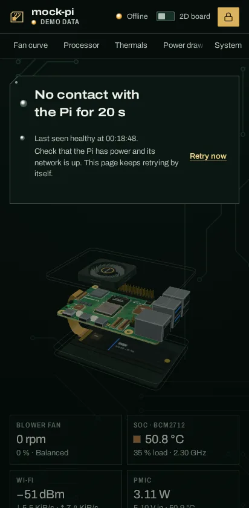

After 20 s without data the verdict says "No contact with the Pi", with the last known state, what to check and Retry
now; the tab title reads "Offline · host", the favicon goes grey and the board's LEDs go out, while a shorter drop only
dims. herocheck's `offline:` and `flaky:` cases guard it (No contact at 19-29 s, never on a 7 s drop).

## #7: the Silent tab looked like a switch

Before: [40, the Silent tab reads "At 41.9 °C: 0 %" while the fan runs Performance](../2026-10-02-persona/40-phone-fan-curve-silent-tab.webp).

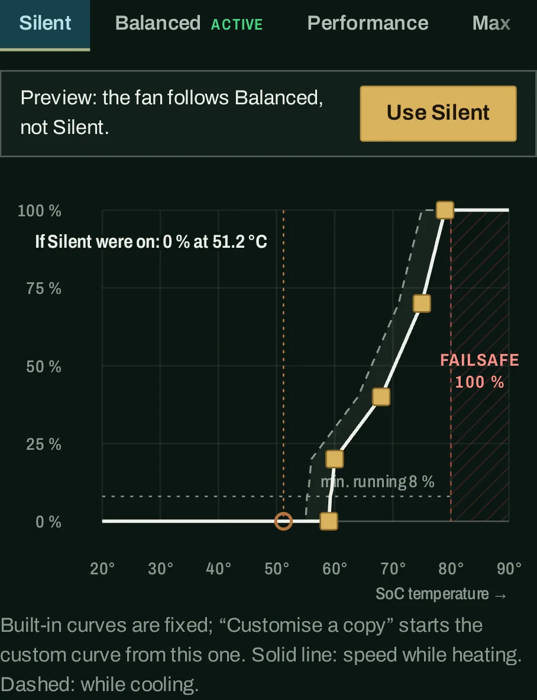

A tab that isn't running is a preview: a bar under the tabs says which curve the fan follows, Use sits in that bar,
and the chart's marker says "If Silent were on". phonecheck's `preview:` cases guard it.

## #8: the chart froze the swipe

Before: [07b, a swipe that starts on the chart doesn't scroll the page](../2026-10-02-persona/07b-phone-curve-chart-swipe-trap.webp).

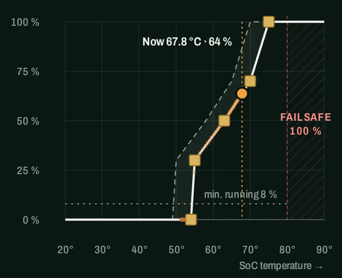

A swipe on a built-in curve, or on the empty plot of the Custom one, scrolls the page; only a point of the editable
curve takes the touch. phonecheck's `swipe:` cases measure it with real touch events: 496 px of scroll on the Balanced
chart (0 px on 0.3.0), 480 px on the empty Custom plot, and 0 px while a Custom point is dragged from 50 to 30 %.

## #9: big letters pushed the boxes off the screen

Before: [31, 320 CSS px](../2026-10-02-persona/31-desktop-320css-callouts-overflow.webp) and
[35, a phone with large text](../2026-10-02-persona/35-phone-font150-callouts.webp).

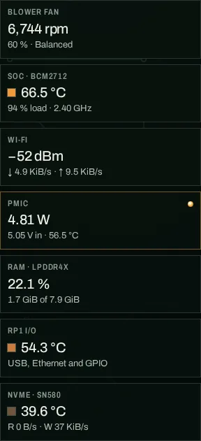

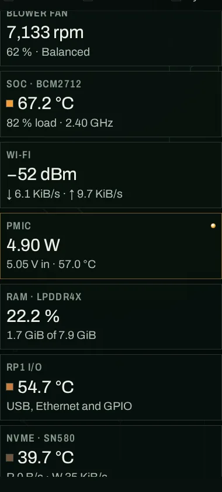

The callouts under the board are a grid that keeps two columns only where two 10rem boxes fit, with sub-lines that
wrap. herocheck's `reflow` cases guard it without phone emulation: 0 px of sideways scroll and the right column count
at 280, 320, 360 and 412 px, and at 412 px with a 21, 24 and 32 px font.

## #10: red alarms with no advice

Before: [24, a throttling reason and a hex dump](../2026-10-02-persona/24-demo-hot-tap-reason.webp).

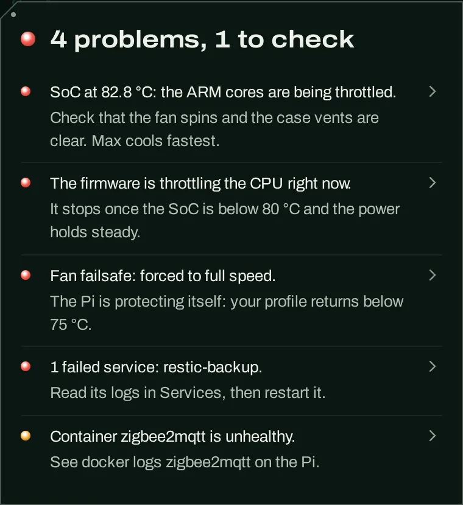

Every warning or problem reason carries one dim line that says what to do next. herocheck's `hot:` case checks that
every warn or bad reason has one.

## #11: quiet at night by itself

Before: [18, Silent by hand](../2026-10-02-persona/18-demo-silent-applied.webp).

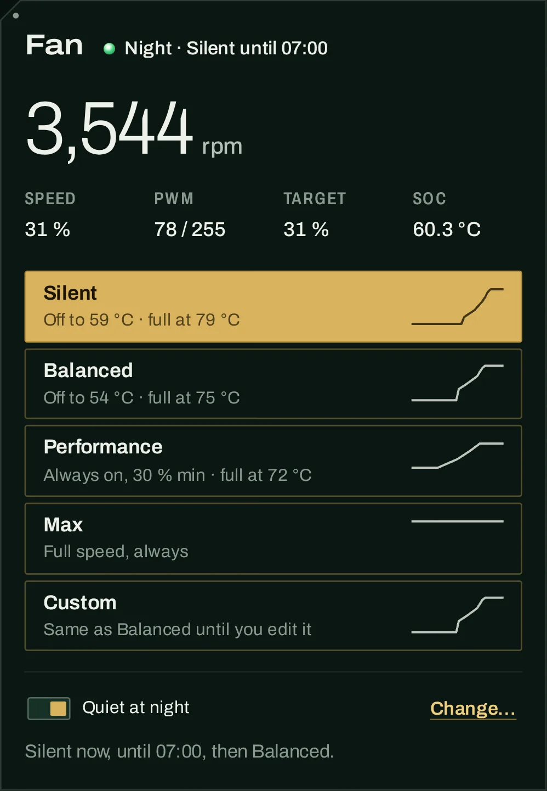

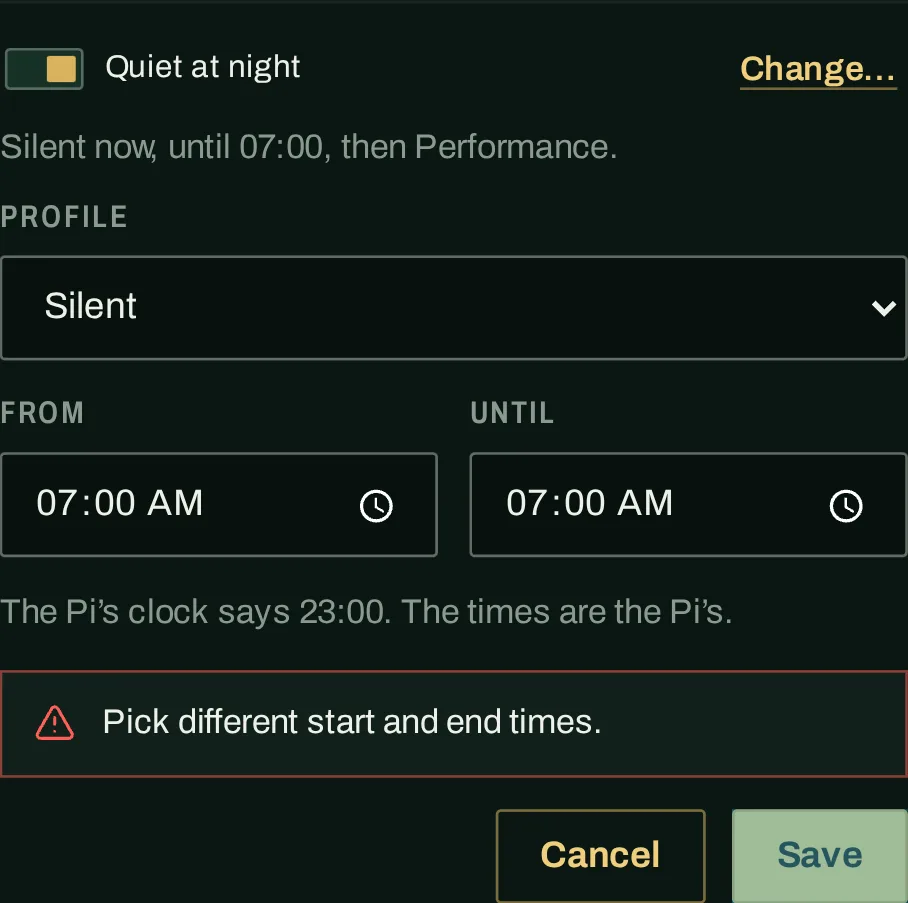

A switch under the profile pads runs a profile from a start to an end time on the Pi's clock and then goes back to
yours; a pick at night applies at once and pauses the schedule for that night only. phonecheck's `night:` cases guard
it on a fake clock (22:59 → 23:00, the pick, Resume now, the form), and the backend's `test_fan` covers the schedule.

## #12: words for touch

Before: [08, "Low power"](../2026-10-02-persona/08-phone-low-power-on.webp),
[32, "Power" is watts](../2026-10-02-persona/32-phone-power-tab-is-watts.webp),
[11, System off the edge](../2026-10-02-persona/11-phone-nav-strip-end.webp),
[12, the services row icons](../2026-10-02-persona/12-phone-services-rows.webp) and
[10, the token box](../2026-10-02-persona/10-phone-wrong-token.webp).

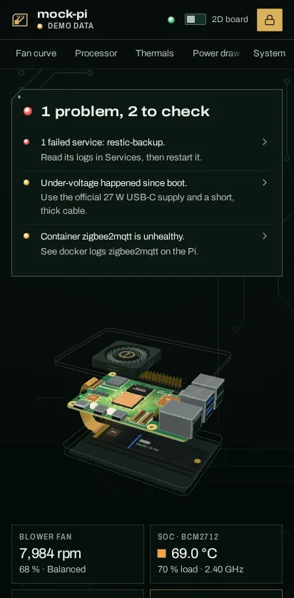

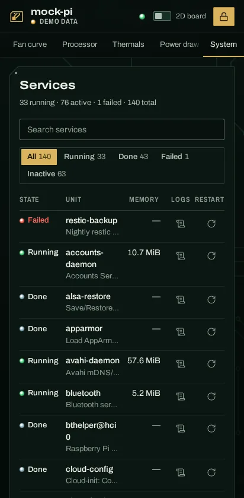

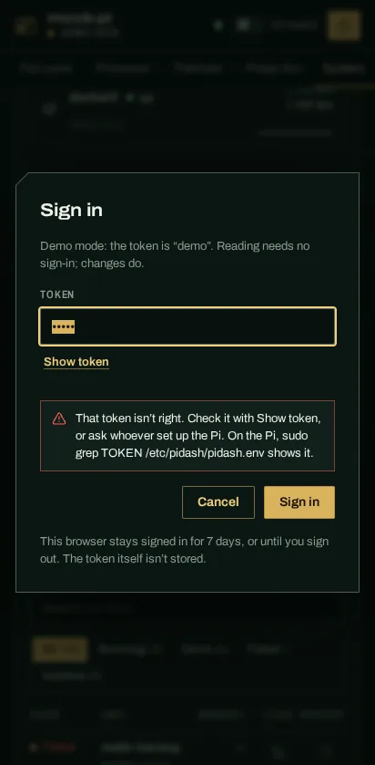

The switch reads "2D board" and the watts tab "Power draw"; on a phone System stays pinned at the strip's right end
and the keycaps are gone; service actions are 44 px pads 8 px apart under Logs and Restart labels; and the sign-in has
Show token and says where the token is. herocheck's `touch:` cases guard each one.

## Checked

On the 0.4.0 build, from `frontend/`:

- `herocheck.mjs`: ALL PASS (89 checks). `phonecheck.mjs`: ALL PASS (25 checks). Both serve the build themselves.
- `npm test` and `npm run build`: pass. The backend suite: pass.
- The footer markings of `?demo` read `app 0.4.0`.
